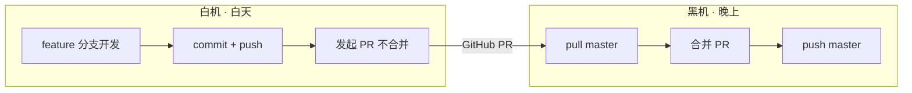

# AI 交接单

> 最后更新：2026-07-15 10:00
> 提交人：陈梓键
> 所在设备：白机（白天）

---

## 协作流程（固定，每次换机必读）



**白机铁律**：只开发不合并，所有改动走 feature 分支，禁止推 master。
**黑机铁律**：先合并白机的 PR，再开始新开发。

> 详细规则见：`.trae/rules/two-machine-collab.md`

---

## 当前任务
- [ ] 德塔 P2：NPC AI 对话接入（优先级：高）
- [ ] 德塔 P4：角色创建系统（优先级：中）
- [ ] 德塔 P5：美术资源替换（黑机 ComfyUI 生图）

## 进行中（未完成，切勿遗漏）
- 分支 `feature/refactor-trae-dir` 已推送，黑机需合并此 PR（含 E 键修复 + .trae 目录优化）
- Colyseus 服务器依赖版本已锁定：`colyseus@0.16.0` + `@colyseus/schema@3.0.76` + `colyseus.js@0.16.0`
- `game-server/node_modules` 未提交（gitignore），黑机 pull 后需执行 `cd game-server && npm install`

## 已完成（本次会话）

### 基础建设（07-13）
- [x] 项目克隆与依赖安装 - 环境就绪
- [x] 端口从 5173 改为 4396
- [x] 目录结构调整（去掉 nandexueyuan 嵌套层）
- [x] AI 跨机协作协议 + 两机协作规则
- [x] 锁定 pnpm 版本：`packageManager: pnpm@11.12.0`

### 管理后台（07-14）
- [x] 管理 API（成员管理 + 邀请码）
- [x] AdminView.vue 双 Tab 页面
- [x] `/admin` 路由 + requiresAdmin 角色守卫

### 德塔 P0：地图+角色+移动+HUD（07-13 ~ 07-14）
- [x] Phaser 4.2.1 集成，Scale.RESIZE 全屏
- [x] 三层塔楼地图（20 格宽，每层 6 格高，梯子连接）
- [x] WASD 移动 + 空格跳跃 + E 交互
- [x] 暗面 UI（博德之门3风格底部面板）：角色信息 | 背包 | 聊天 | 小地图
- [x] 聊天系统：Enter 打开 -> 输入 -> Enter/Esc/Tab 发送并关闭，400ms 冷却防重开
- [x] 聊天气泡：箭头指向角色 + 跟随移动 + 6s 后 2s 渐变消失
- [x] NPC（男德通）+ 物品（群公告牌）+ 大门彩蛋交互
- [x] 小地图（Vue Canvas 渲染地形 + 玩家/NPC/物品位置）

### 德塔 P1：多人同步（07-14）
- [x] Colyseus 0.16.0 游戏服务器（`game-server/`，端口 2567）
- [x] WorldRoom + JWT 验证（复用 Express 密钥）
- [x] PlayerState / WorldState Schema（`defineTypes` 声明）
- [x] NetworkSystem（`room.onStateChange` + diff 算法追踪玩家进出和位置）
- [x] 其他玩家精灵渲染（不同颜色色块 + 昵称显示）
- [x] 聊天广播（其他玩家头顶气泡同步）
- [x] 地图固定化（世界 3200x700，云树硬编码，所有浏览器同一张地图）
- [x] 昵称修复（`options.nickname` 优先于 JWT payload）

### 白机修复 + 目录优化（07-15）
- [x] 修复按 E 无法交互（`checkInteraction` 需在 `inputSystem.update()` 之前执行）
- [x] `.trae` 目录结构优化（`.rules→rules` / `.skills→skills`）

## 环境状态
- 分支：`feature/refactor-trae-dir`（已推送，等待黑机合并）
- 端口：前端 4396 / 后端 3000 / 游戏服务器 2567
- 数据库：已初始化（4 个迁移已应用，21 个种子账号 + testuser）
- 依赖：
  - 前端：`phaser@^4.0.0` + `colyseus.js@0.16.0`（黑机已切 npm）
  - 后端：现有依赖不变
  - game-server：`colyseus@0.16.0` + `@colyseus/schema@3.0.76` + `@colyseus/ws-transport@0.16.0` + `jsonwebtoken`（已安装）
- `server/.env` 未配置 VOLC_API_KEY，AI 助手功能不可用
- 预置账号：`chenzijian/admin123456`（院长）、`testuser/test123456`（测试员）

## 启动命令
```bash
# 前端（白机已在用）
npx vite --port 4396

# 后端 API
cd server && pnpm dev

# 游戏服务器（新增，多人同步必须）
cd game-server && node src/index.js
```

## 黑机合并指南
```bash
# 1. 合并白机 PR
git checkout master
git pull origin master
git fetch origin
git merge origin/feature/refactor-trae-dir
git push origin master

# 2. 安装 game-server 依赖
cd game-server
npm install

# 3. 验证德塔多人同步
# 终端 1: cd game-server && node src/index.js
# 终端 2: npx vite --port 4396
# 浏览器 1: Chrome 登录 testuser -> 进入德塔
# 浏览器 2: Edge 登录 chenzijian -> 进入德塔
# 预期：互相看到对方角色移动 + 聊天气泡
```

## 德塔踩坑记录（黑机必读）

| Bug | 根因 | 解决 |
|-----|------|------|
| 全屏黑边 | `Scale.FIT` 保持宽高比 | 改 `Scale.RESIZE` |
| Colyseus 版本冲突 | 0.15 不兼容 schema 3.x；0.17 依赖 uWebSockets.js 下载超时 | 锁定 0.16.0 |
| `type()` 不存在 | `@colyseus/schema@3.x` 没有 `type()` 导出 | 改用 `defineTypes()` |
| `MapSchema.onChange` 无效 | Colyseus 0.16 客户端回调不是属性赋值 | 改用 `room.onStateChange` + diff |
| 昵称全是"学员" | JWT 只含 `{userId, role}`，没有 nickname | `options.nickname` 优先 |
| 地图不一致 | 云树 `Phaser.Math.Between()` 随机 | 硬编码固定位置 |
| 聊天框重开 | `enableKeyboard()` 后同帧 Enter 又触发 | 400ms 冷却时间戳 |
| 小地图偏高 | `groundY` 随浏览器变化 | 固定世界 3200x700 |
| 按 E 无效 | `inputSystem.update()` 在 `checkInteraction()` 之前重置了 `_eJustDown` | 调换执行顺序 |

> 完整记录见：`prd/01-需求文档/04-德塔/changelog.md` 和 `bug-log.md`

## 文档索引
| 文档 | 路径 |
|------|------|
| MVP 需求 | `prd/01-需求文档/04-德塔/01-需求/MVP需求文档.md` |
| 美术规范 | `prd/01-需求文档/04-德塔/02-设计/美术设计规范.md` |
| 架构设计 | `prd/01-需求文档/04-德塔/04-技术方案/架构设计.md` |
| 开发路线 | `prd/01-需求文档/04-德塔/04-技术方案/开发路线与占位策略.md` |
| Colyseus 部署方案 | `prd/01-需求文档/04-德塔/04-技术方案/Colyseus多人同步部署方案.md` |
| Changelog | `prd/01-需求文档/04-德塔/changelog.md` |
| Bug Log | `prd/01-需求文档/04-德塔/bug-log.md` |

## 下一步
- 白机 commit + push 当前所有改动
- 黑机合并 PR 后验证多人同步
- P2：NPC AI 对话接入（男德通 -> 后端 AI 接口）
- P5：黑机 ComfyUI 生成像素风美术资源（瓦片/角色/NPC/立绘），替换色块占位