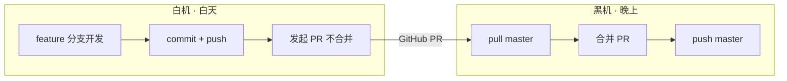

# AI 交接单

> 最后更新：2026-07-13 20:00
> 提交人：陈梓键
> 所在设备：白机（白天）

---

## 协作流程（固定，每次换机必读）



**白机铁律**：只开发不合并，所有改动走 feature 分支，禁止推 master。
**黑机铁律**：先合并白机的 PR，再开始新开发。

> 详细规则见：`.trae/.rules/two-machine-collab.md`

---

## 当前任务
- [ ] 完善 AI 跨机协作基础建设（优先级：高）

## 进行中（未完成，切勿遗漏）
- 无

## 已完成（本次会话）
- [x] 项目克隆与依赖安装 - 环境就绪
- [x] 端口从 5173 改为 4396
- [x] 目录结构调整（去掉 nandexueyuan 嵌套层）
- [x] 创建 AI 跨机协作协议 - 文件：`prd/05-开发规范/ai-collab.md`
- [x] 创建初始交接文件 - 文件：`.ai/handoff.md`
- [x] 文档归档：`ai-collab.md`、`git-manage.md` 移入 `prd/05-开发规范/`
- [x] `change-rules.md` 优化（参考 ADR 理念）后移入 `.trae/.rules/`
- [x] 锁定 pnpm 版本：`packageManager: pnpm@11.12.0`
- [x] `.gitignore` 更新：共享 `.trae/.rules/` 和 `.trae/.skills/`
- [x] 创建白机/黑机协作规则 - 文件：`.trae/.rules/two-machine-collab.md`

## 环境状态
- 分支：`feature/ai-collab-infra`（已推送）
- 最后提交：`chore: AI跨机协作基建 + 文档归档 + 依赖锁定`
- 数据库：已初始化（4 个迁移已应用，21 个种子账号）
- 依赖：前端 + 后端已安装完毕，锁文件已更新

## 注意事项
- 端口：前端 4396，后端 3000
- `server/.env` 未配置 VOLC_API_KEY，AI 助手功能不可用
- 预置账号：`chenzijian/admin123456`（院长），其余成员 `用户名/nande666`
- **当前 PR 已在 GitHub，黑机需合并 `feature/ai-collab-infra` -> master**

## 黑机合并指南
```bash
git checkout master
git pull origin master
git fetch origin
git merge origin/feature/ai-collab-infra
git push origin master
git branch -d feature/ai-collab-infra
git push origin --delete feature/ai-collab-infra
```

## 下一步
- 黑机合并 PR 后，开始正式需求开发
