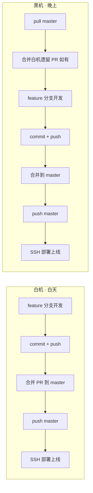

# AI 交接单

> 最后更新：2026-07-22（黑机，WebSocket 黑机外包检索**已部署到生产并验证通过**）
> 提交人：陈梓键（黑机）
> 所在设备：黑机（R7 9700X / 32GB DDR5 / RTX 4070 / 3TB NVMe）
> 稳定版本：`72f77e3`（生产环境，已部署）
> 最新提交：待提交（部署文档同步 + changelog 更新）
> **下一班**：白机，端到端用户验证（浏览器提问验证全量检索）
> **当前阶段**：
> - P5 美术：立绘 + 像素精灵 + 场景瓦片 + 三层塔楼改造 **全部完成**
> - P2 NPC AI 对话：多 Agent v2 + OOM 修复 + **WebSocket 黑机外包检索已部署到生产** ✅
> - 版本公告系统（R-004）：v1.2.0 已录入
> - 三层塔楼改造：7 阶段完成 + 6 个 bug 修复完成，**待用户最终验证**
> - R-003 玩家精灵系统（黑机 07-20 晚开发中）：代码接入完成，**待 ComfyUI 跑美术资源**

> **本轮（黑机 07-22）要点**：
> - **WebSocket 黑机外包检索生产部署完成**：云端 + Nginx + 黑机 Worker 全链路打通
> - **部署内容**：云端 git pull + npm install + Prisma + PM2 重启；Nginx 加 `/search-hub` WS 反代；黑机 PM2 `search-worker` 常驻
> - **验证结果**：云端日志"黑机认证成功，已上线" ✅；黑机日志"认证成功，黑机已上线" ✅；自动重连验证通过 ✅
> - **待白机继续**：用户浏览器端到端验证（提问"如何评价丘序明"看全量检索结果）

---

## 【WebSocket 方案落地】（07-21 黑机实施，07-22 部署到生产 ✅）

### 架构
```
用户浏览器 -> SSE -> 云端 Express :3000
  ├─ WS Hub (:3000/search-hub) <- 黑机 WS Worker 主动连接
  ├─ orchestrator.dispatchAgent()
  │    ├─ 在线 + 重度任务(person_messages/mentioned) -> WS 下发黑机 -> 全量检索 -> 回传
  │    └─ 离线/超时/轻量任务 -> 本地 LIMIT 50
  └─ 大 Agent 分析 -> SSE 流式输出
```

### 启动方式
```bash
# 云端（已部署，PM2 托管）
# PM2: nandexueyuan-api（Express + WS Hub）

# 黑机（7×24 常开，PM2 托管）
npx pm2 start src/searchWorker.js --name search-worker
```

### 部署状态（07-22 ✅ 已完成）
1. ✅ 云端：`git pull` + `npm install`（装 ws）+ `prisma generate/migrate` + PM2 重启
2. ✅ 云端：`.env` 追加 `BLACK_WORKER_TOKEN`
3. ✅ 云端：Nginx 加 `/search-hub` WS 反代 + reload
4. ✅ 黑机：`.env` 的 `CLOUD_WS_URL=ws://www.nandexueyuan.top/search-hub`
5. ✅ 黑机：PM2 `search-worker` 常驻 + `pm2 save`
6. ✅ 验证：云端日志"黑机认证成功，已上线" + 黑机日志"认证成功，黑机已上线"
7. ⏭ 待用户验证：浏览器提问"如何评价丘序明"看全量检索结果

### 降级策略（已验证）
- 黑机在线 + 重度任务 -> 黑机全量检索（数据最完整）
- 黑机离线/超时 -> 降级本地 LIMIT 50（精度降低但不宕机）
- 轻量任务（person_stat/topic_search）-> 始终本地执行
- 网络中断 -> Worker 5 秒自动重连（已验证通过）

---
> - **架构级 - 首次启用 Phaser 动画系统**：项目历史 0 处 `anims.create`/`anims.play`，本次从零搭建。PreloadScene 注册 40 个 anims（5 套 × 4 方向 × 2 状态），Player.js 通过 `anims.play` 切换，NetworkSystem.js 同步远程玩家动画
> - **schema 变更**：`PlayerState` 加 `skinId: 'string'`（默认 '1'），WorldRoom.onJoin 接收 `options.skinId`，向后兼容
> - **HUD 头像接入**：`GameView.vue` 原 `<canvas 40×40>` 空白从未绘制改为 `` 显示真实头像；点击头像弹出立绘弹窗 + 5 套形象切换（重进德塔生效）
> - **auth store 加 skinId**：localStorage 持久化，待 P4 角色创建系统接入后端
> - **5 套少女形象人设**：粉双马尾学园 / 黑长直巫女 / 金单马尾骑士 / 银短发法师 / 蓝双长辫机甲（set5 参考金克丝发型）
> - **5 套立绘工作流 JSON**：`.ai/comfyui-workflows/players/portrait_player_set{1..5}.json`，删除 mygo LoRA，改用纯 waiIllustriousSDXL_v160 大模型，每套 seed 100001~100005
> - **配套脚本**：`scripts/gen_player_portrait_workflows.py`（批量生成 JSON）、`scripts/portrait_to_avatar.py`（立绘截头像）、`scripts/download_models.sh`（hf-mirror 下载 SDXL/Pixel-Art LoRA/ControlNet OpenPose）
> - **BUG-35**：Edit 工具误删 NetworkSystem.js L29 的 IIFE 右括号 `})()` -> `}()`，已修复
> - **验证**：`npx vite build` 通过，GameView chunk 1859.88 kB 正常打包

> **下一步（黑机或下个会话）待办**：
> ⚠️ **优先级说明**：白机 2026-07-21 白天将处理其他模块需求，**玩家精灵任务暂停**，等黑机下次会话继续。白机接手时只需 pull master，无需继续本任务。
>
> 1. 用户启动 ComfyUI -> 加载 5 套 portrait_player_set{N}.json -> 跑出 5 张 1024 立绘
> 2. AI 从 ComfyUI output 复制到 `public/game/portraits/player_set{1..5}.png`
> 3. 跑 `scripts/portrait_to_avatar.py` 生成 5 张 40×40 头像到 `public/game/sprites/avatars/`
> 4. 用户执行 `bash scripts/download_models.sh` 下载 SDXL Base + Pixel-Art LoRA + ControlNet OpenPose（约 8GB，hf-mirror 镜像）
> 5. 设计 ControlNet 精灵表工作流 JSON（4 方向 × 4 帧 = 16 帧/套）
> 6. 准备 OpenPose 骨架参考图（16 张/套，可用 OpenposePreprocessor 从 RPG Maker 行走 spritesheet 提取）
> 7. 生成 5 套精灵表（80 帧，约 40 分钟）+ PIL 拼 128×128 网格 -> 入库 `public/game/sprites/players/player_set{N}_walk.png`
> 8. 启动本地三服务联调验证（npm run dev + game-server + Express）

> **生产环境状态**：
> - 稳定版仍为 `6bf5e57`（白机 07-20 部署）
> - 本次黑机代码改动（R-003 玩家精灵系统接入）**未部署**，仅在本地 + GitHub master
> - 当前 master HEAD 代码功能：NPC 对话/版本公告/塔楼 + 玩家精灵系统（用色块 fallback，无真实美术资源）
> - 下次部署时机：等玩家精灵表生成完成后一起部署，或用户明确要求时

> **本轮（白机 07-20 下午/晚）已完成的上下文**：
> - **NPC 广播 @ 提问者**：`NetworkSystem.js` 收到 npc-reply 广播时自动拼接 `@提问者昵称：` 前缀，程序统一处理，AI 不再自行写 @（修复 BUG-32 双重 @）
> - **身份感知**：`buildGamePersona()` 改为每次请求动态构建，从 `req.user.nickname` 注入提问者真实身份，AI 能识破冒充（"系统告诉我你是陈梓键哦~"）
> - **花名册注入**：新增 `parseRoster()` 从 `成员信息填写表.md` 解析 21 人列表（含外号/绰号/现状），注入 prompt 末尾，AI 可查任意成员
> - **版本公告系统（R-004）**：新增 `Version` 表 + 5 个 REST API + `VersionHistoryDialog.vue` 版本历史弹窗 + 首页公告栏改造（版本徽章 + 「版本历史」按钮），admin 可在弹窗内增删改版本，已 seed v1.1.0
> - **NPC 思考状态 spinner 优化**：ChatView + GameView 的"正在思考"动画从文字点号改为纯 CSS spinner（0.8s 线性旋转）
> - **传送门交互修复**：出生点移到 `towerX+200`(400)，统一大门/传送门交互距离判断（`< INTERACT_DISTANCE` 且 `< nearestDist`）
> - **.gitignore 修正**：`*.png` 改为 `/*.png`（仅忽略根目录临时截图，不影响 `public/game/` 下游戏资源）
> - R-002（NPC AI 对话接入）、R-001（立绘）、R-004（版本公告系统）标记为已完成

---

## 协作流程（固定，每次换机必读）



**两机能力对等**：均可开发、合并 PR、push master、部署上线。
**换机铁律**：接手第一件事先合并对方遗留的 PR，再开始自己的开发。

> 详细规则见：`.trae/rules/two-machine-collab.md`

---

## 当前状态：稳定版已上线

**生产环境已部署并验证通过的版本：`45156b3`**

| 服务 | 状态 | 端口 |
|------|------|------|
| 前端（Nginx） | HTTP 200 | 80/443 |
| 后端 API（PM2: nandexueyuan-api） | online | 3000 |
| Colyseus 游戏服务器（PM2: nandexueyuan-game） | online | 2567 |

**已验证功能**：
- [x] 多人同框：两个不同设备进入德塔，能看到彼此角色移动
- [x] 聊天广播：一个玩家发消息，另一个玩家头顶气泡同步
- [x] E 键交互：NPC 对话、物品查看、大门彩蛋正常
- [x] 路由切换清理：从德塔回主页，角色自动断开，无残影
- [x] Enter 聊天：按 Enter 打开聊天框，输入后再按 Enter 发送

---

## P2 联调验证记录（白机 07-20 上午）

**前置条件**：本地三服务全起（前端 4397 / 后端 3001 / Colyseus 2567），`.env` 已填入用户新申请的火山引擎 Key（`ark-3a` 开头，长度 46）。

### 后端 SSE 接口验证（curl 直连）

```bash
curl -sN -X POST http://localhost:3001/api/chat/npc/talk \
  -H "Authorization: Bearer $TOKEN" \
  -d '{"npcId":"nandetong_game","question":"你是谁？"}'
```

返回（节选）：
```
event: token  data: {"content":"嘿嘿"}
event: token  data: {"content":"~"}
...
event: token  data: {"content":"！"}
event: done   data: {"sessionId":3,"npcId":"nandetong_game"}
```

完整回复：「嘿嘿~我是男德通呀，德塔大厅里的 AI 管家美少女~有什么想问的尽管问我哦！」（30字、单行、美少女口吻，**完全符合需求文档**）

### 浏览器端到端验证（Playwright 自动化）

| AC | 验收点 | 结果 |
|----|--------|------|
| AC-N1 | 按 E 接近 NPC 触发对话（距离判定 + 头顶气泡） | ✅ 通过 |
| AC-N2 | 立绘 + 聊天双栏弹窗（标题栏 + 关闭按钮） | ✅ 通过 |
| AC-N3 | 欢迎语先占位「男德通：欢迎来到德塔！...」 | ✅ 通过 |
| AC-N4 | 输入框 `@ 男德通` 前缀独立元素，用户无法删除 | ✅ 通过 |
| AC-N5 | Enter 发送，AI SSE 流式回复逐字显示 | ✅ 通过（多轮上下文接得住） |
| AC-N6 | AI 回复后世界频道全服广播（`【时间】男德通：xxx`） | ✅ 通过 |
| AC-N7 | Esc 关闭弹窗 / `✕` 按钮关闭 / 空输入时按钮 disabled / 思考中防抖（`npcThinking` 双向锁定输入框和按钮） | ✅ 全通过 |

**测试样例对话**：
- 用户：「你叫什么名字？」
- 男德通：「我叫男德通呀~是德塔大厅里的AI管家美少女，有什么想问的尽管问我哦！」
- 多轮上下文验证：AI 接住了欢迎语里的「男德通」身份设定，自报家门一致

### 已知遗留问题（不阻塞部署）

1. **本地 3000 端口冲突未根治**：用户先前手动起的 node 进程（PID 49348，管理员权限）杀不掉，重启电脑才能清理；本次靠 3001 端口绕开
2. **Colyseus 全服广播仅本机验证**：单浏览器只验证了"自己看到自己的广播"，多人同房间广播需要两台设备/两个浏览器实测
3. **API 额度监控**：本轮只发了 2~3 次请求验证，需观察正式使用时的消耗速率

### 下一步建议

- [ ] **部署到生产**：19 个提交待用户确认后 `bash deploy.sh`
- [ ] 多设备联调 Colyseus 广播
- [ ] 观察火山引擎额度消耗

---

## 当前任务

### 黑机本轮（07-18~19）已完成

- [x] **BUG-22 修复**：男德通统计查询把毫秒时间戳当字符串切片，误报"只有 2022 年 7 月数据"（已部署）
- [x] **P5 立绘生成**：男德通立绘 1024×1024（waiIllustriousSDXL + mygo LoRA + BiRefNet 抠图）
- [x] **P5 像素精灵定稿**：AI 生 1024 像素风 -> PIL 裁切透明边 -> 降采样 32×32（v3 prompt 0003 立姿）
- [x] **P5 场景瓦片**：Tiny Town CC0 包切片（grass/dirt/stone/wood），PreloadScene 加载真实 PNG
- [x] **游戏交互改进**：滚轮缩放（0.75~3.0）、NPC 脚底贴地、塔楼精简后重建
- [x] **P5 文档体系**：美术资源索引、ComfyUI 工作流目录重组、`scripts/portrait_to_pixel.py` + `sprite_32.py`、调研文档 7 处修正、ADR-001/002
- [x] **素材储备**：Tiny Town（室外）+ Tiny Dungeon（地牢）下载
- [x] **P2 NPC AI 对话**：全栈 6 阶段完成（立绘弹窗 + SSE + 全服广播），待 API 额度联调
- [x] **三层塔楼改造**：7 阶段完成（爬梯机制 + 物理门 + Tiny Dungeon 36 瓦片 + 三层精装）
- [x] **塔楼改造 bug 修复**：BUG-26~31（6 个 bug 全部修复）

### 待办（按优先级）

- [ ] **三层塔楼最终验证**：用户强刷确认爬梯/门/视觉无问题
- [ ] 德塔 P4：角色创建系统（优先级：中）
- [ ] 三层塔楼功能扩展：房间内床/宝箱可交互、顶层宝箱奖励
- [ ] R-003：角色精灵表生成（ComfyUI 四方向行走动画）

### ⚠️ 关键未解决问题（下次接手必看）

1. **角色坐标系**：色块时代坐标是凑合的，换 PNG 后暴露。`origin(0.5,1)` + body offset 方案导致玩家掉虚空，已回退。下次需重新设计，建议参考 ADR-002
2. **ComfyUI 输出目录**：绘世启动器会覆盖 `preference.json` 的 `output_directory` 配置。当前方案是 AI 直接读 ComfyUI 默认 output 目录（不在项目内），验证后手动复制
3. **男德通人设锁定**：参考 MyGo 千早爱音（粉发、眼镜、虎牙、糖糖笑），mygo LoRA 触发词 `chihaya anon`，**人物形象只留触发词，其余靠 LoRA**（描述词过多会稀释 LoRA 权重）
4. **塔楼爬梯手感**：冷却逻辑已加，F12 日志可能还有少量重复（不影响功能），如手感差再调
5. **门开门视觉**：当前用半透明模拟开门，无专用"打开的门"贴图，后续可补

### P2 NPC AI 对话 · 黑机实现蓝图

> 本次白机会话（07-17）产出。需求文档 `prd/01-需求文档/04-德塔/01-需求/德塔男德通交互需求.md` 为准（黑机调研方案已废弃）。

#### 一、已锁定的 8 项决策（黑机照此执行，无需重新评审）

| # | 决策项 | 结论 |
|:-:|------|------|
| 1 | 方案选型 | **白机需求方案**（HUD 聊天框 @ 机器人模式），废弃黑机调研的 NPCDialog 弹窗方案 |
| 2 | 上下文来源 | 德塔文档知识库（MVP需求 + 世界观 + 操作指南 + 开发路线§5） |
| 3 | 回复风格 | 美少女口吻，50字以内，禁换行，超纲兜底「这个问题我还不太清楚呢~问问院长吧！」 |
| 4 | 会话管理 | MVP **无状态**，不存历史；私聊+每用户上下文列入未来调研 |
| 5 | 打招呼气泡 | **后端预定义文案库随机返回**（不调 LLM，零 token） |
| 6 | 流式体验 | 发送者看逐 token 流式，其他玩家看完整消息（流结束后广播） |
| 7 | 操作指南 | 先补一份简易版（后续会做功能按钮正式展示） |
| 8 | npcId 区分 | `nandetong`（站外 ChatView）/ `nandetong_game`（德塔内） |

#### 二、实现阶段（建议按顺序）

**阶段 0：文档准备**
- 新建 `prd/01-需求文档/04-德塔/02-设计/德塔操作指南.md`（简易版：键位/移动/聊天/交互/传送门，后续会做功能按钮）
- 修复 `prd/01-需求文档/04-德塔/02-设计/德塔世界观.md` **L194 损坏 FAQ**（"德塔是什么？| 德塔是男德学院..."截断）

**阶段 1：后端 `server/src/controllers/chatController.js`**
- 人设参数化：`SYSTEM_PERSONA`（L7-29）4 处硬编码（L161/L178/L302/L345）改为 `getPersona(npcKey)` 函数
- `askChat`（L380）入参新增 `npcId` 解析
- 新增 `buildGamePersona()`：用 `new URL('../../prd/...', import.meta.url)` 读 4 份 markdown 拼 system prompt（加内存缓存）
- `nandetong_game` 分支：纯角色扮演，**不走 statistic/semantic 三分类**，直接调 LLM 流式
- 新增打招呼文案接口：`GET /api/chat/npc/greet?npcId=nandetong_game` 返回随机文案（预定义文案库）
- 异常兜底：API Key 缺失/超时/文档缺失 → 返回「男德通暂时走神了，请稍后再试~」

**阶段 2：前端 `src/views/GameView.vue`**
- 监听新事件 `npc-chat-open`（区别现有 `npc-interact`）
- 监听后：激活 HUD 聊天框 + 预填 `@ 男德通 ` 蓝色前缀（不可删除）+ 光标定位前缀后方
- 发送时携带 `npcId: 'nandetong_game'`
- SSE 消费：复用 `ChatView.vue` L75-170 的 fetch+reader+decoder 逻辑（可提取 `src/composables/useChatSSE.js`，可选）
- 男德通回复渲染：前缀 `@玩家昵称` 蓝色
- 流结束后通过 Colyseus 广播给其他玩家

**阶段 3：Phaser `game/scenes/WorldScene.js`**
- `handleInteract`（L411-421）：npc 分支按 `config.interactType === 'ai_chat'` 分流，emit `npc-chat-open`
- 按 E 时男德通头顶冒打招呼气泡（广播全服可见，5s 淡隐）
- 气泡实现：复用 `showDoorBubble`（L423-439）模式，为 `this.npcs[0]` 加 `bubble` 字段

**阶段 4：Colyseus 广播 `game-server/src/rooms/WorldRoom.js`**
- AI 回复是 HTTP SSE（Vue 层），不在 Colyseus 内
- 方案：发起者收到完整回复后，`room.send('npc-reply', {nickname, text})` → 服务器 `onMessage('npc-reply')` 广播 → 其他玩家渲染
- 仿照现有 `onMessage('chat')`（L28-34）模式

**阶段 5：联调验证（按需求文档 AC-N1~N7）**
- AC-N1：@ 前缀预填不可删
- AC-N2：发送携带 npcId
- AC-N3：回复美少女口吻 50字内无换行
- AC-N4：上下文正确（问"怎么移动"答对）
- AC-N5：超纲兜底
- AC-N6：广播全服可见
- AC-N7：异常兜底

#### 三、关键技术坑（黑机必读）

| 坑 | 说明 | 对策 |
|----|------|------|
| 后端读文档路径 | server cwd 是 `server/`（deploy.sh L37 `--cwd server`），prd 在 `../prd/`；ESM 无 `__dirname` | 用 `new URL('../../prd/...', import.meta.url)` |
| 文档注入量 | 3 份合计约 3万 token 偏大 | 摘要核心章节：MVP §4.2/4.4/4.10/4.12 + 世界观 §5/§8 + 开发路线 §5 |
| NPC 位置死字段 | `shared/npcs.js` 的 x:1000/y:800 未使用，实际硬编码在 WorldScene（towerX+160=360, groundY-16=620） | 三个预留字段 `portraitKey`/`greetText`/`interactType` 也未使用，本次会激活 `interactType` |
| SSE 不走 axios | 现有 `src/api/chat.js` 的 axios 封装无法消费流 | 用原生 fetch+reader（仿 ChatView L96-162） |
| nickname 来源 | JWT 不含 nickname，来自 Pinia `auth.user.nickname` | GameView L40 已有 `nickname` 变量 |
| 生产环境 VOLC_API_KEY | 未配置（handoff 已记录） | 黑机测试前确认 `server/.env` 已填 |

#### 四、文件变更预估

| 文件 | 动作 |
|------|------|
| `prd/01-需求文档/04-德塔/02-设计/德塔操作指南.md` | 新增 |
| `prd/01-需求文档/04-德塔/02-设计/德塔世界观.md` | 修改（修复 L194） |
| `server/src/controllers/chatController.js` | 修改（人设参数化 + nandetong_game 分支 + 文档读取 + greet 接口） |
| `server/src/routes/api.js` | 修改（新增 greet 路由） |
| `src/views/GameView.vue` | 修改（@ 前缀 + SSE 消费 + npcId 传递 + 广播） |
| `game/scenes/WorldScene.js` | 修改（interactType 分流 + NPC 气泡） |
| `game-server/src/rooms/WorldRoom.js` | 修改（npc-reply 广播） |
| `src/composables/useChatSSE.js` | 可选新增（提取 SSE 逻辑） |
| `shared/npcs.js` | 可选修改（加 greetBubbles 文案或修位置死字段） |

### P5 美术资源 · 黑机 ComfyUI 工作流搭建步骤

完整调研文档见：`prd/01-需求文档/04-德塔/03-调研/comfyui-pixel-art-generation-workflow.md`

**共识**：
1. ComfyUI 工作流本质是 JSON 文件，AI 可直接生成 JSON，用户拖入 ComfyUI 界面加载
2. 混合搭建模式：用户先在 ComfyUI 界面搭一个最简工作流并导出 JSON → AI 读取该 JSON 理解节点命名 → AI 扩展生成完整工作流 → 用户拖入加载
3. 工作流 JSON 存放在 `.ai/comfyui-workflows/`（gitignore，黑机专用）
4. 立绘画风改为二次元（Illustrious XL），不走像素风

**三个工作流**：
| 工作流 | 用途 | 模型 | 抠图 |
|--------|------|------|:--:|
| 一 | 场景贴图（瓦片/物件/物品） | SDXL + Pixel-Art-XL LoRA | 瓦片不需要，物件需要 |
| 二 | 角色精灵表（四方向行走） | SDXL + LoRA + ControlNet OpenPose | 需要 |
| 三 | 二次元美少女立绘 | Illustrious XL | 需要 |

**黑机需要下载的模型**：
- Pixel-Art-XL LoRA → `models/loras/`
- Illustrious XL → `models/checkpoints/`
- Control-LoRA OpenPose（SDXL 版）→ `models/controlnet/`
- BiRefNet → `models/background_removal/`
- `comfyui_controlnet_aux` 自定义节点

**黑机搭好后第一步**：在 ComfyUI 界面建一个最简工作流（加载模型 -> KSampler -> SaveImage），导出 JSON 到 `.ai/comfyui-workflows/base_empty.json`，让 AI 读取后生成三个完整工作流。

**美术资源目录管理**：

```
public/game/
├── tilesets/              ← 工作流一：瓦片（草地/泥土/石墙/木板/天空）
├── sprites/
│   ├── objects/           ← 工作流一：物件（树木/云朵/大门）
│   ├── items/             ← 工作流一：物品（公告牌/日程板/打卡点）
│   ├── players/           ← 工作流二：玩家角色精灵表
│   └── npcs/              ← 工作流二：NPC 角色精灵表
├── portraits/             ← 工作流三：NPC 立绘（二次元半身像）
├── audio/                 ← （暂不涉及）
├── maps/                  ← 地图数据（JSON，非美术资源）
└── ui/                    ← UI 元素（暂不涉及）
```

- 目录结构通过 `.gitkeep` 入库，黑机 `git pull` 后自动获得空目录
- PNG 文件**直接入库**（黑机无法直连服务器，必须走 GitHub 部署链路）
- 总量约 1-2MB，不会导致仓库膨胀
- 部署流程：黑机 `git add PNG + commit + push` → 服务器 `git pull`
- ComfyUI 不迁移到项目目录，JSON 文件就是 AI 与 ComfyUI 的桥梁

## 下一步开发建议
1. **【移交黑机】P2 NPC AI 对话**：白机已锁定 8 项决策 + 完整实现蓝图（见上方「当前任务」），黑机接手按阶段 0~5 实现。测试前确认 `server/.env` 已配置 `VOLC_API_KEY`
2. **P5 美术资源**：黑机 ComfyUI 生成像素风资源（瓦片/角色/NPC/立绘），替换色块占位
3. **传送门部署**：待用户确认后，SSH 到服务器执行 `bash deploy.sh`（含 `d9621b3` 传送门功能 + `c759274` 文档 + `5c3daee` ZCode 配置）
4. **服务器 SSH**：当前白机 IP `113.98.191.139` 已加入安全组，IP 变化时需更新阿里云安全组

---

## 已完成（本次会话 07-17 白机）

### ZCode 适配与工程配置
- [x] 新增 `AGENTS.md`（合并 `.trae/rules/` 中 9 条适用规则，剔除 RMP/PM/Python 残留）
- [x] 新增 `.zcode/skills/`（复制 6 个技能，`.trae/` 原样保留供 Trae IDE 使用）
- [x] 提交 `52e0172` `[chore](工程配置): 新增 AGENTS.md 与 .zcode 技能目录适配 ZCode`

### 传送门功能
- [x] 德塔大厅新增传送门，支持返回男德学院首页
- [x] 涉及文件：`game/mapData.js`、`PreloadScene.js`、`UIScene.js`、`WorldScene.js`、`GameView.vue`、`src/views/changelog.md`
- [x] 提交 `d9621b3` `[feat](德塔): 新增大厅传送门支持返回男德学院首页`

### 文档整理
- [x] 新增 `德塔男德通交互需求.md`、`德塔世界观.md`、`需求池.md`
- [x] 调研文档迁移到 `00-调研/`（comfyui-pixel-art 等）
- [x] 新增 `.trae/rules/docs-management.md`（文档管理规则）
- [x] 提交 `c759274` `[文档](德塔): 新增德塔世界观、男德通交互需求、需求池及调研文档整理`

### 服务器验证
- [x] SSH 通畅：`ssh root@47.96.158.104`
- [x] 服务全绿：Nginx (80) ✅ | API (3000) ✅ | Colyseus (2567) ✅
- [x] 服务器代码停留在 `fbbe785`，落后 GitHub 4 个提交（传送门功能 + 文档 + ZCode 配置未部署）

### P2 NPC AI 对话 · 需求确认与实现蓝图（移交黑机）
- [x] 确认以白机需求文档为准（HUD 聊天框 @ 机器人模式），废弃黑机调研的 NPCDialog 弹窗方案
- [x] 锁定 8 项关键决策（方案/上下文/风格/会话/气泡/流式/操作指南/npcId 区分）
- [x] 完成代码探索：后端 chatController（人设硬编码 4 处、SSE 流式、RAG 链路）、前端 GameView/WorldScene（NPC 交互链路、事件总线、气泡实现）、文档注入路径评估（ESM 用 `import.meta.url`）
- [x] 产出实现蓝图：6 阶段（文档准备 → 后端 → 前端 → Phaser → Colyseus → 联调）+ 6 个技术坑 + 9 文件变更预估
- [x] 明确未来调研项：私聊模式 + 每用户独立上下文（不纳入 MVP）

---

## 已完成（本次会话 07-16 黑机）

### P2 NPC AI 对话需求调研
- [x] 合并白机 07-16 推送（README + ComfyUI 调研 + BUG 记录），解决 `.gitignore` 冲突
- [x] NPC 系统现状调研（交互链路、配置、事件总线、占位弹窗）
- [x] AI 对话系统现状调研（SSE 流式、意图分类、RAG 检索、数据模型）
- [x] 产出调研文档 `prd/01-需求文档/04-德塔/03-调研/npc-ai-chat-integration.md`
- [x] 三方案对比（推荐 GameView 内嵌对话）
- [x] 5 步实现路线 + 5 项待决策清单 + 6 文件变更预估

---

## 已完成（本次会话 07-15）

### 生产环境部署 + 多人同步修复
- [x] **首次部署 game-server 到生产服务器**
  - PM2 启动 Colyseus（`nandexueyuan-game`）
  - Express 改为从 `server/` 目录启动（`--cwd server`），正确加载 `.env`
  - Nginx 配置 `/ws` WebSocket 代理（`proxy_pass http://127.0.0.1:2567/;`）
- [x] **修复多人同框（3 个独立 bug 叠加）**
  - BUG-15：game-server 从未部署 → deploy.sh 新增部署步骤
  - BUG-16：JWT 密钥不匹配 + Nginx 路由错误 → 修复启动目录 + proxy_pass 尾部斜杠
  - BUG-18：ESM 模块导入顺序导致 SECRET 永远是回退值 → 改为运行时读取 `getSecret()`
- [x] **修复切换页签残影（BUG-19）**
  - 旧方案 `visibilitychange` 废弃（不适用 Vue 路由切换）
  - 正确方案：Vue `onUnmounted` → `destroyGame()` → Phaser `shutdown` + `destroy` 双重清理
  - `NetworkSystem.disconnect()` 清理 `knownPlayers` + `stateReady`，重连后 diff 正确
- [x] **修复聊天 Enter 无反应（BUG-19）**
  - `keydown-Enter` 在 Phaser 4 不生效 → 改用 `InputSystem.keyEnter.justDown` 在 update 中检测
- [x] **修复按 E 无法交互（BUG-14）**
  - `checkInteraction()` 移到 `inputSystem.update()` 之前

### 规则 + 文档更新
- [x] 两机协作规则更新：白机也可合并 PR + 部署上线（`two-machine-collab.md`）
- [x] `.trae` 目录结构优化（`.rules→rules` / `.skills→skills`）
- [x] `.gitignore` 新增 `askpass.bat`

### 07-13 ~ 07-14（历史）
- [x] 项目初始化 + 端口 4396 + 目录结构
- [x] 管理后台（成员管理 + 邀请码）
- [x] 德塔 P0：地图 + 角色 + 移动 + HUD
- [x] 德塔 P1：Colyseus 多人同步（本地验证通过）

---

## 环境状态

| 项目 | 值 |
|------|-----|
| Git 分支 | `master`（稳定版，已推送 + 已部署） |
| 最新 commit | `c759274`（已推送 GitHub，**未部署**） |
| 服务器 commit | `fbbe785`（落后 3 个提交 — 传送门功能 + 文档 + ZCode 配置未部署） |
| 前端端口 | 4396（本地）/ 80（服务器 Nginx） |
| 后端端口 | 3000 |
| 游戏服务器端口 | 2567 |
| 数据库 | 已初始化（4 迁移 + 21 种子账号） |
| 服务器 SSH | `ssh root@47.96.158.104`（安全组 IP `113.98.191.139`） |

**服务器 PM2 进程**：
| 名称 | 启动命令 | cwd |
|------|---------|-----|
| nandexueyuan-api | `src/index.js` | `server/` |
| nandexueyuan-game | `game-server/src/index.js` | 项目根目录 |

**服务器 Nginx 关键配置**：
```nginx
location /ws {
    proxy_pass http://127.0.0.1:2567/;  # 尾部斜杠必须！剥离 /ws 前缀
    proxy_http_version 1.1;
    proxy_set_header Upgrade $http_upgrade;
    proxy_set_header Connection "upgrade";
    proxy_read_timeout 86400s;
}
```

**预置账号**：
- `chenzijian/admin123456`（院长，admin 角色）
- `testuser/test123456`（测试员）

**待配置**：
- `server/.env` 未配置 `VOLC_API_KEY`，AI 助手功能不可用

---

## 启动命令
```bash
# 前端（本地开发）
npx vite --port 4396

# 后端 API
cd server && npm run dev

# 游戏服务器（多人同步必须）
cd game-server && node src/index.js

# 生产部署（SSH）
ssh root@47.96.158.104
cd /root/projects/www.nandexueyuan.top
bash deploy.sh
```

---

## 德塔踩坑记录（黑机必读）

| Bug | 根因 | 解决 |
|-----|------|------|
| 全屏黑边 | `Scale.FIT` 保持宽高比 | 改 `Scale.RESIZE` |
| Colyseus 版本冲突 | 0.15 不兼容 schema 3.x；0.17 依赖 uWebSockets.js 下载超时 | 锁定 0.16.0 |
| `type()` 不存在 | `@colyseus/schema@3.x` 没有 `type()` 导出 | 改用 `defineTypes()` |
| `MapSchema.onChange` 无效 | Colyseus 0.16 客户端回调不是属性赋值 | 改用 `room.onStateChange` + diff |
| 昵称全是"学员" | JWT 只含 `{userId, role}`，没有 nickname | `options.nickname` 优先 |
| 地图不一致 | 云树 `Phaser.Math.Between()` 随机 | 硬编码固定位置 |
| 聊天框重开 | `enableKeyboard()` 后同帧 Enter 又触发 | 400ms 冷却时间戳 |
| 小地图偏高 | `groundY` 随浏览器变化 | 固定世界 3200x700 |
| 按 E 无效 | `inputSystem.update()` 在 `checkInteraction()` 之前重置了 `_eJustDown` | 调换执行顺序 |
| 多人看不到彼此 | JWT 密钥不匹配 + Nginx proxy_pass 无尾部斜杠 | Express 从 `server/` 启动 + `proxy_pass http://...:2567/;` |
| JWT 密钥永远回退 | ESM import 提升，`const SECRET` 在 `dotenv.config()` 前求值 | 改为 `function getSecret()` 运行时读取 |
| 切换页签留残影 | `visibilitychange` 不适用 Vue 路由切换 | `onUnmounted` → `destroyGame()` → scene `shutdown`+`destroy` |
| Enter 聊天无反应 | `keydown-Enter` 在 Phaser 4 不生效 | 改用 `InputSystem.keyEnter.justDown` |
| **德塔进入无画面** | `this.anims.getAllAnims()` 在 Phaser 4 不存在 | 改用 `this.anims.anims.size` + `this.anims.get() !== undefined` |

> 完整记录见：`prd/01-需求文档/04-德塔/changelog.md` 和 `bug-log.md`

---

## 文档索引
| 文档 | 路径 |
|------|------|
| MVP 需求 | `prd/01-需求文档/04-德塔/01-需求/MVP需求文档.md` |
| 德塔男德通交互需求 | `prd/01-需求文档/04-德塔/01-需求/德塔男德通交互需求.md` |
| 德塔世界观 | `prd/01-需求文档/04-德塔/02-设计/德塔世界观.md` |
| 美术规范 | `prd/01-需求文档/04-德塔/02-设计/美术设计规范.md` |
| 架构设计 | `prd/01-需求文档/04-德塔/04-技术方案/架构设计.md` |
| 开发路线 | `prd/01-需求文档/04-德塔/04-技术方案/开发路线与占位策略.md` |
| Colyseus 部署方案 | `prd/01-需求文档/04-德塔/04-技术方案/Colyseus多人同步部署方案.md` |
| 需求池 | `prd/01-需求文档/00-基础数据/需求池.md` |
| NPC AI 对话调研 | `prd/01-需求文档/04-德塔/03-调研/npc-ai-chat-integration.md` |
| Changelog | `prd/01-需求文档/04-德塔/changelog.md` |
| Bug Log | `prd/01-需求文档/04-德塔/bug-log.md` |
| ZCode 项目指令 | `AGENTS.md` |
