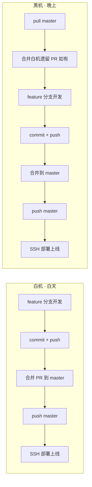

# AI 交接单

> 最后更新：2026-07-17
> 提交人：陈梓键（白机）
> 所在设备：白机（白天）
> 稳定版本：`45156b3`（已部署到生产环境）
> 最新提交：`c759274`（已推送 GitHub，**未部署**，含传送门功能 + 文档 + ZCode 配置）

---

## 协作流程（固定，每次换机必读）



**两机能力对等**：均可开发、合并 PR、push master、部署上线。
**换机铁律**：接手第一件事先合并对方遗留的 PR，再开始自己的开发。

> 详细规则见：`.trae/rules/two-machine-collab.md`

---

## 当前状态：稳定版已上线

**生产环境已部署并验证通过的版本：`45156b3`**

| 服务 | 状态 | 端口 |
|------|------|------|
| 前端（Nginx） | HTTP 200 | 80/443 |
| 后端 API（PM2: nandexueyuan-api） | online | 3000 |
| Colyseus 游戏服务器（PM2: nandexueyuan-game） | online | 2567 |

**已验证功能**：
- [x] 多人同框：两个不同设备进入德塔，能看到彼此角色移动
- [x] 聊天广播：一个玩家发消息，另一个玩家头顶气泡同步
- [x] E 键交互：NPC 对话、物品查看、大门彩蛋正常
- [x] 路由切换清理：从德塔回主页，角色自动断开，无残影
- [x] Enter 聊天：按 Enter 打开聊天框，输入后再按 Enter 发送

---

## 当前任务
- [ ] 德塔 P2：NPC AI 对话接入（优先级：高）— **调研已完成，待白机评审决策清单**
- [ ] 德塔 P4：角色创建系统（优先级：中）
- [ ] 德塔 P5：美术资源替换（黑机 ComfyUI 生图）
- [ ] **传送门功能待部署**：代码已推 GitHub（`d9621b3`），待用户确认后执行 `bash deploy.sh`

### P2 NPC AI 对话 · 白机待评审

完整调研文档见：`prd/01-需求文档/04-德塔/03-调研/npc-ai-chat-integration.md`

**推荐方案**：GameView 内嵌对话（方案 A），提取 `useChatSSE` composable + 新建 `NPCDialog.vue`

**5 项待决策清单**（需白机逐项拍板）：
1. NPC 人设切换方式：复用 `/chat/ask` + `npcId` 参数（推荐）
2. NPC 对话会话管理：MVP 与普通聊天共用 ChatSession（推荐）
3. NPCDialog 组件位置：`src/components/NPCDialog.vue`（推荐）
4. greetText 发送方式：弹窗打开自动发送（推荐）
5. useChatSSE composable 位置：`src/composables/useChatSSE.js`（推荐）

**文件变更预估**：2 新增 + 4 修改

### P5 美术资源 · 黑机 ComfyUI 工作流搭建步骤

完整调研文档见：`prd/01-需求文档/04-德塔/03-调研/comfyui-pixel-art-generation-workflow.md`

**共识**：
1. ComfyUI 工作流本质是 JSON 文件，AI 可直接生成 JSON，用户拖入 ComfyUI 界面加载
2. 混合搭建模式：用户先在 ComfyUI 界面搭一个最简工作流并导出 JSON → AI 读取该 JSON 理解节点命名 → AI 扩展生成完整工作流 → 用户拖入加载
3. 工作流 JSON 存放在 `.ai/comfyui-workflows/`（gitignore，黑机专用）
4. 立绘画风改为二次元（Illustrious XL），不走像素风

**三个工作流**：
| 工作流 | 用途 | 模型 | 抠图 |
|--------|------|------|:--:|
| 一 | 场景贴图（瓦片/物件/物品） | SDXL + Pixel-Art-XL LoRA | 瓦片不需要，物件需要 |
| 二 | 角色精灵表（四方向行走） | SDXL + LoRA + ControlNet OpenPose | 需要 |
| 三 | 二次元美少女立绘 | Illustrious XL | 需要 |

**黑机需要下载的模型**：
- Pixel-Art-XL LoRA → `models/loras/`
- Illustrious XL → `models/checkpoints/`
- Control-LoRA OpenPose（SDXL 版）→ `models/controlnet/`
- BiRefNet → `models/background_removal/`
- `comfyui_controlnet_aux` 自定义节点

**黑机搭好后第一步**：在 ComfyUI 界面建一个最简工作流（加载模型 -> KSampler -> SaveImage），导出 JSON 到 `.ai/comfyui-workflows/base_empty.json`，让 AI 读取后生成三个完整工作流。

**美术资源目录管理**：

```
public/game/
├── tilesets/              ← 工作流一：瓦片（草地/泥土/石墙/木板/天空）
├── sprites/
│   ├── objects/           ← 工作流一：物件（树木/云朵/大门）
│   ├── items/             ← 工作流一：物品（公告牌/日程板/打卡点）
│   ├── players/           ← 工作流二：玩家角色精灵表
│   └── npcs/              ← 工作流二：NPC 角色精灵表
├── portraits/             ← 工作流三：NPC 立绘（二次元半身像）
├── audio/                 ← （暂不涉及）
├── maps/                  ← 地图数据（JSON，非美术资源）
└── ui/                    ← UI 元素（暂不涉及）
```

- 目录结构通过 `.gitkeep` 入库，黑机 `git pull` 后自动获得空目录
- PNG 文件**直接入库**（黑机无法直连服务器，必须走 GitHub 部署链路）
- 总量约 1-2MB，不会导致仓库膨胀
- 部署流程：黑机 `git add PNG + commit + push` → 服务器 `git pull`
- ComfyUI 不迁移到项目目录，JSON 文件就是 AI 与 ComfyUI 的桥梁

## 下一步开发建议
1. **P2 NPC AI 对话**：男德通 NPC 接入后端 AI 接口（需配置 VOLC_API_KEY）
2. **P5 美术资源**：黑机 ComfyUI 生成像素风资源（瓦片/角色/NPC/立绘），替换色块占位
3. **传送门部署**：待用户确认后，SSH 到服务器执行 `bash deploy.sh`（含 `d9621b3` 传送门功能 + `c759274` 文档）
4. **服务器 SSH**：当前白机 IP `113.98.191.139` 已加入安全组，IP 变化时需更新阿里云安全组

---

## 已完成（本次会话 07-17 白机）

### ZCode 适配与工程配置
- [x] 新增 `AGENTS.md`（合并 `.trae/rules/` 中 9 条适用规则，剔除 RMP/PM/Python 残留）
- [x] 新增 `.zcode/skills/`（复制 6 个技能，`.trae/` 原样保留供 Trae IDE 使用）
- [x] 提交 `52e0172` `[chore](工程配置): 新增 AGENTS.md 与 .zcode 技能目录适配 ZCode`

### 传送门功能
- [x] 德塔大厅新增传送门，支持返回男德学院首页
- [x] 涉及文件：`game/mapData.js`、`PreloadScene.js`、`UIScene.js`、`WorldScene.js`、`GameView.vue`、`src/views/changelog.md`
- [x] 提交 `d9621b3` `[feat](德塔): 新增大厅传送门支持返回男德学院首页`

### 文档整理
- [x] 新增 `德塔男德通交互需求.md`、`德塔世界观.md`、`需求池.md`
- [x] 调研文档迁移到 `00-调研/`（comfyui-pixel-art 等）
- [x] 新增 `.trae/rules/docs-management.md`（文档管理规则）
- [x] 提交 `c759274` `[文档](德塔): 新增德塔世界观、男德通交互需求、需求池及调研文档整理`

### 服务器验证
- [x] SSH 通畅：`ssh root@47.96.158.104`
- [x] 服务全绿：Nginx (80) ✅ | API (3000) ✅ | Colyseus (2567) ✅
- [x] 服务器代码停留在 `fbbe785`，落后 GitHub 3 个提交（传送门功能未部署）

---

## 已完成（本次会话 07-16 黑机）

### P2 NPC AI 对话需求调研
- [x] 合并白机 07-16 推送（README + ComfyUI 调研 + BUG 记录），解决 `.gitignore` 冲突
- [x] NPC 系统现状调研（交互链路、配置、事件总线、占位弹窗）
- [x] AI 对话系统现状调研（SSE 流式、意图分类、RAG 检索、数据模型）
- [x] 产出调研文档 `prd/01-需求文档/04-德塔/03-调研/npc-ai-chat-integration.md`
- [x] 三方案对比（推荐 GameView 内嵌对话）
- [x] 5 步实现路线 + 5 项待决策清单 + 6 文件变更预估

---

## 已完成（本次会话 07-15）

### 生产环境部署 + 多人同步修复
- [x] **首次部署 game-server 到生产服务器**
  - PM2 启动 Colyseus（`nandexueyuan-game`）
  - Express 改为从 `server/` 目录启动（`--cwd server`），正确加载 `.env`
  - Nginx 配置 `/ws` WebSocket 代理（`proxy_pass http://127.0.0.1:2567/;`）
- [x] **修复多人同框（3 个独立 bug 叠加）**
  - BUG-15：game-server 从未部署 → deploy.sh 新增部署步骤
  - BUG-16：JWT 密钥不匹配 + Nginx 路由错误 → 修复启动目录 + proxy_pass 尾部斜杠
  - BUG-18：ESM 模块导入顺序导致 SECRET 永远是回退值 → 改为运行时读取 `getSecret()`
- [x] **修复切换页签残影（BUG-19）**
  - 旧方案 `visibilitychange` 废弃（不适用 Vue 路由切换）
  - 正确方案：Vue `onUnmounted` → `destroyGame()` → Phaser `shutdown` + `destroy` 双重清理
  - `NetworkSystem.disconnect()` 清理 `knownPlayers` + `stateReady`，重连后 diff 正确
- [x] **修复聊天 Enter 无反应（BUG-19）**
  - `keydown-Enter` 在 Phaser 4 不生效 → 改用 `InputSystem.keyEnter.justDown` 在 update 中检测
- [x] **修复按 E 无法交互（BUG-14）**
  - `checkInteraction()` 移到 `inputSystem.update()` 之前

### 规则 + 文档更新
- [x] 两机协作规则更新：白机也可合并 PR + 部署上线（`two-machine-collab.md`）
- [x] `.trae` 目录结构优化（`.rules→rules` / `.skills→skills`）
- [x] `.gitignore` 新增 `askpass.bat`

### 07-13 ~ 07-14（历史）
- [x] 项目初始化 + 端口 4396 + 目录结构
- [x] 管理后台（成员管理 + 邀请码）
- [x] 德塔 P0：地图 + 角色 + 移动 + HUD
- [x] 德塔 P1：Colyseus 多人同步（本地验证通过）

---

## 环境状态

| 项目 | 值 |
|------|-----|
| Git 分支 | `master`（稳定版，已推送 + 已部署） |
| 最新 commit | `c759274`（已推送 GitHub，**未部署**） |
| 服务器 commit | `fbbe785`（落后 3 个提交 — 传送门功能 + 文档 + ZCode 配置未部署） |
| 前端端口 | 4396（本地）/ 80（服务器 Nginx） |
| 后端端口 | 3000 |
| 游戏服务器端口 | 2567 |
| 数据库 | 已初始化（4 迁移 + 21 种子账号） |
| 服务器 SSH | `ssh root@47.96.158.104`（安全组 IP `113.98.191.139`） |

**服务器 PM2 进程**：
| 名称 | 启动命令 | cwd |
|------|---------|-----|
| nandexueyuan-api | `src/index.js` | `server/` |
| nandexueyuan-game | `game-server/src/index.js` | 项目根目录 |

**服务器 Nginx 关键配置**：
```nginx
location /ws {
    proxy_pass http://127.0.0.1:2567/;  # 尾部斜杠必须！剥离 /ws 前缀
    proxy_http_version 1.1;
    proxy_set_header Upgrade $http_upgrade;
    proxy_set_header Connection "upgrade";
    proxy_read_timeout 86400s;
}
```

**预置账号**：
- `chenzijian/admin123456`（院长，admin 角色）
- `testuser/test123456`（测试员）

**待配置**：
- `server/.env` 未配置 `VOLC_API_KEY`，AI 助手功能不可用

---

## 启动命令
```bash
# 前端（本地开发）
npx vite --port 4396

# 后端 API
cd server && npm run dev

# 游戏服务器（多人同步必须）
cd game-server && node src/index.js

# 生产部署（SSH）
ssh root@47.96.158.104
cd /root/projects/www.nandexueyuan.top
bash deploy.sh
```

---

## 德塔踩坑记录（黑机必读）

| Bug | 根因 | 解决 |
|-----|------|------|
| 全屏黑边 | `Scale.FIT` 保持宽高比 | 改 `Scale.RESIZE` |
| Colyseus 版本冲突 | 0.15 不兼容 schema 3.x；0.17 依赖 uWebSockets.js 下载超时 | 锁定 0.16.0 |
| `type()` 不存在 | `@colyseus/schema@3.x` 没有 `type()` 导出 | 改用 `defineTypes()` |
| `MapSchema.onChange` 无效 | Colyseus 0.16 客户端回调不是属性赋值 | 改用 `room.onStateChange` + diff |
| 昵称全是"学员" | JWT 只含 `{userId, role}`，没有 nickname | `options.nickname` 优先 |
| 地图不一致 | 云树 `Phaser.Math.Between()` 随机 | 硬编码固定位置 |
| 聊天框重开 | `enableKeyboard()` 后同帧 Enter 又触发 | 400ms 冷却时间戳 |
| 小地图偏高 | `groundY` 随浏览器变化 | 固定世界 3200x700 |
| 按 E 无效 | `inputSystem.update()` 在 `checkInteraction()` 之前重置了 `_eJustDown` | 调换执行顺序 |
| 多人看不到彼此 | JWT 密钥不匹配 + Nginx proxy_pass 无尾部斜杠 | Express 从 `server/` 启动 + `proxy_pass http://...:2567/;` |
| JWT 密钥永远回退 | ESM import 提升，`const SECRET` 在 `dotenv.config()` 前求值 | 改为 `function getSecret()` 运行时读取 |
| 切换页签留残影 | `visibilitychange` 不适用 Vue 路由切换 | `onUnmounted` → `destroyGame()` → scene `shutdown`+`destroy` |
| Enter 聊天无反应 | `keydown-Enter` 在 Phaser 4 不生效 | 改用 `InputSystem.keyEnter.justDown` |

> 完整记录见：`prd/01-需求文档/04-德塔/changelog.md` 和 `bug-log.md`

---

## 文档索引
| 文档 | 路径 |
|------|------|
| MVP 需求 | `prd/01-需求文档/04-德塔/01-需求/MVP需求文档.md` |
| 德塔男德通交互需求 | `prd/01-需求文档/04-德塔/01-需求/德塔男德通交互需求.md` |
| 德塔世界观 | `prd/01-需求文档/04-德塔/02-设计/德塔世界观.md` |
| 美术规范 | `prd/01-需求文档/04-德塔/02-设计/美术设计规范.md` |
| 架构设计 | `prd/01-需求文档/04-德塔/04-技术方案/架构设计.md` |
| 开发路线 | `prd/01-需求文档/04-德塔/04-技术方案/开发路线与占位策略.md` |
| Colyseus 部署方案 | `prd/01-需求文档/04-德塔/04-技术方案/Colyseus多人同步部署方案.md` |
| 需求池 | `prd/01-需求文档/00-基础数据/需求池.md` |
| NPC AI 对话调研 | `prd/01-需求文档/04-德塔/03-调研/npc-ai-chat-integration.md` |
| Changelog | `prd/01-需求文档/04-德塔/changelog.md` |
| Bug Log | `prd/01-需求文档/04-德塔/bug-log.md` |
| ZCode 项目指令 | `AGENTS.md` |
