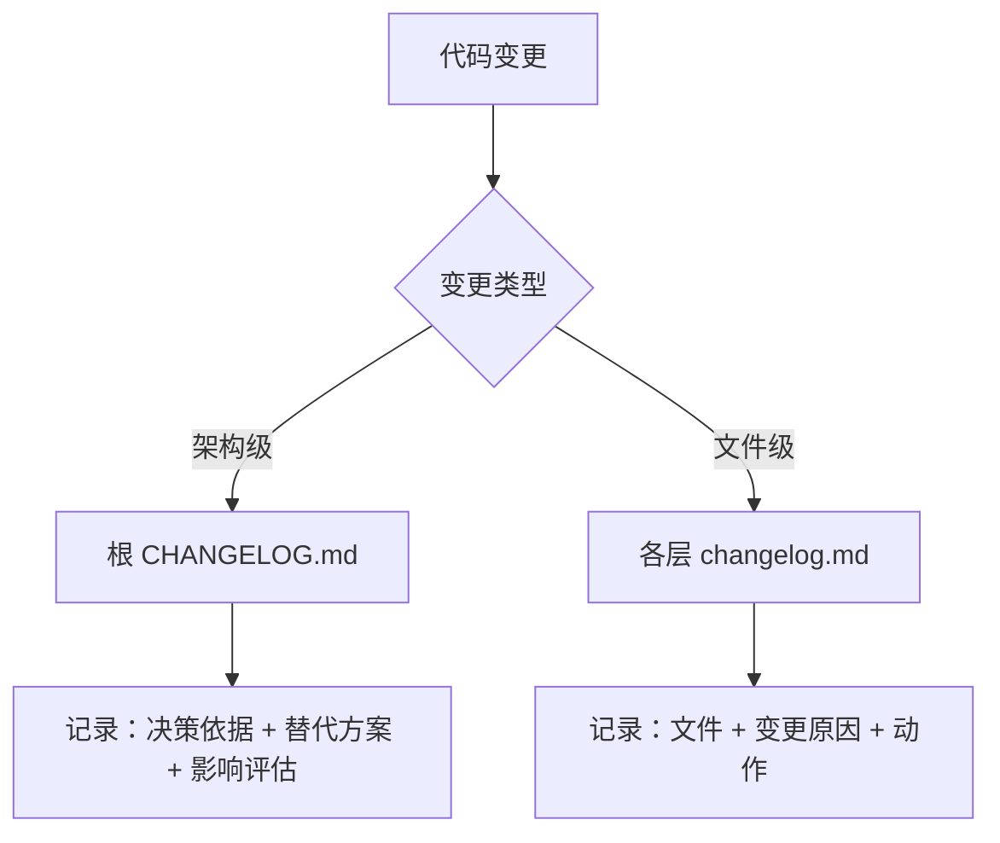
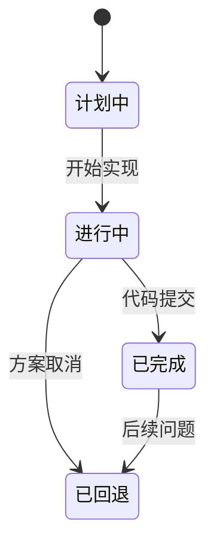

# Changelog 规范（强制）

> 状态：Accepted | 决策人：陈梓键 | 日期：2026-07-13

---

## 1. 决策背景 (Context)

团队在跨设备协作中面临以下问题：
1. 换机后 AI 无法快速了解上一次会话的代码变更范围
2. 代码变更缺乏统一的记录入口，排查问题时需要遍历 git log
3. 架构级变更（新增/删除模块、技术栈调整）与文件级变更混在一起，影响可追溯性

**决策**：采用两层 changelog 结构，根层记录架构决策，各层记录文件变更，强制 AI 在每次会话结束前更新。

---

## 2. 层级结构



| 层级 | 文件 | 触发条件 | 核心字段 |
|------|------|----------|----------|
| 架构级 | 根 `CHANGELOG.md` | 新增/删除目录层、技术栈变更、跨层重构、项目级配置变更 | 决策依据、替代方案、影响评估 |
| 文件级 | 各层 `changelog.md` | 文件新增/修改/删除、接口变更、逻辑调整 | 变更原因、动作类型 |

---

## 3. 各层 changelog 位置

| 层级 | 路径 |
|------|------|
| 前端 API | `src/api/changelog.md` |
| 前端路由 | `src/router/changelog.md` |
| 前端状态 | `src/stores/changelog.md` |
| 前端页面 | `src/views/changelog.md` |
| 前端组件 | `src/components/changelog.md` |
| 前端样式 | `src/styles/changelog.md` |
| 前端工具 | `src/utils/changelog.md`（如有） |
| 后端路由 | `server/src/routes/changelog.md` |
| 后端控制器 | `server/src/controllers/changelog.md` |
| 后端中间件 | `server/src/middleware/changelog.md` |

**新增层时必须同步创建该层的 `changelog.md`，并在根 `CHANGELOG.md` 登记架构变更。**

---

## 4. 记录要求

### 4.1 通用要求
- 所有 changelog 按倒序排列（最新在最上方）
- 每条记录包含：日期、动作、文件名、说明、commit hash（如有）
- 会话结束前必须确认相关 changelog 已更新
- 若用户未要求提交，仅更新文件不自动 commit

### 4.2 变更生命周期



| 状态 | 含义 | 标注方式 |
|------|------|----------|
| 计划中 | 已决策但未开始实施 | 标记 `[计划]` |
| 进行中 | 正在实施，部分完成 | 标记 `[进行中]` |
| 已完成 | 代码已提交合并 | 标记 `[已完成]`（默认） |
| 已回退 | 变更被撤销 | 标记 `[已回退]`，注明原因 |

---

## 5. 格式模板

### 5.1 根 CHANGELOG.md（架构级）

```markdown
# Changelog

> 架构级改动记录，倒序排列。

---

## YYYY-MM-DD 变更主题

### 决策依据
{为什么做这个变更？解决什么问题？}

### 替代方案
- 方案 A：{描述} — 否决原因：{理由}
- 方案 B：{描述} — 否决原因：{理由}

### 变更内容
- [新增/删除/修改] 层名称 — 说明
- commit: <hash>（如有）

### 影响评估
- 影响范围：{涉及模块}
- 回滚风险：{高/中/低}
- 依赖变更：{是否有依赖变更}
```

### 5.2 各层 changelog.md（文件级）

```markdown
# <层名> Changelog

> 倒序排列，最新在最上方。

---

## YYYY-MM-DD
- [状态] [动作] 文件名 — 说明
- 原因：{为什么做这个变更}
- commit: <hash>（如有）
```

**动作类型**：`[新增]` `[修改]` `[删除]` `[重构]` `[修复]`

---

## 6. 后果 (Consequences)

### 正面收益
- **跨设备可追溯**：换机后 AI 读取 changelog 即可恢复上下文
- **决策可回溯**：架构级变更保留"为什么"的决策依据，避免重复讨论
- **风险可控**：影响评估字段帮助识别变更风险

### 负面妥协
- **维护成本**：每次变更需额外记录，增加会话收尾工作量
- **一致性依赖**：若某次遗漏更新，changelog 与实际代码产生偏差

### 风险与缓解

| 风险 | 影响 | 缓解措施 |
|------|------|----------|
| 忘记更新 changelog | 中 | 会话结束前 AI 自动检查变更文件并提醒 |
| changelog 与代码不一致 | 低 | 以 git log 为准，changelog 为辅助 |
| 根 CHANGELOG 过于冗长 | 低 | 仅记录架构级变更，文件级变更放各层 |