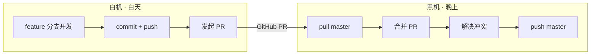

# 白机 / 黑机 双机协作工作流

> **场景**：单人开发者，白天一台设备（白机），晚上一台设备（黑机），通过 GitHub 中央仓库协同。

---

## 设备清单

| 角色 | 设备 | 配置 | 职责 |
|------|------|------|------|
| 白机 | 荣耀笔记本 X16 Plus | 便携本 | 白天开发、需求沟通、调研 |
| 黑机 | 主力机 | RTX 4070，ComfyUI 已部署 | 主导项目全程、AI 生图、合并 PR、部署 |
| 服务器 | 阿里云 ECS | 2核2G，40G 系统盘 | 网站部署（Nginx + Express + Colyseus） |

**分工原则**：
- 白机：轻量开发，需求沟通，不跑 AI 模型
- 黑机：全栈开发，ComfyUI 生图，最终合并与部署
- 服务器：仅运行生产服务，不跑 AI 模型，不存储 ComfyUI 模型

---

## 核心原则

**一句话**：白机只开发不合并，黑机先合并再开发。白机所有改动走 feature 分支；黑机先合并白机的 PR，然后切自己的 feature 分支继续开发。

---

## 操作流程

### 白机（白天）

| 步骤 | 命令 | 说明 |
|------|------|------|
| 1. 切出功能分支 | `git checkout -b feature/xxx` | 从 master 切出，命名参考 `git-workflow.md` |
| 2. 开发 + 提交 | `git add .` → `git commit -m "..."` | 可分多次提交 |
| 3. 推送分支 | `git push -u origin feature/xxx` | 首次推送 |
| 4. 后续提交 | `git push origin feature/xxx` | 同一分支，PR 自动更新 |
| 5. 发起 PR | GitHub 网页操作 | **不合并**，留给黑机处理 |

**白机禁止事项**：
- ❌ 禁止直接推 master
- ❌ 禁止在 GitHub 上点 Merge
- ❌ 禁止在白机上合并 PR

**白机已有未推送提交时，需要换到黑机继续开发**：
- 白机：`git push origin feature/xxx`（推送所有提交）
- 黑机：`git fetch origin` → `git checkout -b feature/xxx origin/feature/xxx`（拉取分支继续开发）

### 黑机（晚上）

| 步骤 | 命令 | 说明 |
|------|------|------|
| 1. 确保 master 最新 | `git checkout master` → `git pull origin master` | |
| 2. 拉取功能分支 | `git fetch origin` | |
| 3. 合并 | `git merge origin/feature/xxx` | 如无冲突直接成功 |
| 4. 解决冲突 | 编辑器处理 → `git add .` → `git commit -m "merge: xxx"` | 如有冲突 |
| 5. 推送 master | `git push origin master` | 合并后的 master |
| 6. 清理 | `git branch -d feature/xxx` + `git push origin --delete feature/xxx` | 删除本地和远程功能分支 |

**黑机合并后**：master 为最新，切新 feature 分支开始当晚的开发。睡前推送分支 + 发起 PR，留给次日白机合并。

**循环往复**：白机和黑机互为对方的"合并者"，谁接手谁先合并对方的 PR，再开始自己的开发。

---

## 当前分支状态（动态更新）

> 此节由 AI 在每次操作后更新，记录当前活跃分支。

| 字段 | 值 |
|------|-----|
| 当前活跃分支 | `feature/ai-collab-infra` |
| 白机状态 | 已推送，等待黑机合并 |
| 黑机待办 | merge `feature/ai-collab-infra` → master |
| 最后更新 | 2026-07-13 |

---

## 冲突预防

| 风险 | 预防措施 |
|------|----------|
| 白机直推 master | 本规则强制禁止，AI 拦截 |
| 两机同时修改同一文件 | 白机先 push，黑机 merge 时解决冲突 |
| 忘记切换分支 | 每次操作前 `git branch --show-current` 确认 |
| 锁文件冲突 | 白机提交时包含 `pnpm-lock.yaml`，黑机合并后重新 `pnpm install` |

---

## AI 行为准则

1. **每次 git 操作前**：静默执行 `git branch --show-current`，确认在正确分支
2. **白机模式**：AI 拒绝任何直接推 master 的请求，引导用户创建 feature 分支
3. **黑机模式**：AI 主动提示"请先合并白机的 PR，再开始新开发"
4. **提交前**：更新 `.ai/handoff.md` 记录进度
5. **换机时**：在白机上 `git push` 所有提交，在黑机上 `git fetch` 后继续