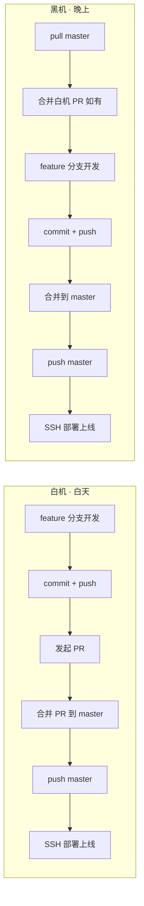

# 白机 / 黑机 双机协作工作流

> **场景**：单人开发者，白天一台设备（白机），晚上一台设备（黑机），通过 GitHub 中央仓库协同。

---

## 设备清单

| 角色 | 设备 | 配置 | 职责 |
|------|------|------|------|
| 白机 | 荣耀笔记本 X16 Plus | 便携本 | 白天开发、合并 PR、部署上线、需求沟通 |
| 黑机 | 主力机 | AMD R7 9700X / 32GB DDR5 6000 / RTX 4070 12GB / 3TB NVMe SSD / 750W 金牌 | 晚上开发 + AI 生图（ComfyUI）+ **检索算力节点（规划中）** |
| 服务器 | 阿里云 ECS | 2核2G，ESSD Entry 40GB，3Mbps | 网站部署（Nginx + Express + Colyseus） |

### 黑机硬件详情

| 部件 | 型号 | 规格 |
|------|------|------|
| CPU | AMD Ryzen 7 9700X | 8核16线程，Zen 5 架构 |
| 主板 | 微星 B650M GAMING WIFI | AM5，DDR5，WiFi |
| 内存 | 阿斯加特 32GB（16G×2）DDR5 6000 | 金仑加&TUF 联名 |
| GPU | 技嘉 RTX 4070 WF3OC 12G V2 | 12GB GDDR6X |
| 固态硬盘 1 | 阿斯加特女武神 V3 1TB | NVMe PCIe 3.0 |
| 固态硬盘 2 | 西数蓝盘 2TB | NVMe PCIe 4.0 |
| 电源 | 航嘉 WD750K 金牌 750W | 80PLUS 金牌，原生 PCIe 5.0 |
| 机箱 | 航嘉 S980 龙卷风海景房 | 360 水冷位，10 风扇位 |
| 散热 | 利民 Frozen Infinity 360 白色 | 一体式水冷，幻彩无限镜 |
| 显示器 | AOC Q27G11E | 27英寸 2K 210Hz Fast IPS |

**分工原则**：
- 白机：白天全流程（开发 + 合并 + 部署），不跑 AI 模型
- 黑机：晚上全流程（开发 + 合并 + 部署）+ ComfyUI 生图 + **全量检索算力（规划中，利用 32GB 内存把 700MB 数据库常驻内存）**
- 服务器：仅运行生产服务，不跑 AI 模型，不存储 ComfyUI 模型

---

## 核心原则

**一句话**：两机能力对等，均可开发、合并、部署。换机第一件事：先合并对方遗留的 PR，再开始自己的开发。

---

## 操作流程（两机通用）

### 开发流程

| 步骤 | 命令 | 说明 |
|------|------|------|
| 1. 切出功能分支 | `git checkout -b feature/xxx` | 从 master 切出 |
| 2. 开发 + 提交 | `git add .` -> `git commit -m "..."` | 可分多次提交 |
| 3. 推送分支 | `git push -u origin feature/xxx` | 首次推送 |
| 4. 后续提交 | `git push origin feature/xxx` | 同一分支 |

### 合并流程

| 步骤 | 命令 | 说明 |
|------|------|------|
| 1. 确保 master 最新 | `git checkout master` -> `git pull origin master` | |
| 2. 合并功能分支 | `git merge origin/feature/xxx` | 如无冲突直接成功 |
| 3. 解决冲突 | 编辑器处理 -> `git add .` -> `git commit -m "merge: xxx"` | 如有冲突 |
| 4. 推送 master | `git push origin master` | |
| 5. 清理 | `git branch -d feature/xxx` + `git push origin --delete feature/xxx` | 可选 |

### 部署流程

| 步骤 | 命令 | 说明 |
|------|------|------|
| 1. 前端构建 | `npm run build` | 本地验证构建通过 |
| 2. SSH 到服务器 | `ssh user@server` | |
| 3. 拉取最新代码 | `git pull origin master` | 在服务器上执行 |
| 4. 安装依赖 | `npm install`（如有变更） | |
| 5. 重启服务 | `systemctl --user restart xxx` 或 PM2 | |
| 6. 验证 | `curl` 检查 HTTP 200 | |

> 部署需用户明确指示，AI 不得自行部署（详见 `deploy-discipline.md`）。

---

## 换机交接

**换机时必须**：
1. 当前机器：`git push` 所有提交到 feature 分支或 master
2. 更新 `.ai/handoff.md`（分支状态、未完成事项、下一步）
3. 接手机器：`git fetch origin` -> `git pull origin master` -> 先合并对方遗留 PR

---

## 当前分支状态（动态更新）

> 此节由 AI 在每次操作后更新，记录当前活跃分支。

| 字段 | 值 |
|------|-----|
| 当前活跃分支 | `feature/refactor-trae-dir`（已推送，等待黑机合并） |
| 最后更新 | 2026-07-15 |

---

## 冲突预防

| 风险 | 预防措施 |
|------|----------|
| 两机同时修改同一文件 | 先 push 的为准，后 merge 的解决冲突 |
| 忘记切换分支 | 每次操作前 `git branch --show-current` 确认 |
| 锁文件冲突 | 统一使用 `npm`，合并后重新 `npm install` |
| 两机同时部署 | 部署前确认 master 为最新，避免覆盖 |

---

## AI 行为准则

1. **每次 git 操作前**：静默执行 `git branch --show-current`，确认在正确分支
2. **合并前**：确认 master 已 `git pull`，避免覆盖远端
3. **提交前**：更新 `.ai/handoff.md` 记录进度
4. **换机时**：当前机器 `git push` 所有提交，接手机器 `git fetch` 后先合并对方 PR
5. **部署时**：必须用户明确指示，AI 不得自行执行部署命令
