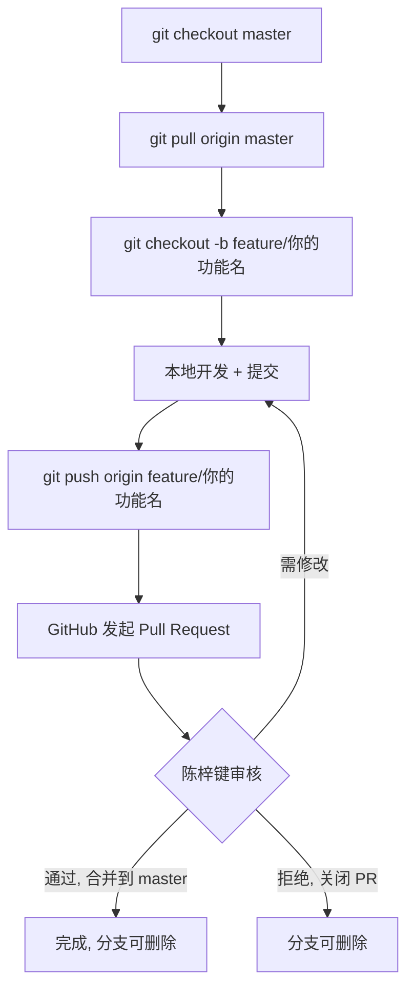

# 协作开发指南

> 面向项目协作者（丘序明）。克隆仓库后请先阅读本文件。

## 项目角色

| 成员 | 职责 | 分支权限 |
|------|------|----------|
| 陈梓键 | 维护 master、审核 PR、部署 | master 直接推送 + 合并 PR |
| 丘序明 | feature/fix 分支开发 | 自有分支推送，发起 PR，**不可直接推 master** |

---

## 一、技术栈与项目结构

### 技术栈

| 层 | 技术 | 说明 |
|------|------|------|
| 前端 | Vue 3 + Vite 6 + Pinia + Vue Router | SPA，开发端口 5173 |
| 后端 | Node.js + Express 4 | REST API，端口 3000 |
| 数据库 | SQLite | 文件型，无需额外安装 |
| 包管理 | pnpm（项目内置 bundle） | 见下方说明 |

### 目录结构

```
nandexueyuan/
├── src/                # 前端源码
│   ├── api/            #   API 请求封装
│   ├── components/     #   公共组件
│   ├── router/         #   路由配置
│   ├── stores/         #   Pinia 状态管理
│   ├── styles/         #   全局样式
│   └── views/          #   页面视图
├── server/             # 后端源码
│   └── src/
│       ├── controllers/  #   控制器（业务逻辑）
│       ├── middleware/   #   中间件
│       ├── routes/       #   路由定义
│       └── index.js      #   入口
├── public/             # 静态资源（媒体文件不提交）
├── prd/                # 产品需求文档
├── .trae/rules/        # 项目规则（必读）
├── .env.example        # 环境变量模板
└── package.json        # 前端依赖
```

> 每层目录下有 `changelog.md`，记录该层所有改动，开发前先看相关层的 changelog 了解上下文。

---

## 二、环境搭建

### 前置要求

- **Node.js** >= 18（推荐 LTS 版）
- **Git** 已安装并完成全局配置：

```bash
# 首次使用 Git 必须配置，否则 commit 会失败
git config --global user.name  "你的名字"
git config --global user.email "你的邮箱"
```

### 认证配置（二选一）

**方式 A：SSH Key（推荐）**

```bash
# 1. 生成密钥（已有可跳过）
ssh-keygen -t ed25519 -C "你的邮箱"
# 一路回车，密钥生成在 ~/.ssh/id_ed25519

# 2. 复制公钥内容
#    Windows: type %USERPROFILE%\.ssh\id_ed25519.pub
#    macOS:   cat ~/.ssh/id_ed25519.pub

# 3. 添加到 GitHub：Settings → SSH and GPG keys → New SSH key
#    粘贴公钥，Title 随意填

# 4. 验证
ssh -T git@github.com
#    出现 "Hi xxx! You've successfully authenticated" 即成功
```

**方式 B：HTTPS + Personal Access Token**

GitHub 已不支持密码认证，需用 PAT 代替：
1. GitHub → Settings → Developer settings → Personal access tokens → Generate new token
2. 勾选 `repo` 权限
3. clone / push 时用 GitHub 用户名 + Token 作为密码

### 安装步骤

```bash
# 1. 克隆仓库
git clone git@github.com:chen136523510/nandexueyuan.git
cd nandexueyuan

# 2. 启用 pnpm（Node >= 16.9 自带 corepack，无需全局安装）
corepack enable pnpm

# 3. 安装前端依赖
pnpm install

# 4. 安装后端依赖
cd server && pnpm install --ignore-workspace
cd ..

# 5. 配置环境变量
#    Windows:  copy .env.example .env
#    macOS:    cp .env.example .env
#    编辑 .env，填入本地实际值（数据库路径、JWT 密钥、端口等）

# 6. 启动开发
#    前端：npm run dev          → http://localhost:5173
#    后端：cd server && npm run dev  → http://localhost:3000
```

> `.env` 不提交 git，各设备各自配置。如缺少所需变量，联系陈梓键获取。

---

## 三、分支工作流



### 分支命名规范

| 前缀 | 用途 | 示例 |
|------|------|------|
| `feature/` | 新功能 | `feature/user-login` |
| `fix/` | bug 修复 | `fix/avatar-upload` |
| `refactor/` | 重构 | `refactor/api-layer` |

### 核心规则

1. **永远从最新 master 切分支**：切之前先 `git pull origin master`
2. **不直接推 master**：所有改动走 feature 分支 + PR
3. **一个分支做一件事**：不要在一个 feature 分支堆多个无关功能
4. **分支生命周期短**：合并后立即删除本地和远程分支

### 日常开发循环

```bash
# 1. 切到 master 并拉取最新
git checkout master
git pull origin master

# 2. 创建功能分支
git checkout -b feature/your-feature

# 3. 开发...完成后提交（指定具体文件，不要 git add .）
git add src/views/HomeView.vue src/api/user.js
git commit -m "feat(views): 首页用户卡片"

# 4. 推送到 GitHub
git push origin feature/your-feature

# 5. 到 GitHub 网页发起 Pull Request，目标分支选 master
#    指定陈梓键为 Reviewer
```

---

## 四、提交规范

### Commit Message 格式

```
<type>(<scope>): <摘要>
```

| type | 说明 | 示例 |
|------|------|------|
| feat | 新功能 | `feat(views): 用户登录页面` |
| fix | 修复 bug | `fix(api): 头像上传失败` |
| refactor | 重构（无功能变化） | `refactor(stores): 抽离用户状态` |
| docs | 文档变更 | `docs: 更新协作指南` |
| chore | 构建/配置/依赖 | `chore: 升级 vite 版本` |
| style | 格式调整（无逻辑变化） | `style: 统一缩进` |
| perf | 性能优化 | `perf(api): 减少列表请求冗余字段` |
| test | 测试相关 | `test(server): 补充路由单元测试` |

### Scope（可选，推荐）

前后端分离项目，scope 能快速定位改动范围：

| scope | 对应目录 | 说明 |
|------|------|------|
| `views` | `src/views/` | 前端页面 |
| `components` | `src/components/` | 前端组件 |
| `api` | `src/api/` | 前端 API 封装 |
| `stores` | `src/stores/` | 前端状态管理 |
| `router` | `src/router/` | 前端路由 |
| `server` | `server/src/` | 后端整体 |
| `routes` | `server/src/routes/` | 后端路由 |
| `controllers` | `server/src/controllers/` | 后端控制器 |

### 要求

- 一次提交 = 一个完整的逻辑变更
- 不要提交无法编译的代码
- 不要提交 `.env` 文件
- `git add` 指定具体文件，不要用 `git add .`

---

## 五、同步上游变更

开发期间 master 可能被他人更新，定期同步避免冲突：

```bash
# 在你的 feature 分支上
git fetch origin
git rebase origin/master    # 将你的提交变基到最新 master 之上
```

### 冲突解决

```bash
# rebase 遇到冲突时：
# 1. Git 会提示冲突文件，打开编辑器解决 <<<< ==== >>>> 标记
# 2. 解决后标记为已解决
git add <冲突文件>

# 3. 继续 rebase
git rebase --continue

# 4. 如有多个冲突，重复步骤 1-3

# 5. rebase 完成后推送（rebase 改写了历史，需强制推送自己的分支）
git push origin feature/your-feature --force-with-lease
```

> `--force-with-lease` 比 `--force` 安全，仅在你本地分支是最新的时才强制推送。
> **只对自己的 feature 分支用强制推送，永远不要对 master 用。**

---

## 六、Pull Request 流程

1. **发起 PR**：GitHub 网页 → Pull requests → New pull request → 源分支选你的 feature，目标选 master
2. **填写标题**：用 commit message 格式，如 `feat(views): 首页用户卡片`
3. **填写描述**（参考模板）：

```markdown
## 改了什么
<!-- 简述本次改动内容 -->

## 为什么改
<!-- 背景或需求来源 -->

## 怎么测
<!-- 本地验证步骤，如：启动前端 → 打开首页 → 点击 XX → 预期 YY -->
```

4. **指定 Reviewer**：选陈梓键
5. **等待审核**：
   - 需修改 → 在**原分支**继续 commit + push，PR 自动更新，无需新建 PR
   - 审核通过 → 陈梓键合并到 master
   - 拒绝 → PR 关闭，分支可删除
6. **合并后清理**：

```bash
git checkout master
git pull origin master
git branch -d feature/your-feature             # 删本地
git push origin --delete feature/your-feature  # 删远程
```

---

## 七、不提交的内容

以下内容由 `.gitignore` 忽略，**切勿手动添加**：

| 路径 | 说明 |
|------|------|
| `node_modules/` | 依赖目录 |
| `.env` | 环境变量 |
| `dist/` | 构建产物 |
| `*.db` | 数据库文件 |
| `public/media/**/*` | 媒体文件（仅保留目录结构） |
| `package/` | pnpm standalone bundle |
| `logs/`、`*.log` | 日志文件 |
| `.trae/*`（保留 `.trae/rules/`） | IDE 配置 |

---

## 八、常见问题

| 问题 | 解决 |
|------|------|
| 拉取/推送失败 | 检查网络；确认 SSH key 已添加到 GitHub；确认账号有仓库访问权限（联系陈梓键邀请） |
| commit 失败提示无 user.name | `git config --global user.name "名字"` 和 `git config --global user.email "邮箱"` |
| 冲突 | `git rebase origin/master` 后逐个解决冲突文件（见第五节） |
| 不确定改哪里 | 先看 `.trae/rules/` 下的项目规则与各层 `changelog.md` |
| 缺环境变量 | 联系陈梓键 |
| 误提交了大文件 | 在 feature 分支上 `git reset HEAD~1` 撤销最近一次提交，重新 add 正确文件后重提交 |
| commit 到了错误分支 | `git log` 确认提交 → `git reset HEAD~N`（N 为误提交数）→ 切到正确分支 → `git stash pop` 或重新提交 |
| 想撤销最近一次提交 | `git reset --soft HEAD~1`（保留改动到暂存区）→ 修改后重新提交 |
