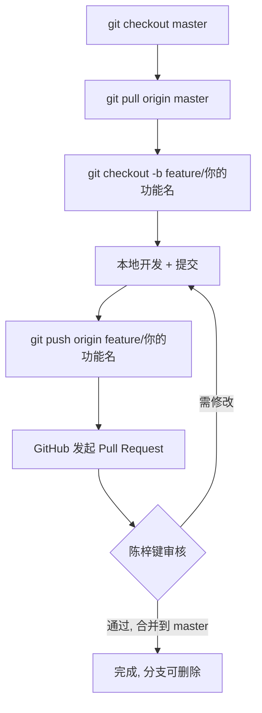

# 协作开发指南

> 面向项目协作者（丘序明）。克隆仓库后请先阅读本文件。

## 项目角色

| 成员 | 职责 | 分支权限 |
|------|------|----------|
| 陈梓键 | 维护 master、审核 PR、部署 | master 直接推送 + 合并 PR |
| 丘序明 | feature/fix 分支开发 | 自有分支推送，发起 PR，**不可直接推 master** |

---

## 一、环境搭建

```bash
# 1. 克隆仓库（从 GitHub）
git clone https://github.com/chen136523510/nandexueyuan.git
cd nandexueyuan

# 2. 安装前端依赖
node package/dist/pnpm.mjs install

# 3. 安装后端依赖
cd server && node ../package/dist/pnpm.mjs install --ignore-workspace
cd ..

# 4. 配置环境变量
cp .env.example .env
#   编辑 .env，填入本地实际值（数据库路径、JWT 密钥、端口等）

# 5. 启动开发
#   前端：npm run dev
#   后端：cd server && npm run dev
```

> `.env` 不提交 git，各设备各自配置。如缺少所需变量，联系陈梓键获取。

---

## 二、分支工作流



### 分支命名规范

| 前缀 | 用途 | 示例 |
|------|------|------|
| `feature/` | 新功能 | `feature/user-login` |
| `fix/` | bug 修复 | `fix/avatar-upload` |
| `refactor/` | 重构 | `refactor/api-layer` |

### 核心规则

1. **永远从最新 master 切分支**：切之前先 `git pull origin master`
2. **不直接推 master**：所有改动走 feature 分支 + PR
3. **一个分支做一件事**：不要在一个 feature 分支堆多个无关功能
4. **分支生命周期短**：合并后立即删除本地和远程分支

---

## 三、日常开发循环

```bash
# 1. 切到 master 并拉取最新
git checkout master
git pull origin master

# 2. 创建功能分支
git checkout -b feature/your-feature

# 3. 开发...完成后提交
git add <具体文件>          # 不要用 git add .，避免误提交
git commit -m "feat: 简要描述本次改动"

# 4. 推送到 GitHub
git push origin feature/your-feature

# 5. 到 GitHub 网页发起 Pull Request，目标分支选 master
#    指定陈梓键为 Reviewer
```

---

## 四、提交规范

### Commit Message 格式

```
<type>: <摘要>
```

| type | 说明 | 示例 |
|------|------|------|
| feat | 新功能 | `feat: 用户登录页面` |
| fix | 修复 bug | `fix: 头像上传失败` |
| refactor | 重构（无功能变化） | `refactor: 抽离请求拦截器` |
| docs | 文档变更 | `docs: 更新 README` |
| chore | 构建/配置/依赖 | `chore: 升级 vite 版本` |
| style | 格式调整（无逻辑变化） | `style: 统一缩进` |

### 要求
- 一次提交 = 一个完整的逻辑变更
- 不要提交无法编译的代码
- 不要提交 `.env` 文件
- `git add` 指定具体文件，不要用 `git add .`

---

## 五、同步上游变更

开发期间 master 可能被他人更新，定期同步避免冲突：

```bash
# 在你的 feature 分支上
git fetch origin
git rebase origin/master    # 将你的提交变基到最新 master 之上

# 如有冲突：解决冲突 → git add → git rebase --continue
# 推送（rebase 后需强制推送自己的分支，安全）
git push origin feature/your-feature --force-with-lease
```

> `--force-with-lease` 比 `--force` 安全，仅在你本地分支是最新的时才强制推送。

---

## 六、Pull Request 流程

1. **发起 PR**：GitHub 网页 → Pull requests → New pull request → 源分支选你的 feature，目标选 master
2. **填写描述**：说明改了什么、为什么改、如何测试
3. **指定 Reviewer**：选陈梓键
4. **等待审核**：
   - 需修改 → 在原分支继续提交 → PR 自动更新 → 再次推送
   - 审核通过 → 陈梓键合并到 master → 你的分支可删除
5. **合并后清理**：
   ```bash
   git checkout master
   git pull origin master
   git branch -d feature/your-feature      # 删本地
   git push origin --delete feature/your-feature  # 删远程
   ```

---

## 七、不提交的内容

以下内容由 `.gitignore` 忽略，**切勿手动添加**：

- `node_modules/` — 依赖目录
- `.env` — 环境变量
- `dist/` — 构建产物
- `*.db` — 数据库文件
- `public/media/**/*` — 媒体文件
- `package/` — pnpm bundle

---

## 八、遇到问题

| 问题 | 解决 |
|------|------|
| 拉取/推送失败 | 检查网络、确认账号有仓库访问权限（联系陈梓键邀请） |
| 冲突 | `git rebase origin/master` 后逐个解决冲突文件 |
| 不确定改哪里 | 先看 `.trae/rules/` 下的项目规则与各层 `changelog.md` |
| 缺环境变量 | 联系陈梓键 |
