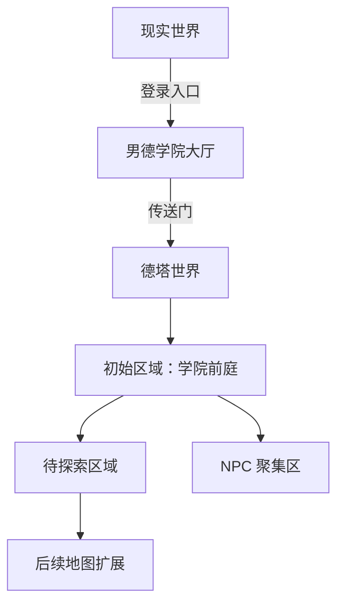

# 男德学院世界观

> 状态：V1（MVP 阶段） | 维护者：陈梓键 | 日期：2026-07-13
> 用途：为德塔（NDO）剧情模式提供背景设定，当前仅作基础框架，后续逐步丰富。

---

## 1. 核心设定

| 维度 | 设定 |
|------|------|
| 世界观基调 | 幽默自嘲 + 轻松日常，非严肃史诗 |
| 时空背景 | 现代都市 + 嵌入的像素异世界"德塔" |
| 角色来源 | 现实中的男德学院成员，在德塔中以像素化身出现 |

**一句话**：一群宅男发现了一个名为「德塔」的像素异世界，他们以 2D 像素化身在其中探索、互动、建造。

---

## 2. 德塔（NDO）—— 世界设定

### 2.1 起源

- 德塔（Delta）是一个与现实世界平行的 2D 像素维度
- 其入口随机出现在网络世界中，男德学院成员偶然发现了进入方法
- 德塔的物理法则与现实不同：世界是 2D 侧视角的，重力、方块、物理规则更接近游戏世界

### 2.2 世界结构

| 层级 | 说明 |
|------|------|
| 现实世界 | 浏览器/Web 端，用户登录界面 |
| 男德学院大厅 | 现有 Web 功能页面（首页、公告、AI 助手等） |
| 德塔世界 | 2D 像素虚拟世界，Phaser Canvas 渲染 |

### 2.3 德塔的规则

- 时间是线性的，与现实同步
- 所有进入者以像素化身出现，外观可自定义
- 世界中的 NPC 是有意识的像素生物，有些来自现实世界的投影（如男德通）
- 世界可以扩建、改造（后续版本）

---

## 3. 角色体系

### 3.1 玩家角色

- 现实中的男德学院成员，在德塔中自由选择像素化身
- 化身无等级、无属性（MVP），纯外观差异
- 化身是成员在德塔中的"身体"，可移动、跳跃、交互

### 3.2 NPC

| NPC | 定位 | 功能 | 背景故事（预留） |
|-----|------|------|-----------------|
| **男德通** | 学院 AI 管家 | AI 对话助手 | 德塔世界的原住民，意外获得了连接现实知识库的能力 |
| 院长 | 学院领袖 | 未来：发布任务/公告 | 德塔世界的管理者，通晓两个世界的规则 |
| 其他 NPC | 引导者/商人/任务发布者 | 未来扩展 | 各具性格的像素生命 |

### 3.3 势力/阵营（预留，V2+）

| 阵营 | 定位 | 说明 |
|------|------|------|
| 探索者 | 玩家阵营 | 进入德塔的男德学院成员 |
| 像素原住民 | NPC 阵营 | 德塔世界的原生生命 |
| 裂隙生物 | 敌对阵营（V2） | 从德塔裂隙中出现的未知存在 |

---

## 4. 剧情框架（预留，V2+）

### 4.1 主线方向

1. **发现篇**：成员们陆续发现德塔，建立第一个据点
2. **探索篇**：深入德塔世界，发现更多区域和原住民
3. **冲突篇**：裂隙生物的威胁，保卫德塔
4. **建设篇**：大规模改造德塔，建立自己的像素王国

### 4.2 叙事风格

- 轻松幽默，不黑暗不沉重
- NPC 对话带有梗和吐槽元素
- 玩家之间可自由互动，无强制剧情

### 4.3 剧情触发机制（预留）

- 探索特定区域触发对话
- 与 NPC 交互推进剧情
- 集体事件（如"裂隙入侵"全服活动）

---

## 5. 世界扩展路线图

| 阶段 | 内容 | 世界观关联 |
|------|------|------------|
| **MVP** | 学院前庭（初始地图） | 成员进入德塔，开始探索 |
| **V1** | 新区域 + 建造系统 | 成员改造德塔，建立据点 |
| **V2** | 战斗 + 裂隙生物 | 引入冲突，丰富世界观 |
| **V3** | 剧情任务 + 多区域 | 完整叙事体验 |

---

## 6. 设计原则

1. **轻量优先**：世界观服务于游戏体验，不强加深度叙事
2. **可扩展**：每个设定预留扩展空间，不锁死方向
3. **幽默感**：保持男德学院的调性，不严肃
4. **玩家驱动**：成员的行为塑造世界，而非预设剧情