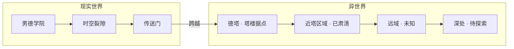
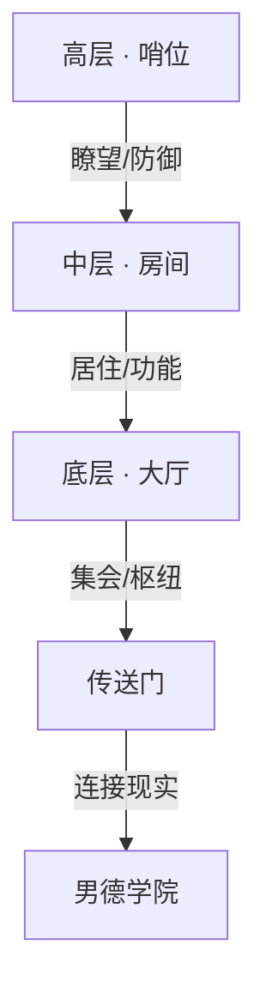

# 男德学院世界观

> 状态：V2（2026-07-13 修订） | 维护者：陈梓键
> 用途：为德塔（NDO）提供背景设定，支撑地图设计、剧情模式与后续扩展。

---

## 1. 核心设定

| 维度 | 设定 |
|------|------|
| 世界观基调 | 幽默自嘲 + 轻松日常，非严肃史诗 |
| 时空背景 | 现代都市 + 异世界（通过时空裂隙连接） |
| 角色来源 | 现实中的男德学院成员，在异世界以像素化身出现 |

**一句话**：男德学院发现了一道时空裂隙，打通了通往异世界的传送门。他们在传送门附近建起了一座塔楼——「德塔」，作为探索异世界的据点。

---

## 2. 世界结构

### 2.1 双世界模型

| 区域 | 状态 | 说明 |
|------|------|------|
| 现实世界 | 安全 | 男德学院日常活动场所 |
| 传送门 | 已打通 | 连接两个世界的通道，学院已掌握控制方法 |
| **德塔（塔楼）** | **已建成** | **学院在传送门附近建造的据点** |
| 近塔区域 | 已肃清 | 塔周围的安全区域，可自由活动 |
| 远域 | 未知 | 更远处的世界，需要学员们探索 |
| 深处 | 未触及 | 后续版本扩展区域 |

### 2.2 物理法则

异世界的物理法则与现实不同：
- 世界是 **2D 侧视角**的，由**格子（Grid）**构成
- 角色占 **1 格**（32x32 像素）
- 跳跃高度：最高 **2 格**（即从 1 格高度跳到 3 格高度）
- 存在重力、方块、平台，物理规则接近泰拉瑞亚/我的世界
- 时间与现实同步

### 2.3 德塔占地与外观

| 属性 | 设定 |
|------|------|
| 德塔占地 | **20 格宽**（640 像素） |
| 德塔外部 | 绿化树林环绕 |
| 天空 | 有云顶（云层装饰，视差滚动） |

---

## 3. 德塔（塔楼据点）

### 3.1 建筑结构

「德塔」是一座学院建造的塔楼，作为异世界的据点和前哨站：

| 层级 | 名称 | 功能 | 游戏映射 |
|------|------|------|----------|
| 底层 | **大厅** | 集会枢纽，传送门所在地，NPC 聚集 | **MVP 初始地图** |
| 中层 | **房间** | 学员居住区、功能室（预留） | V1+ 扩展地图 |
| 高层 | **哨位** | 瞭望塔、防御工事，观察异世界 | V2+ 扩展地图 |
| 塔外 | **近塔区域** | 已肃清的安全区域，公告牌/交互点 | MVP 地图外围 |

### 3.2 大厅（MVP 初始地图）

大厅是所有玩家进入德塔的**出生点和集散中心**：

| 区域 | 内容 | 功能 |
|------|------|------|
| 传送门入口 | 玩家出生点 | 进入德塔的位置 |
| 男德通位置 | NPC · 男德通 | AI 对话助手 |
| 公告牌 | 可交互物品 | 群公告查看 |
| 塔楼大门 | **大门（可交互）** | 通往塔外的门，现阶段未开放 |
| 楼梯 | 向上通道 | 通往中层房间（预留，V1） |

### 3.3 塔楼大门彩蛋

现阶段塔外世界未开放，玩家与大门交互时弹出文字气泡（箭头指向门），多次交互循环弹出：

| 交互次数 | 气泡文字 |
|----------|----------|
| 第 1 次 | **「那一天，人类终于回想起了被巨人支配的恐惧……」** |
| 第 2 次 | **「前面的区域以后再来探索吧……」** |
| 第 3+ 次 | 循环以上两句 |

---

## 4. 角色体系

### 4.1 玩家角色

- 现实中的男德学院成员，通过传送门以像素化身进入异世界
- 化身无等级、无属性（MVP），纯外观差异
- 可移动、跳跃、交互

### 4.2 NPC

| NPC | 定位 | 位置 | 功能 | 背景故事 |
|-----|------|------|------|----------|
| **男德通** | 学院 AI 管家 | 大厅 | AI 对话助手 | 学院部署在德塔的 AI 管家，连接现实知识库 |
| 院长 | 学院领袖 | 大厅/哨位 | 未来：发布任务/公告 | 德塔建造的总指挥 |
| 其他 NPC | 引导者/商人/任务发布者 | 各层 | 未来扩展 | 各具性格的像素生命 |

### 4.3 势力/阵营（预留，V2+）

| 阵营 | 定位 | 说明 |
|------|------|------|
| 男德学院 | 玩家阵营 | 进入异世界的探索者 |
| 异世界原住民 | NPC 阵营 | 异世界的原生生命（友好/中立/敌对） |
| 裂隙生物 | 敌对阵营（V2） | 从时空裂隙深处出现的未知存在 |

---

## 5. 剧情框架（预留，V2+）

### 5.1 主线方向

1. **发现篇**：学院发现时空裂隙，打通传送门
2. **建设篇**：在传送门附近建造德塔，建立据点
3. **探索篇**：探索近塔区域，向远域推进
4. **冲突篇**：裂隙生物的威胁，保卫德塔
5. **扩张篇**：大规模探索异世界深处

### 5.2 叙事风格

- 轻松幽默，不黑暗不沉重
- NPC 对话带有梗和吐槽元素
- 玩家之间可自由互动，无强制剧情

---

## 6. 世界扩展路线图

| 阶段 | 世界观 | 地图 | 玩法 |
|------|--------|------|------|
| **MVP** | 德塔底层大厅 | 大厅地图 | 移动 + NPC交互 + 物品交互 |
| **V1** | 德塔中层房间 + 近塔区域 | 新地图 | 建造/挖掘/放置 |
| **V2** | 德塔高层哨位 + 远域探索 | 新地图 | 战斗 + 物品/背包 |
| **V3** | 异世界深处 + 剧情任务 | 新地图 | NPC/敌人 + 任务系统 |

---

## 7. 设计原则

1. **塔为核心**：德塔塔楼是所有活动的中心，地图围绕塔展开
2. **渐进探索**：从大厅开始，逐层逐区域解锁，不一次性开放全部世界
3. **轻量优先**：世界观服务于游戏体验，不强加深度叙事
4. **幽默感**：保持男德学院的调性，不严肃
5. **玩家驱动**：成员的行为塑造世界，而非预设剧情

---

## 8. 变更记录

| 日期 | 版本 | 变更 |
|------|------|------|
| 2026-07-13 | V1 | 初始版本：德塔定义为"像素异世界" |
| 2026-07-13 | V2 | **重大修订**：明确德塔=塔楼据点（非世界本身），新增三层结构（大厅/房间/哨位）、传送门设定、双世界模型、近塔区域概念 |
| 2026-07-14 | V3 | 新增格子规则（角色占1格/跳跃2格）、德塔占地20格、外部绿化树林+云顶、塔楼大门彩蛋文字 |
