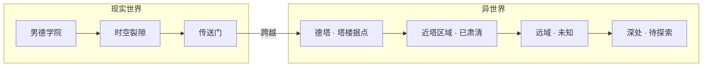
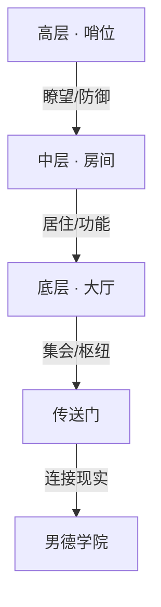

# 男德学院世界观

> 状态：V4（2026-07-29 修订） | 维护者：陈梓键
> 用途：描述男德学院社区的元设定框架（现实社区 → 德塔游戏）。
>
> ⚠️ **德塔游戏内的世界观（六大势力/虚空纪元/角色设定/地理格局）以设定集 v1.3 为唯一权威：**
> → [德塔世界观设定集-v1.3](../04-德塔/02-设计/德塔世界观设定集-v1.3.md)
>
> 本文档描述的是社区的元框架：男德学院（现实社区）→ 德塔（游戏产品）的关系。
> 下文中的 2D 游戏机制设定（侧视角/格子/跳跃/塔楼大门彩蛋）属于 MVP 阶段历史方案，
> 当前德塔已转向视觉小说方向，这些游戏机制不再作为开发依据。

---

## 1. 核心设定

| 维度 | 设定 |
|------|------|
| 社区定位 | 朋友圈限定的小型社区，以男德学院为品牌 |
| 产品形态 | 社区网站（首页/男德通/师德墙）+ 德塔视觉小说 |
| 德塔世界观 | **以设定集 v1.3 为准**（黑深残×戏谑反差，虚空纪元 A.V.118） |
| 角色来源 | 现实中的男德学院成员，在德塔中以剧情角色出现 |

**一句话**：男德学院是一个现实中的小社区，其成员以德塔世界观为背景创作了视觉小说游戏，玩家在游戏中体验学院降临虚空世界的故事。

---

## 2. 历史世界结构（MVP 阶段，已归档）

> 以下内容属于 MVP 阶段 2D 游戏方案的世界结构设定，当前已转向视觉小说方向。
> 保留作为历史参考，不再作为开发依据。

### 2.1 双世界模型

```mermaid
flowchart LR
    subgraph 现实世界
        A[男德学院] --> B[时空裂隙]
        B --> C[传送门]
    end

    C -->|跨越| D

    subgraph 异世界
        D[德塔 · 塔楼据点]
        D --> E[近塔区域 · 已肃清]
        E --> F[远域 · 未知]
        F --> G[深处 · 待探索]
    end
```

### 2.2 物理法则（2D 游戏机制，已废弃）

- 世界是 **2D 侧视角**的，由**格子（Grid）**构成
- 角色占 **1 格**（32x32 像素）
- 跳跃高度：最高 **2 格**
- 存在重力、方块、平台，物理规则接近泰拉瑞亚/我的世界
- 当前德塔已转为视觉小说，以上机制不再适用

### 2.3 德塔占地与外观

| 属性 | 设定 |
|------|------|
| 德塔占地 | **20 格宽**（640 像素）（历史方案） |
| 德塔外部 | 绿化树林环绕 |
| 天空 | 有云顶（云层装饰，视差滚动） |

---

## 3. 德塔（塔楼据点）

> 以下建筑结构设定属于 MVP 2D 游戏方案，视觉小说中的德塔以设定集 v1.3 为准。

### 3.1 建筑结构（历史方案）

「德塔」是一座学院建造的塔楼，作为异世界的据点和前哨站：

```mermaid
flowchart TD
    F[高层 · 哨位] -->|瞭望/防御| E
    E[中层 · 房间] -->|居住/功能| D
    D[底层 · 大厅] -->|集会/枢纽| G
    G[传送门] -->|连接现实| R[男德学院]
```

| 层级 | 名称 | 功能 | 历史游戏映射 |
|------|------|------|----------|
| 底层 | **大厅** | 集会枢纽，传送门所在地 | 曾为 MVP 初始地图 |
| 中层 | **房间** | 学员居住区、功能室 | V1+ 扩展地图（已废弃） |
| 高层 | **哨位** | 瞭望塔、防御工事 | V2+ 扩展地图（已废弃） |
| 塔外 | **近塔区域** | 已肃清的安全区域 | MVP 地图外围（已废弃） |

---

## 4. 角色体系（历史方案）

> 视觉小说中的角色设定以设定集 v1.3 为准。以下为 MVP 阶段的角色框架，保留作参考。

### 4.1 玩家角色

- 现实中的男德学院成员，通过传送门以像素化身进入异世界
- 化身无等级、无属性（MVP），纯外观差异
- 当前视觉小说中，玩家为「漂泊者」主角，剧情角色为睿/丘/杰/汪神等

### 4.2 NPC

| NPC | 定位 | 功能 |
|-----|------|------|
| **男德通** | 学院 AI 管家 | AI 对话助手（在视觉小说中保留此功能） |
| 院长 | 学院领袖 | 德塔建造的总指挥 |
| 其他 NPC | 引导者/商人/任务发布者 | 各具性格的角色 |

---

## 5. 设计原则

1. **设定集为准**：德塔游戏内世界观统一以设定集 v1.3 为权威
2. **社区驱动**：成员的行为和创作塑造内容
3. **渐进扩展**：从序章开始，逐步解锁更多剧情和区域

---

## 6. 变更记录

| 日期 | 版本 | 变更 |
|------|------|------|
| 2026-07-13 | V1 | 初始版本：德塔定义为"像素异世界" |
| 2026-07-13 | V2 | 明确德塔=塔楼据点，新增三层结构、传送门设定 |
| 2026-07-14 | V3 | 新增格子规则、德塔占地、塔楼大门彩蛋 |
| 2026-07-29 | V4 | **方向修正**：德塔已转向视觉小说，世界观权威指向设定集v1.3。本文档保留社区元框架+历史方案归档，不再作为开发依据 |
