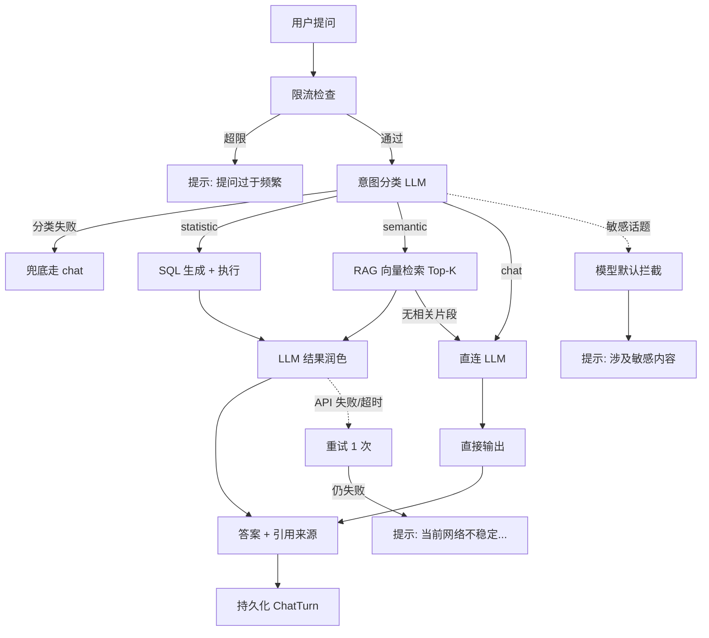
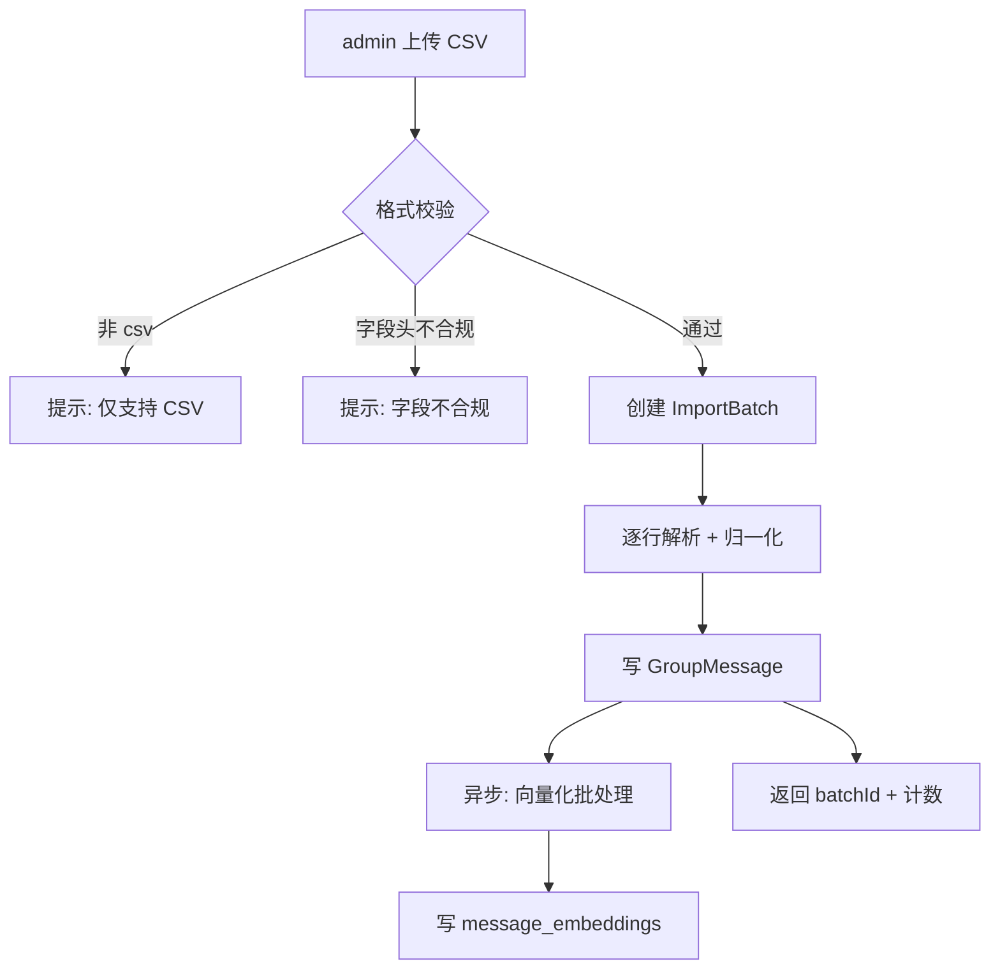
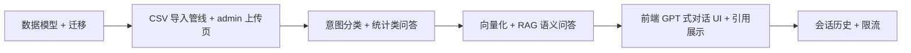

# AI 助手 PRD

## 1. Why-Who-What

- **业务背景**：男德学院为朋友圈限定社区（约 20 人），群聊沉淀了大量日常互动数据。人工翻阅聊天记录效率低，且无法快速做聚合分析（如活跃度、话题趋势）。引入 AI 助手，让用户用自然语言提问即可获得基于群聊数据的回答
- **目标用户**：已注册并登录的成员（含 admin / super_admin）
- **功能范围**：群聊数据导入（CSV）、意图分类、统计类问答（SQL）、语义类问答（RAG）、闲聊、对话历史管理、引用来源展示

## 2. 角色体系

| 角色 | 标识 | 权限 |
|------|------|------|
| 院长 | `super_admin` | 全部权限：导入数据、提问、查看历史、管理所有人会话 |
| 管理员 | `admin` | 导入数据、提问、查看本人历史 |
| 成员 | `member` | 提问、查看本人历史 |

### 权限矩阵

| 操作 | 院长 | 管理员 | 成员 |
|------|:----:|:------:|:----:|
| 提问问答 | ✓ | ✓ | ✓ |
| 查看本人会话历史 | ✓ | ✓ | ✓ |
| 导入群聊 CSV | ✓ | ✓ | ✗ |
| 查看导入批次列表 | ✓ | ✓ | ✗ |
| 删除任意用户会话 | ✓ | ✗ | ✗ |

### 数据可见性

- **全局共享**：群聊数据为社区公共数据，任何登录用户提问均覆盖全员发言记录
- 不做行级隐私过滤（社区共识前提下）

## 3. 数据模型

### GroupMessage（群聊消息）

| 字段 | 类型 | 约束 | 说明 |
|------|------|------|------|
| id | Int | PK, 自增 | |
| batchId | Int | FK → ImportBatch.id | 导入批次 |
| talker | String | 非空 | 发言者 wxid |
| nickname | String | 可空 | 发言者昵称 |
| content | String | 非空 | 消息正文 |
| msgTime | DateTime | 非空 | 消息原始时间 |
| type | String | 默认 `text` | `text` / `image` / `system` 等 |
| createdAt | DateTime | 默认 now | 入库时间 |

> 索引：`talker`、`msgTime`、`(talker, msgTime)` 去重唯一键

### ImportBatch（导入批次）

| 字段 | 类型 | 约束 | 说明 |
|------|------|------|------|
| id | Int | PK, 自增 | |
| filename | String | 非空 | 原始文件名 |
| importedBy | Int | FK → User.id | 操作人 |
| count | Int | 非空 | 成功导入条数 |
| skipped | Int | 非空 | 跳过条数 |
| createdAt | DateTime | 默认 now | |

### ChatSession（对话会话）

| 字段 | 类型 | 约束 | 说明 |
|------|------|------|------|
| id | Int | PK, 自增 | |
| userId | Int | FK → User.id | 会话归属 |
| title | String | 可空 | 会话标题（取首问前 20 字） |
| createdAt | DateTime | 默认 now | |
| updatedAt | DateTime | 自动更新 | 最后活跃时间 |

### ChatTurn（对话轮次）

| 字段 | 类型 | 约束 | 说明 |
|------|------|------|------|
| id | Int | PK, 自增 | |
| sessionId | Int | FK → ChatSession.id | 所属会话 |
| role | String | 非空 | `user` / `assistant` |
| content | String | 非空 | 消息正文 |
| intent | String | 可空 | 意图分类（仅 assistant）|
| sources | String | 可空 | JSON 字符串，引用来源 |
| createdAt | DateTime | 默认 now | |

### 向量存储（sqlite-vec）

- 使用 sqlite-vec 扩展，建立虚拟表 `message_embeddings`
- 字段：`messageId`（FK → GroupMessage.id）、`embedding`（向量,维度由 embedding 模型决定）
- Prisma 不直接管理，通过 `$queryRaw` 原生 SQL 操作
- 检索：`SELECT ... FROM message_embeddings WHERE embedding MATCH ? ORDER BY distance LIMIT k`

## 4. 功能清单

| 功能 | 优先级 | 状态 | 角色 |
|------|--------|------|------|
| 群聊 CSV 导入 | P0 | 待开发 | admin+ |
| 意图分类 | P0 | 待开发 | 系统级 |
| 统计类问答（SQL） | P0 | 待开发 | 已登录 |
| 语义类问答（RAG） | P1 | 待开发 | 已登录 |
| 闲聊（直连 LLM） | P1 | 待开发 | 已登录 |
| 引用来源展示 | P1 | 待开发 | 已登录 |
| 对话历史（会话列表/详情/删除） | P2 | 待开发 | 已登录 |
| 导入批次列表 | P2 | 待开发 | admin+ |
| 限流 | P1 | 待开发 | 系统级 |

## 5. 业务契约

### 5.1 群聊 CSV 导入

- **前置条件**：role = admin 或 super_admin；CSV 字段头含 `talker`、`nickname`、`msg_time`、`message`、`type`
- **处理规则**：
  1. 校验文件格式（.csv）与字段头合法性
  2. 逐行解析，字段归一化：
     - `msg_time` → ISO8601 DateTime
     - 过滤 `type = system` 的系统消息
     - 去重（同 talker + msg_time + content）
  3. 写入 GroupMessage，关联新批次 ImportBatch
  4. 异步触发向量化：对每条 text 消息调用 embedding 模型生成向量，写入 `message_embeddings`
  5. 失败行计入 skipped，不中断整体导入
- **输出结果**：`{ batchId, imported, skipped }`
- **提示文案**：
  - 文件格式错误：**「仅支持 CSV 格式文件」**
  - 字段头不合规：**「CSV 字段不合规，需包含 talker/nickname/msg_time/message/type」**
  - 成功：**「导入完成，成功 N 条，跳过 M 条，正在后台生成向量索引」**

### 5.2 提问问答

- **前置条件**：已登录；群聊数据已导入（语义/统计类需要）
- **处理规则**：
  1. 限流检查：单用户 10 次/分钟
  2. 意图分类（LLM 判定）：`statistic` / `semantic` / `chat`
  3. 按意图路由：
     - **statistic**：解析问题 → 生成 SQL → 执行统计查询 → 将结果作为上下文交 LLM 润色
     - **semantic**：将问题向量化 → 在 `message_embeddings` 检索 Top-K（默认 K=5）→ 将片段作为上下文交 LLM 生成回答
     - **chat**：直接交 LLM 回复（不依赖群聊数据）
  4. 调用 LLM（火山引擎 glm-latest），失败重试 1 次
  5. 持久化到 ChatTurn（user + assistant 各一条）
  6. assistant 消息附带 intent 与 sources（语义类才有 sources）
- **输出结果**：
  ```json
  {
    "answer": "群里最活跃的是陈楠，共发言 1283 条，占比 23%",
    "intent": "statistic",
    "sources": [
      { "nickname": "陈楠", "msgTime": "2026-06-01T10:23:00Z", "content": "..." }
    ]
  }
  ```
- **提示文案**：
  - 限流：**「提问过于频繁，请稍后再试」**
  - 数据未导入（统计/语义类）：**「群聊数据尚未导入，暂无法回答此类问题」**
  - LLM 失败/超时（重试后仍失败）：**「当前网络不稳定，请重试。若仍旧无效，请联系管理员。」**
  - 敏感话题（模型默认拦截）：**「该问题涉及敏感内容，无法回答」**

### 5.3 意图分类

- **职责**：判定用户问题路由到哪个回答引擎
- **实现**：调用 LLM，给定系统提示词，输出单一标签 `statistic` / `semantic` / `chat`
- **判定标准**：
  - `statistic`：可由 SQL 聚合得出（计数、排行、最值、时间分布）
  - `semantic`：需要语义理解、话题归纳、观点总结
  - `chat`：与群聊数据无关的开放对话
- **兜底**：分类失败时默认走 `chat`，保证响应不中断

### 5.4 统计类问答（SQL 引擎）

- **职责**：将统计类问题转化为 SQL 并执行
- **处理规则**：
  1. LLM 根据问题 + GroupMessage 表结构生成 SQL（只允许 SELECT）
  2. SQL 安全校验：白名单表名、禁止写操作、禁止子查询危险操作
  3. 执行 SQL 得到结构化结果
  4. 将问题 + 结果交 LLM 润色为自然语言回答
- **安全约束**：SQL 仅限 `SELECT`，表名白名单 `GroupMessage`，结果行数上限 1000

### 5.5 语义类问答（RAG）

- **职责**：基于向量检索相关消息并生成回答
- **处理规则**：
  1. 问题向量化（embedding 模型）
  2. 检索 Top-K（默认 5）最相似消息
  3. 拼装 prompt：系统提示 + 检索片段 + 用户问题
  4. LLM 生成回答，附带引用来源
- **空结果兜底**：检索无相关片段时，降级走 `chat` 路径

### 5.6 会话历史管理

- **列表**：分页查询当前用户的 ChatSession（按 updatedAt 倒序）
- **详情**：按 sessionId 查询 ChatTurn 列表（按 createdAt 升序）
- **删除**：仅会话归属人或 super_admin 可删
- **提示文案**：
  - 删除他人会话（非 super_admin）：**「无权操作该会话」**

## 6. API 契约

> 统一响应格式：`{ code, message, data }`，错误码见 [API规范.md](../04-接口契约/API规范.md)

### 6.1 问答

| 方法 | 路径 | 鉴权 | 说明 |
|------|------|:----:|------|
| POST | `/api/chat/ask` | 已登录 | 提问 |

**POST /api/chat/ask**
```json
// Request
{ "question": "string", "sessionId": 123 }
// Response data
{
  "answer": "string",
  "intent": "statistic | semantic | chat",
  "sources": [{ "nickname": "", "msgTime": "", "content": "" }],
  "sessionId": 123
}
```
> sessionId 缺省时新建会话；返回的 sessionId 供后续多轮使用

### 6.2 会话历史

| 方法 | 路径 | 鉴权 | 说明 |
|------|------|:----:|------|
| GET | `/api/chat/sessions` | 已登录 | 会话列表 |
| GET | `/api/chat/sessions/:id` | 已登录 | 会话详情 |
| DELETE | `/api/chat/sessions/:id` | 已登录 | 删除会话 |

### 6.3 数据导入（admin+）

| 方法 | 路径 | 鉴权 | 说明 |
|------|------|:----:|------|
| POST | `/api/admin/chat/import` | admin+ | 上传 CSV |
| GET | `/api/admin/chat/batches` | admin+ | 导入批次列表 |

## 7. 流程图

### 7.1 问答主流程



### 7.2 数据导入流程



## 8. 异常分支（MECE）

### 导入
- [ ] 文件非 CSV 格式
- [ ] CSV 字段头缺失或不合规
- [ ] 文件为空（0 行数据）
- [ ] 单行字段缺失（跳过该行，计入 skipped）
- [ ] 时间格式解析失败（跳过该行）
- [ ] 重复消息（同 talker + msg_time + content，去重）
- [ ] 文件过大（限制 50MB，超出拒绝）
- [ ] 向量化失败（单条失败不中断，记录错误日志）

### 意图分类
- [ ] LLM 返回非预期标签（兜底走 chat）
- [ ] LLM 调用失败（兜底走 chat）

### 统计类
- [ ] LLM 生成 SQL 语法错误（返回兜底文案）
- [ ] SQL 执行超时（限制 5s，超时返回兜底）
- [ ] SQL 含危险操作（白名单拦截）
- [ ] 查询结果为空（提示未找到相关记录）

### 语义类
- [ ] 向量库为空（数据未导入）
- [ ] 检索无相关片段（降级走 chat）
- [ ] embedding 模型调用失败（返回兜底文案）

### LLM 调用
- [ ] API 超时（重试 1 次）
- [ ] API 鉴权失败（环境变量配置错误，运维告警）
- [ ] 触发内容安全策略（敏感话题拦截）
- [ ] 响应格式异常（解析失败，返回兜底）

### 会话历史
- [ ] 删除他人会话（权限不足）
- [ ] 会话不存在（1004）
- [ ] 会话无消息（空详情）

### 网络/空状态
- [ ] 弱网：前端请求超时提示**「网络异常，请稍后重试」**
- [ ] 断网：前端检测 offline 提示**「网络已断开」**
- [ ] 首次使用无任何会话：展示空状态引导提问
- [ ] 群聊数据未导入时提问统计/语义类：提示**「群聊数据尚未导入」**

## 9. 技术依赖

| 依赖 | 用途 | 安装位置 |
|------|------|----------|
| sqlite-vec | 向量检索 | server（SQLite 扩展） |
| @volcengine/openai（或 openai 兼容客户端） | 调用火山引擎 LLM | server |
| multer | CSV 文件上传 | server |
| csv-parse | CSV 解析 | server |

### 环境变量（.env）

| 变量名 | 用途 |
|--------|------|
| `VOLC_API_KEY` | 火山引擎 API Key |
| `VOLC_BASE_URL` | 火山引擎接入地址 |
| `VOLC_MODEL` | 模型 ID，默认 `glm-latest` |
| `VOLC_EMBED_MODEL` | embedding 模型 ID（待定） |

> ⚠️ API Key 严禁入库 git，仅放 `.env`（已被 .gitignore 忽略）

## 10. 实施路径



| 阶段 | 范围 | 验收标准 |
|------|------|----------|
| P0 | GroupMessage / ImportBatch 表 + 迁移 | 表结构就绪，可 seed 测试数据 |
| P1 | CSV 导入接口 + admin 上传页 | CSV 可入库，返回批次与计数 |
| P2 | 意图分类 + SQL 统计问答 | "最活跃的人"类问题可答 |
| P3 | 向量化 + RAG | "大家最近聊什么"类问题可答，附引用 |
| P4 | 前端对话 UI | GPT 式气泡 + 多轮 + 引用折叠 |
| P5 | 会话历史 + 限流 | 历史可查可删，限流生效 |
