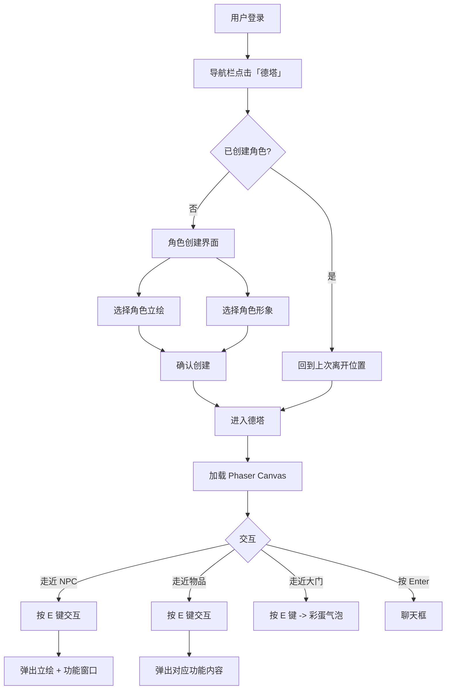
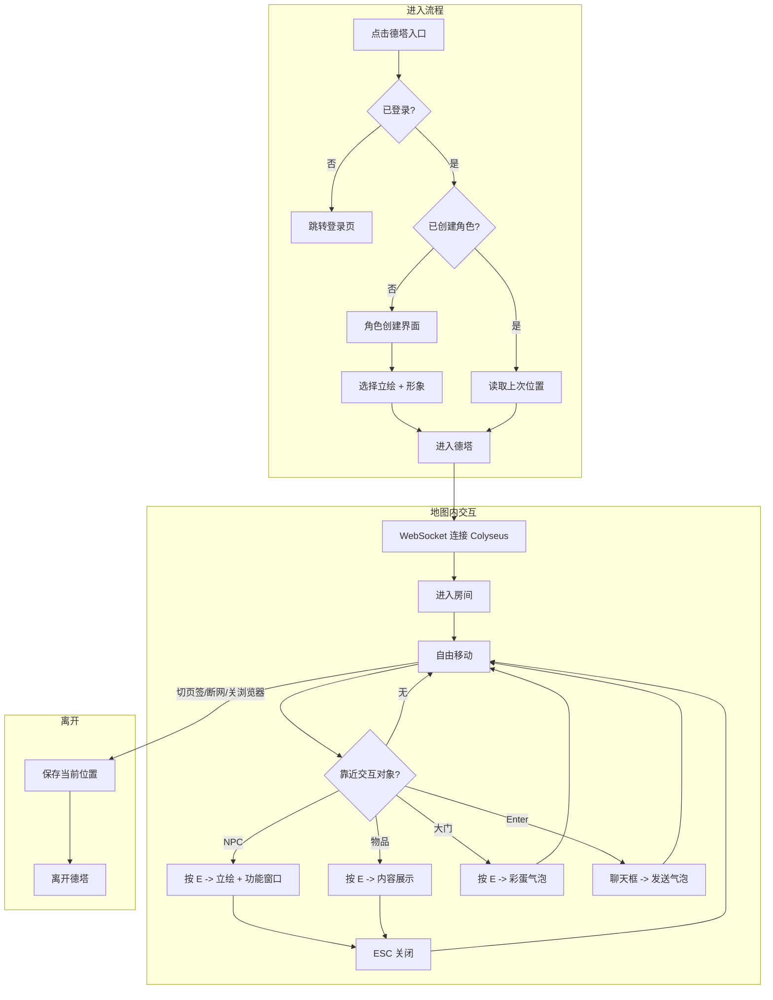
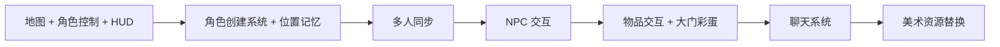

# 德塔（NDO）MVP PRD

> 状态：Accepted | 决策人：陈梓键 | 日期：2026-07-13
> 关联调研：[nandexueyuan-terraria-like-module-research.md](../00-基础数据/nandexueyuan-terraria-like-module-research.md)

---

## 1. Why-Who-What

| 维度 | 说明 |
|------|------|
| 业务背景 | 男德学院为朋友圈限定社区（约 20 人），目前仅有 Web 端功能入口。引入 2D 虚拟世界"德塔（NDO）"，将功能入口（男德通、群公告等）融入可探索的地图，增强团队临场感与趣味性 |
| 目标用户 | 已注册并登录的成员（约 20 人），手机为主、偶尔电脑 |
| 功能范围 | 地图加载、角色移动、多人实时同步、NPC 交互（男德通）、物品交互（群公告等）、角色外观选择 |

**定位**：2D 侧视角像素风虚拟世界，功能聚合大厅，不是纯游戏。当前 MVP 不做战斗/建造/挖掘，后续逐步引入。

---

## 2. 产品形态



### 2.1 视角与风格

| 属性 | 选择 |
|------|------|
| 视角 | 2D 侧视角（泰拉瑞亚风格，左右移动 + 跳跃） |
| 美术风格 | SNES 精细像素风，32x32 瓦片 |
| 渲染 | Phaser.js 3，Canvas 渲染 |
| 地图 | Tiled Map Editor 编辑，导出 JSON |

### 2.2 入口

- Vue Router 新增 `/nde` 路由
- 导航栏「德塔」与「男德通」「男通讯录」并列显示
- 点击后进入全屏 Phaser Canvas 页面
- 进入时校验角色有无创建，未创建则进入角色创建界面

### 2.3 部署架构

```
浏览器 → Nginx → 静态资源 (dist/)
              → /api → Express:3000 → SQLite
              → /ws  → Colyseus:2567 → 游戏状态
```

---

## 3. 功能清单（MVP）

| 编号 | 功能 | 优先级 | 说明 |
|------|------|:------:|------|
| F1 | 地图加载与渲染 | P0 | 格子世界，德塔占地 20 格，瓦片渲染 |
| F2 | 角色控制 | P0 | 角色占 1 格，跳跃最高 2 格，WASD 移动 |
| F3 | 多人同步 | P0 | 实时位置广播，视野内其他玩家可见 |
| F4 | NPC 交互 — 男德通 | P0 | 走近按 E 交互，弹出立绘 + AI 对话窗口 |
| F5 | 物品交互 — 群公告 | P0 | 走近按 E 查看公告 |
| F6 | 角色创建系统 | P0 | 首次进入选择立绘 + 形象，不可重复，可更改 |
| F7 | 摄像机跟随 | P0 | 摄像机跟随玩家，平滑移动 |
| F8 | 地图边界 | P0 | 碰撞检测，不超出地图范围 |
| F9 | 位置记忆 | P0 | 离开后回到上次位置（切换页签/断网/关浏览器均视为离开） |
| F10 | 聊天系统 | P1 | Enter 激活输入，100 字限制，气泡显示，10s 淡隐 |
| F11 | 塔楼大门彩蛋 | P1 | 走近大门按 E 弹出彩蛋文字气泡，多次交互循环 |
| F12 | HUD 界面 | P1 | 左下角角色信息（头像/血条/蓝量/buff），右上角小地图 |
| F13 | 传送门交互 | P1 | 走到大厅传送门按 E，确认后离开德塔回到主界面 |

### 3.1 不做（MVP 明确排除）

| 功能 | 原因 |
|------|------|
| 战斗系统 | V2 引入 |
| 方块挖掘/放置 | V1 引入 |
| 怪物/NPC AI | V2 引入 |
| 建造系统 | V1 引入 |
| 物品/背包 | V2 引入 |
| 手机触控操作 | P2（当前桌面优先，手机走 Web 端） |
| 多房间/多实例 | 当前 20 人，单世界足够 |

---

## 4. 业务契约

### 4.1 F1 地图加载

- **前置条件**：Tiled Map Editor 导出 JSON + 瓦片集 PNG 就绪
- **处理规则**：
  1. Phaser 加载 JSON 地图文件
  2. 渲染瓦片层（地面、墙壁、装饰）
  3. 加载碰撞层（不可行走区域）
  4. 渲染交互层（NPC 生成点、物品位置）
- **输出**：地图渲染完成，玩家可进入
- **地图规格**：首次建议 100x30 瓦片（32x32 像素），3200x960 像素视口

### 4.2 F2 角色控制

- **前置条件**：地图已加载
- **处理规则**：
  1. 键盘 A/D 或 ←/→ 左右移动，W 或 ↑ 或 Space 跳跃
  2. 角色占 **1 格**（32x32 像素）
  3. 移动速度：200px/s（约 6 瓦片/秒）
  4. 跳跃高度：最高 **2 格**（从 1 格高度跳到 3 格高度，64px 跃升）
  5. 重力 800px/s²
  6. 碰撞检测：与碰撞层交互，不可穿透
  7. 角色精灵：四方向（左/右站立 + 左/右行走），4 帧动画
- **输出**：角色在地图上移动，受物理约束

### 4.3 F3 多人同步

- **前置条件**：WebSocket 连接正常
- **处理规则**：
  1. 客户端每 50ms 上报位置（x, y, facing, state）
  2. 服务端广播给同房间其他玩家
  3. 其他玩家渲染为不同精灵（外观差异）
  4. 玩家头顶显示昵称
- **输出**：实时可见其他在线玩家
- **异常处理**：
  - 断线：角色原地停留，5 秒后移除
  - 重连：恢复角色到上次位置

### 4.4 F4 NPC 交互 — 男德通

> 详细交互规范见：[德塔男德通交互需求.md](德塔男德通交互需求.md)

- **前置条件**：玩家靠近 NPC 碰撞范围（48px 内）
- **处理规则**：
  1. 玩家走近 NPC 时，NPC 头顶显示「按 E 与男德通对话」提示
  2. 按下 E 键后：
     - 激活 HUD 底部聊天框，输入框预填蓝色 `@ 男德通 ` 前缀
     - 采用 **@ 机器人模式**（类似 QQ 群机器人），而非独立弹窗
     - 男德通回复前缀为 `@玩家昵称`，回复在聊天框中**广播给所有在线玩家可见**
  3. 按 ESC 关闭聊天框，按 Enter 发送消息
  4. 交互期间角色不可移动
- **输出**：男德通 AI 对话功能可用，回复风格为美少女口吻，50 字以内
- **提示文案**：
  - 靠近 NPC：**「按 E 与男德通对话」**
  - 接口失败：**「男德通暂时走神了，请稍后再试~」**

### 4.5 F5 物品交互 — 群公告

- **前置条件**：玩家靠近物品碰撞范围（48px 内）
- **处理规则**：
  1. 玩家走近物品时，物品头顶显示「按 E 查看」提示
  2. 按下 E 键后弹出公告内容面板
  3. 按 ESC 关闭
- **输出**：公告内容展示
- **可扩展物品类型**：日程板、投票箱、打卡点（后续扩展）

### 4.6 F6 角色创建系统

- **前置条件**：用户首次进入德塔，未创建角色
- **处理规则**：
  1. 校验用户是否已有德塔角色（数据库字段）
  2. 若未建立，进入角色创建界面：
     - 选择**角色立绘**（半身像，用于对话框头像）
     - 选择**角色形象**（Sprite，用于地图上行走的小人）
     - 立绘和形象可以更改，但**不能与已存在的角色重复**
  3. 确认创建后，角色数据持久化到数据库
  4. 若已建立，跳过角色创建，直接进入德塔
- **输出**：用户以所选角色进入德塔
- **离开判定**：
  - 主动切换页签 → 视为离开德塔
  - 断网 → 视为离开德塔
  - 直接关闭浏览器 → 视为离开德塔
  - 离开时保存当前位置坐标

### 4.7 F9 位置记忆

- **前置条件**：角色已创建
- **处理规则**：
  1. 每次用户离开德塔时，保存当前坐标（x, y）到数据库
  2. 再次进入德塔时，从数据库读取上次坐标
  3. 角色出生在保存的坐标位置
  4. 首次进入（无历史坐标）→ 出生在传送门默认位置
- **离开触发**：切换页签、断网、关闭浏览器、主动退出

### 4.8 F10 聊天系统

- **前置条件**：已进入德塔
- **处理规则**：
  1. 按 **Enter** 键激活聊天输入框
  2. 输入内容后按 Enter 发送
  3. 单次发送内容限制在 **100 字**以内
  4. 消息以**文字气泡**形式显示在发送者角色上方
  5. 聊天框位于页面左下角，角色信息面板上方
  6. 聊天框在 **10 秒**内无新内容后自动淡隐
  7. 同时显示其他玩家的聊天气泡
- **输出**：聊天内容实时显示
- **提示文案**：超过 100 字 → **「消息不能超过 100 字」**

### 4.9 F11 塔楼大门彩蛋

- **前置条件**：玩家靠近塔楼大门（碰撞范围 48px 内）
- **处理规则**：
  1. 玩家走近大门时，显示「按 E 开门」提示
  2. 按下 E 键后，弹出文字气泡（箭头指向大门）：
     - 第 1 次：**「那一天，人类终于回想起了被巨人支配的恐惧……」**
     - 第 2 次：**「前面的区域以后再来探索吧……」**
     - 第 3 次+：循环以上两句
  3. 气泡显示 3 秒后自动消失
  4. 多次重复交互则气泡文字循环弹出
- **输出**：彩蛋文字气泡

### 4.10 F12 HUD 界面

- **前置条件**：已进入德塔
- **处理规则**：
  1. HUD 采用**博德之门3风格底部面板**，与游戏画面独立，不遮挡地图
  2. 底部面板三栏布局（左→右）：
     - **角色信息**（200px）：头像、昵称、HP条、MP条、buff/debuff 图标区
     - **聊天区**（flex:1）：消息列表 + 输入框
     - **小地图**（160px）：Canvas 渲染地形 + 玩家/NPC/物品位置
  3. 面板高度 120px，游戏画布占据剩余空间
  4. HP/MP 在 MVP 阶段固定满值，仅为 UI 预留
- **输出**：HUD 正常渲染

### 4.11 F13 传送门交互

> 详细设定见：[德塔世界观.md](../02-设计/德塔世界观.md) §2.4

- **前置条件**：玩家靠近传送门碰撞范围（48px 内）
- **处理规则**：
  1. 玩家走近传送门时，显示「按 E 返回男德学院」提示
  2. 按下 E 键后，弹出确认对话框：**「确定要离开德塔吗？」**
  3. 选择「是」-> 保存当前位置 -> 断开 WebSocket -> 跳转到主界面
  4. 选择「否」-> 关闭对话框，留在德塔
- **输出**：玩家离开德塔，返回男德学院主界面
- **异常处理**：
  - WebSocket 断开失败 -> 仍然跳转主界面（前端兜底）
  - 位置保存失败 -> 不阻止离开，使用上次保存的位置

---

## 5. 数据模型

### 5.1 新增表

```sql
-- 用户外观
ALTER TABLE User ADD COLUMN avatarId INT DEFAULT 1;

-- 游戏世界状态（内存为主，SQLite 辅助持久化）
-- 世界不持久化，每次进入从初始状态开始
```

### 5.2 游戏状态（Colyseus Schema）

```
Player {
  id: string          // 用户 ID
  x: float32          // 位置 X
  y: float32          // 位置 Y
  facing: string      // 'left' | 'right'
  state: string       // 'idle' | 'walking' | 'jumping'
  avatarId: int8      // 外观 ID
  nickname: string    // 昵称
}

WorldState {
  players: Map<Player>  // 在线玩家
}
```

---

## 6. 交互流程



---

## 7. 美术资源需求

### 7.1 资源清单

| 资源 | 规格 | 数量 | 生成方式 |
|------|------|:----:|----------|
| 地图瓦片集 | 32x32 PNG，森林/村庄主题 | 1 套 | ComfyUI 生成 + Tiled 编排 |
| 玩家角色 Sprite | 32x64 PNG，四方向 × 4 帧 | 20 套 | ComfyUI + Pixel-Art-XL LoRA |
| NPC 角色 Sprite | 32x64 PNG，单方向 | 5 个 | ComfyUI 生成 |
| NPC 立绘 | 512x512 PNG，半身像 | 5 张 | ComfyUI 生成 |
| 物品 Sprite | 32x32 PNG | 10 个 | ComfyUI 生成 |
| UI 元素 | 对话框、提示气泡 | 1 套 | CSS 为主 |

### 7.2 生成工作流（黑机 ComfyUI）

```
ComfyUI 工作流：
  ├─ 模型：SDXL + Pixel-Art-XL LoRA（像素风）
  ├─ 瓦片生成：控制网格 + 主题提示词，批量 32x32
  ├─ 角色生成：Sprite Sheet 模板，四方向 + 行走帧
  └─ 立绘生成：512x512，半身像，PNG 透明背景
```

### 7.3 存储评估

| 资源 | 预估大小 |
|------|----------|
| 瓦片集（1 套） | ~10MB |
| 角色 Sprite（20 套） | ~20MB |
| NPC 立绘（5 张） | ~5MB |
| 物品 Sprite（10 个） | ~2MB |
| **合计** | **~37MB** |

---

## 8. 技术方案

### 8.1 前端

| 组件 | 技术 | 说明 |
|------|------|------|
| 游戏引擎 | Phaser.js 3 | Canvas 渲染，内置物理（Matter.js） |
| 集成方式 | Vue 组件挂载 Phaser | `GameView.vue` 挂载 Canvas，路由 `/game` |
| 网络 | Colyseus Client SDK | WebSocket 连接，状态同步 |
| 构建 | Vite | 内联 Phaser，无需额外配置 |

### 8.2 后端

| 组件 | 技术 | 说明 |
|------|------|------|
| 游戏服务器 | Colyseus Server | 独立进程，端口 2567 |
| 传输层 | uWebSockets.js | 性能优化（可选，默认 WebSocket 也可） |
| 进程管理 | PM2 | 管理 Express + Colyseus 双进程 |
| 数据库 | SQLite | 仅存外观选择，游戏状态不持久化 |

### 8.3 依赖新增

| 依赖 | 位置 | 用途 |
|------|------|------|
| phaser | 前端 | 游戏引擎 |
| colyseus.js | 前端 | 客户端 SDK |
| colyseus | 后端 | 游戏服务器框架 |
| @colyseus/uwebsockets-transport | 后端 | 传输层优化（可选） |

---

## 9. MVP 验收标准

| 编号 | 验收项 | 通过条件 |
|------|--------|----------|
| AC1 | 地图加载 | 进入德塔后，完整渲染格子世界地图，德塔 20 格宽，外部绿化树林 + 云顶 |
| AC2 | 角色移动 | 角色占 1 格，键盘控制左右移动 + 跳跃（最高 2 格），碰撞检测生效 |
| AC3 | 多人可见 | 两个浏览器同时进入，互相可见位置和移动 |
| AC4 | NPC 交互 | 走近男德通 NPC，按 E 弹出立绘 + AI 对话窗口 |
| AC5 | 物品交互 | 走近群公告板，按 E 弹出公告内容 |
| AC6 | 角色创建 | 首次进入弹出角色创建界面（立绘 + 形象），确认后进入，不可重复 |
| AC7 | 摄像机跟随 | 摄像机平滑跟随玩家，不超出地图边界 |
| AC8 | 位置记忆 | 离开后再次进入，回到上次离开位置 |
| AC9 | 聊天系统 | 按 Enter 输入，发送后气泡显示，10s 无新消息淡隐 |
| AC10 | 大门彩蛋 | 走近大门按 E，弹出彩蛋文字气泡，多次交互循环 |
| AC11 | HUD | 底部面板三栏（角色信息/聊天/小地图），游戏画布不被遮挡，小地图实时显示玩家位置 |

---

## 10. 实施路径



| 阶段 | 范围 | 输入 | 验收标准 |
|------|------|------|----------|
| P0 | 地图 + 角色控制 + HUD 框架 | 色块占位 + 方块角色 | AC1, AC2, AC7, AC11 |
| P1 | 角色创建 + 位置记忆 | P0 完成 | AC6, AC8 |
| P2 | 多人同步 | P1 完成 | AC3 |
| P3 | NPC 交互 | P2 完成，AI 接口就绪 | AC4 |
| P4 | 物品交互 + 大门彩蛋 | P3 完成 | AC5, AC10 |
| P5 | 聊天系统 | P4 完成 | AC9 |
| P6 | 美术资源替换 | 黑机生成完整瓦片 + 立绘 | 整体视觉就绪 |

---

## 11. 异常分支（MECE）

### 网络
- [ ] WebSocket 连接失败 → 提示**「连接服务器失败，请检查网络」**，允许离线模式（仅本地移动）
- [ ] 断线重连 → 自动重试 3 次，间隔 2s，失败后提示并允许重试

### 加载
- [ ] 地图 JSON 加载失败 → 提示**「地图加载失败，请刷新重试」**
- [ ] 角色 Sprite 加载失败 → 显示默认方块角色
- [ ] 立绘加载失败 → 纯文字对话窗口

### 交互
- [ ] 同时多人交互同一 NPC → 各自独立弹窗，不冲突
- [ ] 交互期间收到新消息 → 不中断交互
- [ ] AI 接口超时 → 提示**「男德通暂时走神了，请稍后再试」**
- [ ] 聊天发送空消息 → 不发送，不显示气泡
- [ ] 聊天超过 100 字 → 输入框截断，提示**「消息不能超过 100 字」**
- [ ] 大门彩蛋连续快速按 E → 防抖，气泡按序循环

### 离开/重连
- [ ] 切换页签离开 → 保存位置，断开 WebSocket
- [ ] 断网 → 保存位置（最后已知坐标），断开连接
- [ ] 关闭浏览器 → beforeunload 保存位置
- [ ] 重连后位置已被其他玩家占据 → 不冲突（位置可重叠）

### 空状态
- [ ] 无人在线 → 仅自己在地图上
- [ ] 首次进入无外观 → 引导选择外观
- [ ] 地图无 NPC/物品 → 纯探索地图（开发阶段）

### 边界
- [ ] 角色移动到地图边缘 → 碰撞阻挡，不超出
- [ ] 快速连续按键 → 不卡墙，不穿墙
- [ ] 浏览器窗口失焦 → 暂停移动，不继续移动

---

## 12. 实施状态

> 更新日期：2026-07-14

| 功能 | 状态 | 说明 |
|------|:----:|------|
| F1 地图加载与渲染 | ✅ | 色块占位，德塔三层塔楼，外部绿化+云顶 |
| F2 角色控制 | ✅ | 角色占1格，WASD 移动，跳跃最高2格 |
| F8 地图边界 | ✅ | 碰撞检测，摄像机边界 |
| F7 摄像机跟随 | ✅ | 平滑跟随玩家 |
| F12 HUD 界面 | ✅ | 博德之门3风格底部面板（角色信息/聊天/小地图） |
| F10 聊天系统 | ✅ | Enter 触发，100字限制，气泡显示，10s淡隐 |
| F11 大门彩蛋 | ✅ | 2句彩蛋文字循环 |
| F4 NPC 交互 | ✅ | 按 E 触发弹窗（占位，待接入 AI 对话） |
| F5 物品交互 | ✅ | 按 E 触发弹窗（占位，待接入公告） |
| F6 角色创建 | ⏳ | 待开发 |
| F9 位置记忆 | ⏳ | 待开发 |
| F3 多人同步 | ⏳ | 待搭建 Colyseus |
| P5 美术替换 | ⏳ | 待黑机生成资源 |

### 架构变更记录

| 日期 | 变更 | 原因 |
|------|------|------|
| 2026-07-13 | 初始架构 | PRD 制定 |
| 2026-07-14 | UIScene 移除，HUD 迁移到 Vue 底部面板 | 避免 HUD 遮挡游戏画面，更易于维护 |
| 2026-07-14 | 小地图从 Phaser 迁移到 Vue Canvas | 实时渲染地形结构，与玩家位置同步 |
| 2026-07-14 | 聊天框从 Phaser 内嵌改为 Vue 底部面板 | 更好的用户体验，博德之门3风格 |
| 2026-07-14 | Phaser 键盘启停机制 | 聊天输入时禁用 Phaser 按键，避免冲突 |
| 2026-07-14 | Scale.FIT → Scale.RESIZE | 消除全屏黑边，游戏填充整个浏览器 |
| 2026-07-14 | 新增 fetchMe 调用 | 修复页面刷新后昵称丢失问题 |