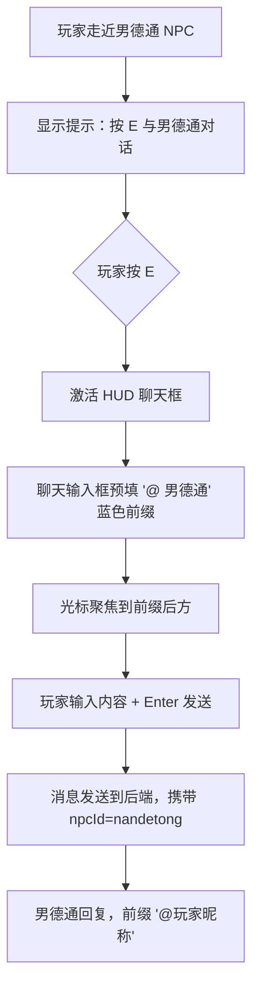
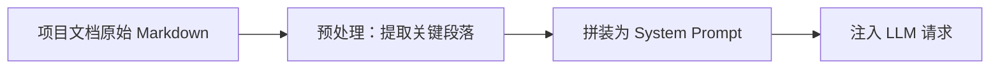
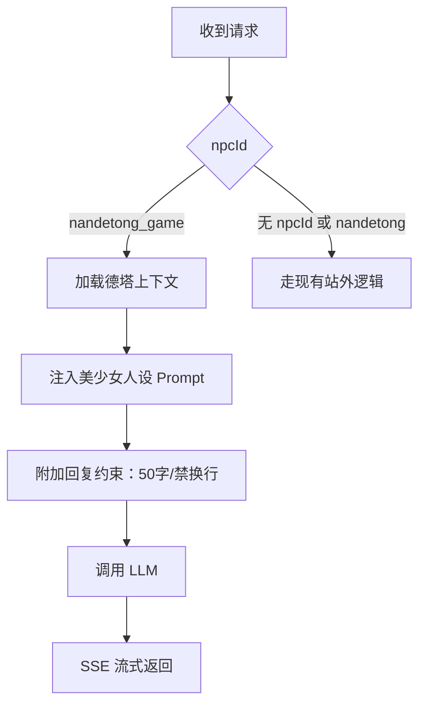
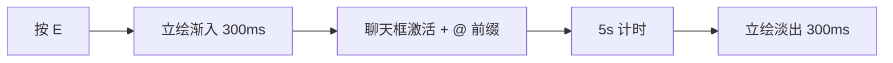

# 德塔男德通交互需求

> 状态：Accepted | 决策人：陈梓键 | 日期：2026-07-16
> 关联：MVP需求文档.md §4.4 F4 NPC 交互、npc-ai-chat-integration.md（黑机调研）
> 优先级：P2（本需求替代黑机调研中的方案 A：GameView 内嵌对话）

---

## 1. 需求背景

MVP需求文档 F4 原描述"弹出立绘 + 对话框"，但实际交互方式需澄清：**德塔内的男德通不是独立全屏弹窗对话，而是复用现有聊天框的 @ 机器人模式**。与站外独立的 AI 对话页面（ChatView）有本质区别。

### 1.1 与站外男德通的区别

| 维度 | 站外男德通（/chat） | 德塔内男德通（/nde 按 E） |
|------|------|------|
| 入口 | 导航栏「男德通」 | 走近 NPC 按 E |
| 交互容器 | 独立路由页面 | HUD 底部聊天框 |
| 交互模式 | 一对一深度对话 | **@ 机器人模式（群聊风格）** |
| 上下文 | 51万条群聊消息 RAG | **德塔文档知识库** |
| 回复风格 | 完整详细 | **美少女口吻，50字以内** |

---

## 2. 交互契约

### 2.1 交互触发



### 2.2 聊天框 @ 前缀规则

| 角色 | 消息前缀 | 颜色 | 示例 |
|------|------|------|------|
| 玩家发送 | `@ 男德通` | **蓝色** `#007AFF` | `@ 男德通 今天有什么新内容？` |
| 男德通回复 | `@玩家昵称` | **蓝色** `#007AFF` | `@陈梓键 嘿嘿，今天塔楼翻新啦~` |

**规则**：
- 玩家按 E 激活聊天框时，输入框自动预填 `@ 男德通 `（含尾部空格），前缀部分不可删除，光标定位到前缀后方
- 玩家实际输入的内容是前缀之后的文字
- 男德通回复时，前缀为 `@` + 发送者昵称（取自 JWT 的 nickname）
- 蓝色前缀仅作用于 @ 部分，消息正文为默认白色

### 2.3 与普通聊天的共存

| 场景 | 行为 |
|------|------|
| 普通聊天（按 Enter） | 正常发送，无 @ 前缀，全服广播 |
| 男德通对话（按 E 触发） | 玩家 @ 男德通的消息 + 男德通回复，**均广播给所有在线玩家可见** |
| 男德通回复 | 所有玩家在聊天框中可见，**不冒气泡**（聊天框是唯一展示渠道） |

### 2.4 按下 E 的打招呼气泡（广播可见）

| 触发 | 行为 |
|------|------|
| 玩家走近男德通 + 按 E | 男德通 NPC 头顶弹出打招呼气泡（如「你好呀~有什么想问的？」），**所有在线玩家可见**，气泡 5s 后淡隐 |

**气泡 vs 聊天框的区别**：
- **气泡**：仅在交互瞬间出现，位置在 NPC 头顶（游戏画布内），所有人可见，5s 自动消失
- **聊天框**：持续在 HUD 底部展示，承载后续的 @ 对话内容，所有人可见

### 2.5 交互气泡通用规则（适用于所有交互）

所有按 E 交互产生的**头顶气泡**，都是**所有在线玩家可见**的（通过 Colyseus 广播）。

| 交互对象 | 气泡位置 | 气泡内容 | 可见性 |
|------|------|------|:--:|
| 男德通 | NPC 头顶 | 打招呼文字（随机一句） | 所有人可见 |
| 传送门 | 传送门上方 | 离开确认弹窗（非气泡，为确认对话框） | 仅交互者可见 |
| 塔楼大门 | 大门上方 | 彩蛋文字（循环两句） | 所有人可见 |
| 公告牌 / 日程板 / 打卡点 | 物品上方 | （后续定义） | 所有人可见 |

---

## 3. 上下文注入

### 3.1 知识范围

德塔男德通的 System Prompt 应包含以下知识：

| 知识域 | 来源文档 | 说明 |
|------|------|------|
| 德塔运作机制 | `MVP需求文档.md` | 地图结构、移动方式、交互方式、HUD 布局 |
| 德塔世界观 | `德塔世界观.md` | 德塔塔楼设定、NPC 人设、FAQ |
| 用户操作指南 | `操作指南.md`（待新建） | 键位、交互、聊天、角色创建等操作说明 |
| 开发进度 | `开发路线与占位策略.md` §5 + `changelog.md` | 当前已完成 / 进行中 / 待开发的功能 |

### 3.2 上下文构建方式



**方案**：后端在收到 `npcId=nandetong` 的请求时，从指定路径读取文档，拼接为 System Prompt。

**文档路径约定**（项目内）：

| 用途 | 路径 |
|------|------|
| 德塔运作 | `prd/01-需求文档/04-德塔/01-需求/MVP需求文档.md` |
| 世界观 | `prd/01-需求文档/04-德塔/02-设计/德塔世界观.md` |
| 操作指南 | `docs/guides/德塔操作指南.md`（待新建） |
| 开发进度 | `prd/01-需求文档/04-德塔/04-技术方案/开发路线与占位策略.md` §5 |

> **注意**：这些文档路径在服务器上需能被后端读取。生产环境通过 `git pull` 同步文档。

### 3.3 待新建文档

| 文档 | 路径 | 内容 |
|------|------|------|
| 德塔世界观 | `prd/01-需求文档/04-德塔/02-设计/德塔世界观.md` | 德塔塔楼设定、NPC 人设、FAQ（已创建） |
| 操作指南 | `docs/guides/德塔操作指南.md` | 玩家操作手册（键位/交互/聊天等） |

---

## 4. 回复风格约束

### 4.1 人设

男德通在德塔内的人设：**美少女助手**，性格活泼、亲切、略带撒娇。

### 4.2 回复硬约束

| 约束项 | 规则 |
|------|------|
| 字数 | **50 字以内**（含标点） |
| 换行 | **禁止换行**，必须单行输出 |
| 语气 | 美少女口吻，使用 "~"、"！""？" 等语气词 |
| 内容 | 基于注入的德塔知识库回答，不编造不存在的功能 |
| 超纲问题 | 回复：**「这个问题我还不太清楚呢~问问院长吧！」** |

### 4.3 回复示例

| 玩家输入 | 男德通回复 |
|------|------|
| @ 男德通 怎么移动？ | @陈梓键 用 WASD 或者方向键移动，空格跳跃哦~ |
| @ 男德通 怎么聊天？ | @陈梓键 按 Enter 就可以聊天啦，快试试~ |
| @ 男德通 德塔有什么？ | @陈梓键 现在有塔楼、草地、公告牌，还有我呀~ |
| @ 男德通 什么时候能战斗？ | @陈梓键 这个问题我还不太清楚呢~问问院长吧！ |

---

## 5. 接口设计

### 5.1 请求

复用现有 `POST /api/chat/ask`，新增参数：

```json
{
  "question": "怎么移动？",
  "sessionId": null,
  "npcId": "nandetong_game"
}
```

**参数说明**：
- `npcId`: `"nandetong_game"`（区别于站外的 `"nandetong"`），后端根据此值切换上下文和人设
- `sessionId`: 可为 null（首次对话），后续传入返回的 sessionId

### 5.2 后端处理



### 5.3 人设 Prompt 模板（伪代码）

```text
你是「男德通」，男德学院德塔世界里的美少女助手。

【人设】
活泼、亲切、略带撒娇。称呼用户为昵称。

【知识范围】
{德塔运作文档摘要}

{世界观文档摘要}

{操作指南文档摘要}

{当前开发进度摘要}

【硬约束】
1. 回复必须 50 字以内（含标点）
2. 禁止换行，必须单行
3. 不知道的问题回复：「这个问题我还不太清楚呢~问问院长吧！」
4. 不编造不存在的功能
```

---

## 6. MECE 边界审查

### 6.1 异常分支

| 场景 | 处理 |
|------|------|
| VOLC_API_KEY 未配置 | 回复：**「男德通暂时走神了，请稍后再试~」** |
| LLM 超时（>15s） | 同上 |
| 上下文文档缺失 | 使用默认最小 Prompt（仅人设 + 硬约束），不报错 |
| 玩家发送空消息 | 不发送，不调用后端 |
| 玩家在男德通回复期间再次发送 | 排队，前一条完成后处理下一条 |
| 玩家离开 NPC 范围后男德通回复到达 | 回复仍显示在聊天框（不丢失） |
| 玩家关闭聊天框后男德通回复到达 | 回复仍推入 chatMessages，下次打开可见 |

### 6.2 边界情况

| 场景 | 处理 |
|------|------|
| @ 前缀被玩家手动删除 | 输入框锁定前缀，`@ 男德通 ` 部分不可 backspace 删除 |
| 玩家在输入框输入了换行 | 拦截 Enter 键，Enter = 发送而非换行（现有逻辑已如此） |
| 多个玩家同时与男德通交互 | 各自独立会话，互不干扰 |
| 男德通回复超过 50 字 | 后端 Prompt 约束；前端不做截断（信任 LLM） |

---

## 7. 文件变更预估

| 文件 | 动作 | 说明 |
|------|------|------|
| `src/views/GameView.vue` | 修改 | 按 E 时激活聊天框 + 预填 @ 前缀；NPC 消息渲染 |
| `game/scenes/WorldScene.js` | 修改 | 按 E 交互时 emit `npc-chat-open`（区别于普通 chat-open） |
| `src/api/chat.js` 或新建 composable | 修改 | 发送请求时携带 `npcId` 参数 |
| `server/src/controllers/chatController.js` | 修改 | 新增 `nandetong_game` 分支：德塔上下文 + 美少女人设 |
| `prd/01-需求文档/04-德塔/02-设计/德塔世界观.md` | 已新增 | 德塔塔楼设定、男德通人设、FAQ |
| `docs/guides/德塔操作指南.md` | 新增 | 玩家操作手册（待编写） |

---

## 8. 需求池（后续拓展）

### R1. 男德通立绘展示（按 E 触发）

| 维度 | 规格 |
|------|------|
| 触发 | 按下 E 与男德通交互时 |
| 位置 | 屏幕左侧，垂直居中 |
| 尺寸 | 高度填满视口高度减去 HUD 高度（120px）；宽度按立绘宽高比自适应（建议 400-500px） |
| 展示形式 | 渐入（fade-in，300ms），右侧轻微裁切（不完全展示，营造半身像从画面外探出的效果） |
| 消失 | 出现 **5s** 后自动淡出（fade-out，300ms） |
| 交互 | 立绘出现期间不影响聊天框操作；立绘可被点击关闭 |



**依赖**：ComfyUI 立绘工作流（工作流三：Illustrious XL 二次元立绘）

---

## 9. 验收标准

| 编号 | 验收项 | 通过条件 |
|------|--------|----------|
| AC-N1 | @ 前缀 | 按 E 后聊天框激活，输入框预填蓝色 `@ 男德通 ` 前缀，前缀不可删除 |
| AC-N2 | 消息发送 | 输入内容 + Enter 发送，消息携带 npcId 到后端 |
| AC-N3 | 男德通回复 | 回复前缀为 `@玩家昵称`（蓝色），内容为美少女口吻，50字以内，无换行 |
| AC-N4 | 上下文正确 | 询问"怎么移动""德塔有什么"等问题，回答符合项目文档内容 |
| AC-N5 | 超纲处理 | 询问不存在的内容，回复固定兜底文案 |
| AC-N6 | 广播可见 | 男德通对话和回复均广播给所有在线玩家，在聊天框中可见 |
| AC-N7 | 异常兜底 | API Key 缺失或超时时，显示兜底提示 |
