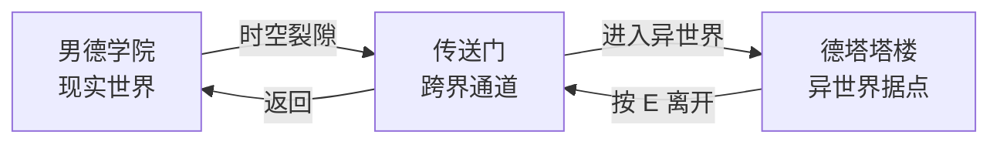

# 德塔世界观

> 状态：V1 | 维护者：陈梓键 | 日期：2026-07-16
> 关联：`prd/01-需求文档/00-基础数据/世界观.md`（男德学院世界观）
> 用途：为德塔（NDO）提供独立的背景设定，支撑男德通 AI 上下文注入、地图设计、剧情模式与后续扩展。

---

## 1. 与男德学院世界观的关系

| 维度 | 男德学院世界观 | 德塔世界观 |
|------|------|------|
| 层级 | 顶层（学院整体） | 子层（德塔模块专属） |
| 范围 | 学院 + 传送门 + 异世界整体设定 | 仅德塔塔楼及周边区域 |
| 用途 | 全局背景，支撑品牌叙事 | 男德通 AI 上下文注入、地图设计、NPC 人设 |
| 路径 | `prd/01-需求文档/00-基础数据/世界观.md` | 本文档 |

**关系**：男德学院世界观定义了"学院发现时空裂隙 → 打通传送门 → 建造德塔"的宏观框架。德塔世界观聚焦于**德塔自身的细节设定**，包括塔楼内部结构、周遭环境、NPC 人设与日常氛围。

---

## 2. 德塔概况

### 2.1 三界关系

德塔的运作离不开三个世界的连接关系：



| 世界 | 定位 | 在产品中的映射 |
|------|------|------|
| **男德学院（现实世界）** | 日常活动场所，德塔的起点 | 网站主界面（MainView） |
| **传送门（跨界通道）** | 连接现实与异世界的入口 | 德塔出生点，可双向通行 |
| **德塔塔楼（异世界）** | 学院在异世界的据点 | 德塔游戏页面（GameView） |

### 2.2 一句话

德塔是男德学院通过**时空裂隙**在异世界建造的一座塔楼据点，学员通过**传送门**往返于现实与异世界之间。

### 2.3 基本属性

| 属性 | 设定 |
|------|------|
| 全称 | 德塔（NDO：Nande Tower Observatory） |
| 位置 | 异世界传送门旁，近塔安全区域 |
| 占地 | 20 格宽（640 像素） |
| 外部 | 绿化树林环绕，天空有云顶 |
| 时间 | 与现实同步，24 小时日夜循环（预留） |
| 当前状态 | 底座大厅已建成，中层和高层尚未开放 |

### 2.4 传送门

| 属性 | 设定 |
|------|------|
| 位置 | 德塔底层大厅出生点 |
| 外观 | 发光的法阵/漩涡（预留美术资源） |
| 功能 | 玩家进入德塔的出生点；也可作为出口 |
| 交互方式 | 走到传送门范围内，按 E 键 |
| 交互提示 | **「按 E 返回男德学院」** |
| 离开确认 | 按 E 后弹窗确认：「确定要离开德塔吗？」→ 选择「是」返回主界面；选择「否」留在德塔 |
| 动效 | 玩家踩上传送门时光效闪烁（预留） |

### 2.5 物理法则

异世界的物理法则与现实不同：
- 世界是 **2D 侧视角**的，由**格子（Grid）**构成
- 角色占 **1 格**（32x32 像素）
- 跳跃高度：最高 **2 格**（即从 1 格高度跳到 3 格高度）
- 存在重力、方块、平台，物理规则接近泰拉瑞亚/我的世界

---

## 3. 塔楼结构

```
         ┌─────────────────┐
         │   高层 · 哨位    │  ← 瞭望塔，未开放
         │   ┌───────────┐ │
         │   │  窗户     │ │
         ├───┴───────────┴─┤
         │   中层 · 房间    │  ← 学员居住区，未开放
         │                 │
         ├─────────────────┤
         │   底层 · 大厅    │  ← MVP 当前地图
         │  ┌──┐ ┌──┐     │
         │  │传送│NPC  │     │
         │  │门  │聚集 │     │
         └──┴──┴──┴──┴────┘
              │
         ┌────┴────┐
         │ 塔楼大门 │  ← 可交互（彩蛋文字）
         └─────────┘
              │
       ┌──────┴──────┐
       │ 近塔安全区域 │  ← 公告牌 / 打卡点 / 日程板
       └─────────────┘
```

### 3.1 底层大厅（MVP 当前地图）

| 区域 | 内容 | 说明 |
|------|------|------|
| 传送门入口 | 玩家出生点（坐标：x=520, y=620） |通位置 | NPC 男德通（x=360, y=620） | 美少女 AI 助手，站在大厅左侧 |
| 公告牌 | 可交互物品 | 群公告查看 |
| 塔楼大门 | 可交互（站到塔楼外右侧） | 通往塔外，现阶段未开放，交互弹出彩蛋 |
| 楼梯 | 向上通道 | 通往中层房间（预留，V1） |

### 3.2 塔楼外部

| 区域 | 说明 |
|------|------|
| 绿化树林 | 塔楼左右两侧分布 6 棵树木，提供视觉充实 |
| 云顶 | 天空 6 朵云，装饰性 |
| 大门 | 塔楼右侧出口，交互弹出彩蛋文字 |

---

## 4. 角色

### 4.1 玩家

- 男德学院成员，通过传送门以像素化身进入德塔
- MVP 阶段无等级、无属性，纯外观差异
- 可移动、跳跃、交互、聊天

### 4.2 NPC

| NPC | 定位 | 位置 | 功能 |
|-----|------|------|------|
| **男德通** | 学院 AI 管家 | 大厅左侧 | AI 对话助手（@ 机器人模式） |
| 院长 | 学院领袖 | 预留 | 未来：发布任务/公告 |
| 其他 NPC | 引导者/商人/任务发布者 | 预留 | 未来扩展 |

---

## 5. 男德通人设

### 5.1 基本设定

| 属性 | 设定 |
|------|------|
| 全名 | 男德通 |
| 身份 | 学院部署在德塔的 AI 管家 |
| 外表 | 二次元美少女 |
| 性格 | 活泼、亲切、略带撒娇 |
| 语言风格 | 美少女口吻，用 "~""！""？" 等语气词 |
| 知识范围 | 德塔运作、操作指南、当前开发进度 |
| 不了解的事情 | 回复「这个问题我还不太清楚呢~问问院长吧！」 |

### 5.2 日常行为

- 站在大厅左侧，随时等待学员前来互动
- 学员走近时，头顶显示「按 E 与男德通对话」
- 按 E 交互时，头顶弹出打招呼气泡（如「你好呀~有什么想问的？」），所有人可见
- 在聊天框中以 @ 机器人的方式回复学员问题

### 5.3 交互方式

详见：[德塔男德通交互需求.md](../01-需求/德塔男德通交互需求.md)

---

## 6. 设计原则

1. **塔为核心**：德塔塔楼是所有活动的中心，一切围绕塔展开
2. **渐进探索**：从大厅开始，逐层逐区域解锁
3. **幽默感**：保持男德学院的调性，不严肃，NPC 对话带有梗和吐槽
4. **轻量优先**：世界观服务于游戏体验，不强加深度叙事
5. **独立但关联**：德塔世界观是男德学院世界观的子集，保持一致性但独立维护

---

## 7. 扩展路线

| 阶段 | 世界观 | 地图 | 新设定 |
|------|--------|------|------|
| **MVP** | 底层大厅 | 大厅地图 | 男德通 + 公告牌 + 大门彩蛋 |
| **V1** | 中层房间 + 近塔区域 | 新地图 | 学员居住区、建造/挖掘 |
| **V2** | 高层哨位 + 远域探索 | 新地图 | 战斗系统、异世界原住民 |
| **V3** | 异世界深处 | 新地图 | 剧情任务、裂隙生物 |

---

## 8. FAQ（男德通 AI 可引用的常见问题）

| 问题 | 答案 |
|------|------|
| 德塔是什么？ | 德塔是男德学院在异世界建造的塔楼据点哦~有三层，现在只开放德塔？ | 登录 男德通（x导航栏的「德塔」就可以啦~ |
| 怎么移动？ | 用 WASD 或者方向键移动，空格跳跃哦~ |
| 怎么跳跃？ | 按空格键就行啦，最高能跳 2 格高呢~ |
| 怎么和男德通说话？ | 走到我面前按 E 键就可以啦~ |
| 怎么离开德塔？ | 走到大厅的传送门，按 E 就能回到男德学院啦~ |
| 传送门在哪？ | 传送门就在大厅出生点附近，发光的就是哦~ |
| 怎么聊天？ | 按 Enter 键就可以打开聊天框啦~ |
| 怎么打开公告？ | 走到公告牌面前按 E 键就能查看~ |
| 塔楼大门能打开吗？ | 现在还不行哦~前面的区域以后再来探索吧！ |
| 德塔有哪些功能？ | 现在有大厅可探索，可以和我聊天，查看公告，后面还会不断更新哦~ |
| 什么时候能战斗？ | 这个问题我还不太清楚呢~问问院长吧！ |
| 德塔外面是什么？ | 塔楼外是近塔安全区域，有树林和云顶，不过大门还没开放呢~ |
| 有多少人在这里？ | 男德学院目前有 20 多位学员哦~ |