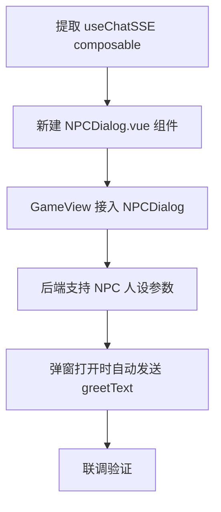

# 德塔 P2 NPC AI 对话接入 · 需求调研文档

> 调研日期：2026-07-16
> 调研人：陈梓键（黑机）
> 状态：待白机评审
> 关联文档：`MVP需求文档.md` §4.2 NPC 系统、`架构设计.md` §3.3 NPC 交互

---

## 一、设计理念

**目标**：用户走到 NPC 面前按 E 键 → 弹出对话窗口 → 与 AI 实时对话 → 关闭窗口回到游戏。

**核心原则**：
1. **复用而非重造**：现有 AI 对话系统（ChatView + chatController + SSE 流式 + RAG）已完整可用，NPC 对话应最大化复用
2. **NPC 作为对话入口**：NPC 对话本质是 ChatView 的另一个入口，差异仅在于：人设切换、UI 容器、游戏暂停/恢复
3. **最小 MVP 先行**：第一版只接入男德通，后续 NPC 逐步扩展

---

## 二、现状调研

### 2.1 NPC 系统现状

| 维度 | 现状 |
|------|------|
| 已部署 NPC | 1 个（男德通），`interactType='ai_chat'` |
| 渲染位置 | `x=360, y=620`（塔楼底层左侧），[WorldScene.js L73-L82](file:///g:/UGit/nandexueyuan/game/scenes/WorldScene.js#L73-L82) |
| 交互方式 | 按 E 键，距离检测 48px，[WorldScene.js L347-L401](file:///g:/UGit/nandexueyuan/game/scenes/WorldScene.js#L347-L401) |
| 事件传递 | Phaser `events.emit('npc-interact', { npcId })` → Vue `onNpcInteract()` |
| 对话弹窗 | **占位态**（显示 npcId + "开发中"），[GameView.vue L327-L337](file:///g:/UGit/nandexueyuan/src/views/GameView.vue#L327-L337) |
| 游戏暂停 | `pauseGame()` / `resumeGame()` 已实现，[main.js L29-L37](file:///g:/UGit/nandexueyuan/game/main.js#L29-L37) |
| NPC 配置 | `shared/npcs.js` 含 `greetText` 字段，**未被使用** |

### 2.2 AI 对话系统现状

| 维度 | 现状 |
|------|------|
| 入口 | `src/views/ChatView.vue`（独立路由页面） |
| 后端端点 | `POST /api/chat/ask`（SSE分类 | statistic / semanticat，[chatController.js L32-L50](file:///g:/UGit/nandexueyuan/server/src/controllers/chatController.js#L32-L50) |
| 系统人设 | 硬编码单一 "男德通"，[chatController.js L7-L29](file:///g:/UGit/nandexueyuan/server/src/controllers/chatController.js#L7-L29) |
| 会话管理 | ChatSession/ChatTurn 模型，关联 userId，[schema.prisma L86-L113](file:///g:/UGit/nandexueyuan/server/prisma/schema.prisma#L86-L113) |
| RAG 检索 | FTS5 + LIKE 两级检索，51万条群聊消息索引 |
| SSE 消费 | 前端直接 fetch 流式读取，ChatView.vue L96-L162 |
| 认证 | JWT，所有端点需 Authorization header |

### 2.3 架构设计文档规划

```
架构设计.md §3.3 NPC 交互（已规划）：
  NPC 交互类型分支：
    ├─ ai_chat  → 复用现有 ChatView 组件（男德通）
    ├─ dialog   → 显示预设对话文本（院长等）
    └─ announcement → 显示公告列表

开发路线与占位策略.md：
  | 男德通集成 | NPCDialog 内 | interactType=ai_chat 时复用现有 AI 对话 |
```

### 2.4 当前缺失的环节

1. **NPC 弹窗未接入 AI**：`onNpcInteract()` 接收到 `npcId` 后仅展示占位文本
2. **`interactType` 分支未实现**：所有 NPC 走同一个弹窗，未区分 `ai_chat` / `dialog` / `announcement`
3. **`greetText` 未消费**：没有在弹窗打开时发送初始问候语
4. **NPCDialog 组件不存在**：弹窗逻辑直接写在 GameView.vue 中
5. **NPC 与 ChatView 未打通**：ChatView 是独立路由页面，NPC 交互需在 GameView 内嵌对话

---

## 三、技术方案对比

### 3.1 方案 A：GameView 内嵌对话（推荐）

**做法**：在 GameView.vue 中内嵌一个精简版对话组件，复用 ChatView 的 SSE 消费逻辑。

```
GameView.vue
├── Phaser 游戏画布
└── NPC 对话弹窗（overlay）
    ├── 消息列表（复用 ChatView 的 messages 渲染逻辑）
    ├── 输入框
    └── 关闭按钮 → resumeGame()
```

**SSE 调用**：直接复用 `POST /api/chat/ask`，前端 fetch 流式消费。

**实现概要**：
- 提取 `ChatView.vue` 中的 SSE 消费逻辑为 composable（`useChatSSE`）
- NPC 弹窗调用 `useChatSSE`，传入 `npcId` 作为人设切换参数
- 弹窗打开时自动发送 `greetText` 作为首条消息

| 维度 | 评价 |
|------|------|
| 开发量 | 中（需提取 composable + 新建 NPC 弹窗组件） |
| 用户体验 | 好（无路由跳转，游戏背景可见） |
| 可扩展性 | 好（后续 NPC 可复用同一组件） |
| 与现有架构的兼容性 | 需改动 ChatView 的结构（提取 composable） |

### 3.2 方案 B：路由跳转到 ChatView

**做法**：按 E 跳转到 ChatView 路由，关闭后回退到 GameView。

```
GameView 按 E → router.push('/chat') → ChatView（全屏）→ 返回按钮 → router.back()
```

||
| 开发量at，[chatController.js 低（几乎零改动） |
| 用户体验 | 差（全屏跳转，割裂感强，失去游戏沉浸感） |
| 可扩展性 | 差（NPC 与 ChatView 耦合，无法区分 NPC 对话与普通聊天） |
| 与现有架构的兼容性 | 好（无冲突） |

### 3.3 方案 C：iframe 内嵌 ChatView

**做法**：在 NPC 弹窗中用 iframe 加载 ChatView 路由。

| 维度 | 评价 |
|------|------|
| 开发量 | 低 |
| 用户体验 | 中（内嵌，但 iframe 通信复杂） |
| 可扩展性 | 差（iframe 通信维护成本高） |
| 与现有架构的兼容性 | 差（跨 iframe 事件传递、路由状态管理复杂） |

### 3.4 推荐结论

**推荐方案 A**。理由：
- 游戏沉浸感最好（overlay 弹窗，不跳转路由）
- 架构可扩展（后续 NPC 新增只需切换人设参数）
- 符合架构设计文档中的规划（"复用现有 ChatView 组件"）

---

## 四、实现路线

### 4.1 MVP 路线（男德通）



### 4.2 详细步骤

#### 步骤 1：提取 `useChatSSE` composable

**目标**：将 ChatView.vue 中的 SSE 消费逻辑（fetch → 流式读取 → messages 更新）提取为独立 composable，ChatView 和 NPCDialog 共享。

**涉及文件**：
- 新建 `src/composables/useChatSSE.js`
- 修改 `src/views/ChatView.vue`（替换为使用 composable）

**useChatSSE 接口设计**：

```ts
// 伪代码
function useChatSSE(options: {
  question: string
  sessionId: number | null
  onThinking: (data) => void
  onToken: (content) => void
  onSources: (sources) => void
  onDone: (data) => void
  onError: (error) => void
}) => { abort: () => void }
```

#### 步骤 2：新建 `NPCDialog.vue` 组件

**目标**：独立的 NPC 对话弹窗组件，内嵌消息列表 + 输入框 + 关闭按钮。

**涉及文件**：
- 新建 `src/components/NPCDialog.vue`
- 修改 `src/views/GameView.vue`（替换占位弹窗）

**组件 props**：
- `npcId`: NPC 标识
- `greetText`: 初始问候语
- `visible`: 是否显示

**组件 emits**：
- `close`: 关闭弹窗

**样式**：使用项目现有 `.nde-dialog` 样式体系（GameView.vue 中已有占位弹窗的样式框架）。

#### 步骤 3：后端支持 NPC 人设参数

**问题**：当前系统人设硬编码为"男德通"（[chatController.js L7](file:///g:/UGit/nandexueyuan/server/src/controllers/chatController.js#L7)），无法动态切换。

**最小改动方案**：在 `POST /api/chat/ask` 的请求体中新增可选参数 `npcId`，后端根据 `npcId` 选择对应人设。

```js
// 新增 NPC 人设映射
const NPC_PERSONAS = {
  nandetong: {
    name: '男德通',
    persona: '你是"男德通"，...',
  },
  // 后续at，[chatController.js
  // dean: { name: '院长', persona: '你是男德学院院长...' },
}
```

**待决策**：是否需要新增后端端点（如 `POST /api/chat/npc/ask`），还是复用现有 `/chat/ask` + `npcId` 参数？详见下方"待决策清单"。

#### 步骤 4：弹窗打开时自动发送 greetText

**目标**：用户按 E 打开 NPC 弹窗后，自动发送 `greetText` 作为首条消息。

**实现**：在 `NPCDialog` 的 `onMounted` 中调用 `useChatSSE`，传入 `greetText` 作为初始 question。

```js
onMounted(() => {
  if (props.greetText) {
    sendMessage(props.greetText) // 自动发送问候语
  }
})
```

#### 步骤 5：联调验证

**验证清单**：
- [ ] 走到男德通面前显示"按 E 与男德通对话"提示
- [ ] 按 E 弹出对话窗口，自动发送问候语
- [ ] 输入问题后收到 SSE 流式回复（思考过程 + 逐 token 渲染）
- [ ] 关闭弹窗后游戏恢复正常操作
- [ ] 重新打开弹窗后恢复之前的对话历史

### 4.3 后续扩展

| 阶段 | 内容 |
|------|------|
| P2.1 | 院长 NPC 接入（`interactType='dialog'`，预设对话文本） |
| P2.2 | 公告牌 NPC 接入（`interactType='announcement'`，展示公告列表） |
| P2.3 | NPC 对话历史持久化（独立 ChatSession，下次打开恢复） |

---

## 五、接口调研

### 5.1 现有接口复用评估

| 接口 | 能否复用 | 说明 |
|------|:--:|------|
| `POST /api/chat/ask` | **是** | 需新增 `npcId` 参数切换人设 |
| `GET /api/chat/sessions` | **是** | NPC 对话可复用 ChatSession 模型，后续可扩展 NPC 专属会话 |
| `GET /api/chat/sessions/:id` | **是** | 加载历史对话 |
| `DELETE /api/chat/sessions/:id` | **是** | 删除 NPC 对话会话 |

### 5.2 是否需要新增端点

**建议不新增**。MVP 阶段复用现有 `/chat/ask`，新增 `npcId` 参数即可。理由：
- 后端逻辑差异极小（仅人设文本不同）
- 避免维护两套相似接口
- 后续如有 NPC 专属逻辑（如 NPC 专用知识库），再拆分

### 5.3 数据库现状

**ChatSession 模型**：
```prisma
model ChatSession {
  id        Int       @id @default(autoincrement())
  userId    Int
  title     String?
  // ...
}
```

**问题**：ChatSession 通过 `userId` 关联用户，**无法区分 NPC 对话和普通聊天**。

**对 MVP 的影响**：MVP 阶段可接受混用，后续如需 NPC 专属会话管理，可在 ChatSession 中新增 `source` 字段（`'chat'` | `'npc'`）。

---

## 六、风险与对策

| 风险 | 影响 | 对策 |
|------|------|------|
| NPC 对话与普通聊天会话混淆 | 中 | MVP 阶段接受混用；后续 ChatSession 加 `source` 字段区分 |
| 后端不支持 NPC 人设切换 | 中 | 新增 `NPC_PERSONAS` 配置映射，`npcId` 参数可选 |
| ChatView 的 SSE 逻辑提取工作量 | 低 | ChatView L96-L162 的核心逻辑约 60 行，提取为 composable 工作量可控 |
| NPCDialog 组件样式不统一 | 低 | 复用 G体系 |
|at，[chatController.js/恢复与 SSE 流式冲突 | 低 | 弹窗打开时暂停 Phaser 场景（已实现），SSE 不影响 Phaser 生命周期 |

---

## 七、待决策清单

> 以下问题需白机（陈梓键）逐项拍板。

### 决策 1：NPC 人设切换方式

| 选项 | 说明 |
|------|------|
| A. 复用 `/chat/ask` + `npcId` 参数 | 请求体新增 `npcId`，后端根据 `npcId` 选择人设 |
| B. 新增 `/api/chat/npc/ask` 端点 | 独立端点，与普通聊天完全隔离 |

**建议**：A，MVP 阶段保持简单。

### 决策 2：NPC 对话是否需要独立会话管理

| 选项 | 说明 |
|------|------|
| A. 与普通聊天共用一个 ChatSession 列表 | MVP 简单，但侧边栏会混入 NPC 对话 |
| B. NPC 对话单独管理（ChatSession 新增 `source` 字段） | 结构清晰，但增加开发工作量 |

**建议**：A（MVP），后续再考虑 B。

### 决策 3：NPCDialog 组件位置

| 选项 | 说明 |
|------|------|
| A. 放在 `src/components/NPCDialog.vue` | 独立组件，符合架构设计文档规划 |
| B. 直接在 `GameView.vue` 中实现 | 减少文件数，但 GameView 会更臃肿 |

**建议**：A。

### 决策 4：greetText 发送方式

| 选项 | 说明 |
|------|------|
| A. 弹窗打开时自动发送 | 用户体验好，但会产生一条 AI 调用 |
| B. 仅显示为静态文本 | 零成本，但缺少 AI 互动感 |

**建议**：A，体现 NPC 的"主动性"。

### 决策 5：useChatSSE composable 放置位置

| 选项 | 说明 |
|------|------|
| A. `src/composables/useChatSSE.js` | 按 Vue 3 惯例放在 composables 目录 |
| B. `src/api/chatSSE.js` | 放在 api 目录，与现有 chat.js 并列 |

**建议**：A，composable 是 Vue 层概念，api 是 HTTP 封装层。

---

## 八、文件变更预估

| 文件 | 动作 | 说明 |
|------|------|------|
| `src/composables/useChatSSE.js` | 新增 | 提取 ChatView 的 SSE 消费逻辑 |
| `src/components/NPCDialog.vue` | 新增 | NPC 对话弹窗组件 |
| `src/views/GameView.vue` | 修改 | 替换占位弹窗为 NPCDialog |
| `src/views/ChatView.vue` | 修改 | 替换为使用 useChatSSE |
| `server/src/controllers/chatController.js` | 修改 | 新增 NPC_PERSONAS 映射 + npcId 参数处理 |
| `shared/npcs.js` | 修改 | 补充 greetText 内容（当前 "嘿，有什么事要问我？" 可保留） |

---

## 九、参考资料

| 文档 | 路径 |
|------|------|
| MVP 需求文档 §4.2 NPC 系统 | `prd/01-需求文档/04-德塔/01-需求/MVP需求文档.md` |
| 架构设计 §3.3 NPC 交互 | `prd/01-需求文档/04-德塔/04-技术方案/架构设计.md` |
| 开发路线与占位策略 | `prd/01-需求文档/04-德塔/04-技术方案/开发路线与占位策略.md` |
| 聊天控制器（SSE + 意图分类） | `server/src/controllers/chatController.js` |
| 前端聊天页面 | `src/views/ChatView.vue` |
| NPC 定义 | `shared/npcs.js` |
| 游戏场景（NPC 交互） | `game/scenes/WorldScene.js` |