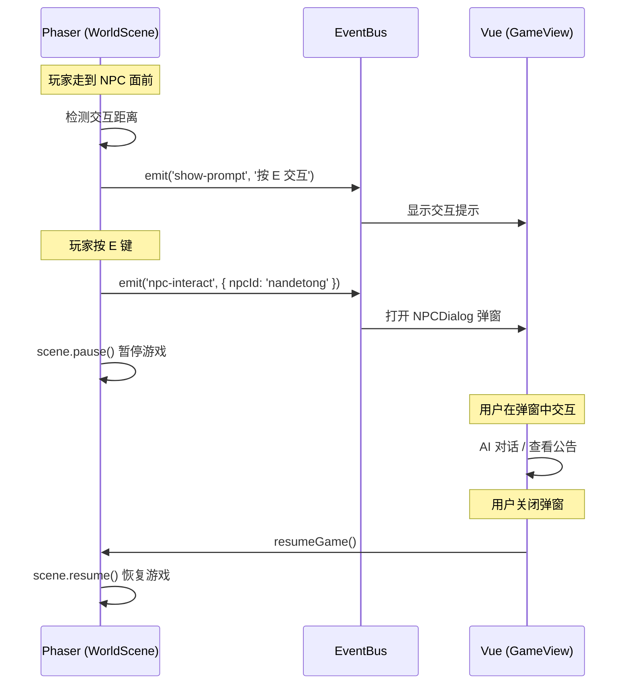
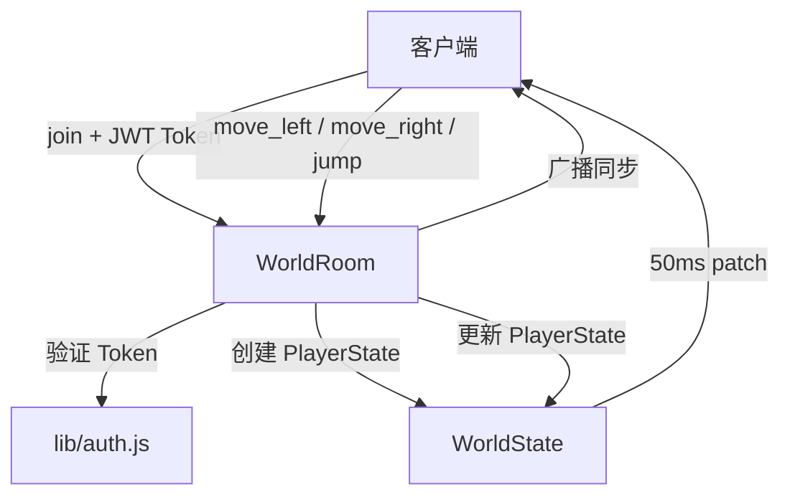

# 德塔（NDO）架构设计

> 版本：V2 | 日期：2026-07-14 | 状态：已确认（P0 已完成，架构变更已落地）

---

## 1. 整体架构

```
浏览器
  ├─ Vue 3 SPA
  │   ├─ /home → 现有首页
  │   ├─ /chat → 男德通（现有）
  │   └─ /nde → GameView.vue（Phaser Canvas 挂载点）
  │              ├─ Phaser 游戏实例
  │              └─ Vue 弹窗桥接（NPC 对话 / 物品交互 / 外观选择）
  │
  ├─ HTTP/SSE → Express :3000（API + AI 助手 + 公告）
  └─ WebSocket → Colyseus :2567（游戏状态同步）

服务器（PM2 双进程）
  ├─ nandexueyuan-api  → Express :3000 + SQLite
  └─ nandexueyuan-game → Colyseus :2567
```

---

## 2. 前端集成方案

### 2.1 GameView.vue 的角色

GameView.vue 是 Vue 和 Phaser 的**唯一接触点**，采用**博德之门3风格底部面板**布局：

```
GameView.vue
├─ <template>
│   ├─ TopBar（返回学院 + 标题）
│   ├─ <div id="game-container" />   ← Phaser Canvas 挂载点（flex:1）
│   ├─ BottomPanel（120px 固定高度）
│   │   ├─ 左：角色信息（头像/昵称/HP/MP/buff）
│   │   ├─ 中：聊天区（消息列表 + 输入框）
│   │   └─ 右：小地图（Canvas 渲染地形+玩家位置）
│   ├─ <NPCDialog v-if="npcActive" /> ← NPC 交互弹窗（Vue）
│   └─ <ItemDialog v-if="itemActive" />← 物品交互弹窗（Vue）
│
├─ <script setup>
│   onMounted → fetchMe() → createGame('game-container', token, nickname)
│   onUnmounted → destroyGame()
│
│   Phaser 通过事件总线通知 Vue
│   Vue 通过 main.js 导出函数调用 Phaser 方法
```

**关键设计决策**：
- UIScene 已移除，HUD 全部由 Vue 底部面板渲染，**不遮挡游戏画面**
- 小地图使用 Vue Canvas 绘制地形 + 玩家位置，从 Phaser 每 100ms 接收位置事件
- 聊天输入时调用 `disableKeyboard()` 禁用 Phaser 按键，避免冲突

### 2.2 Phaser ↔ Vue 通信协议



### 2.3 EventBus 定义

```javascript
// game/events.js — 已实现
{
  // Phaser → Vue
  'npc-interact':      { npcId: string }        // NPC 交互触发
  'item-interact':     { itemId: string }       // 物品交互触发
  'game-ready':        {}                       // 游戏加载完成
  'chat-open':         {}                       // 按 Enter 打开聊天
  'player-position':   { x: number, y: number } // 玩家位置（100ms 节流）
}
// Vue → Phaser（通过 main.js 导出函数）
{
  sendChatMessage(nickname, text)  // 发送聊天 → 角色头顶气泡
  closeChat()                      // 关闭聊天模式
  disableKeyboard() / enableKeyboard()  // 键盘启停
  pauseGame() / resumeGame()       // 游戏暂停/恢复
}
```

---

## 3. 多人同步方案

### 3.1 Colyseus 房间模型



### 3.2 状态 Schema

```
WorldState
  └─ players: Map<string, PlayerState>
       ├─ x: number          // 坐标
       ├─ y: number
       ├─ avatarId: string   // 外观 ID
       ├─ nickname: string   // 昵称
       ├─ facing: string     // 朝向 left/right
       └─ anim: string       // 当前动画 walk/idle/jump
```

### 3.3 同步策略（MVP）

| 数据 | 方向 | 频率 |
|------|------|------|
| 玩家位置 | 客户端 → 服务器 | 每帧（~60Hz） |
| 所有玩家位置 | 服务器 → 所有客户端 | 50ms patch |
| NPC 状态 | 不需要同步 | 静态，客户端各自渲染 |
| 物品状态 | 不需要同步 | 静态，客户端各自渲染 |

> 30 人量级不需要任何优化，直接全量同步。

---

## 4. NPC 交互流程

```
用户走到 NPC 面前 → 显示提示「按 E 交互」
  → 用户按 E
  → Phaser emit('npc-interact') → Vue 打开弹窗
  → 弹窗类型：
      ├─ ai_chat  → 复用现有 ChatView 组件（男德通）
      ├─ dialog   → 显示预设对话文本（院长等）
      └─ announcement → 显示公告列表
  → 用户关闭弹窗 → Vue 调用 resumeGame() → Phaser 恢复
```

---

## 5. 部署架构演进

### 5.1 现状

```
浏览器 → Nginx → 静态资源 (dist/)
              → /api → PM2 (nandexueyuan-api) → Express:3000 → SQLite
```

### 5.2 演进后

```
浏览器 → Nginx → 静态资源 (dist/)
              → /api  → PM2 (nandexueyuan-api)  → Express:3000 → SQLite
              → /ws   → PM2 (nandexueyuan-game) → Colyseus:2567 → 游戏状态
```

### 5.3 Nginx 配置变更

新增 WebSocket 反向代理规则（`/ws` → Colyseus :2567），需要 `proxy_set_header Upgrade` 和 `Connection` 头。
