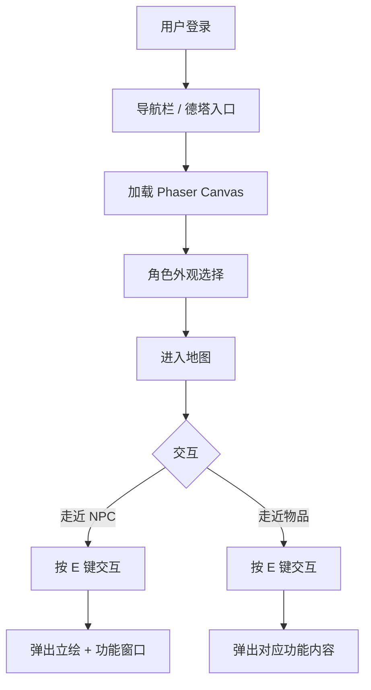
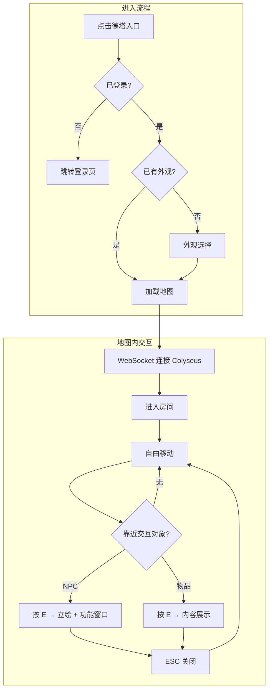
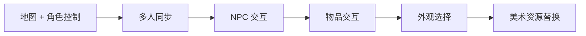

# 德塔（NDO）MVP PRD

> 状态：Accepted | 决策人：陈梓键 | 日期：2026-07-13
> 关联调研：[nandexueyuan-terraria-like-module-research.md](../00-基础数据/nandexueyuan-terraria-like-module-research.md)

---

## 1. Why-Who-What

| 维度 | 说明 |
|------|------|
| 业务背景 | 男德学院为朋友圈限定社区（约 20 人），目前仅有 Web 端功能入口。引入 2D 虚拟世界"德塔（NDO）"，将功能入口（男德通、群公告等）融入可探索的地图，增强团队临场感与趣味性 |
| 目标用户 | 已注册并登录的成员（约 20 人），手机为主、偶尔电脑 |
| 功能范围 | 地图加载、角色移动、多人实时同步、NPC 交互（男德通）、物品交互（群公告等）、角色外观选择 |

**定位**：2D 侧视角像素风虚拟世界，功能聚合大厅，不是纯游戏。当前 MVP 不做战斗/建造/挖掘，后续逐步引入。

---

## 2. 产品形态



### 2.1 视角与风格

| 属性 | 选择 |
|------|------|
| 视角 | 2D 侧视角（泰拉瑞亚风格，左右移动 + 跳跃） |
| 美术风格 | SNES 精细像素风，32x32 瓦片 |
| 渲染 | Phaser.js 3，Canvas 渲染 |
| 地图 | Tiled Map Editor 编辑，导出 JSON |

### 2.2 入口

- Vue Router 新增 `/game` 路由
- 导航栏新增「德塔」入口
- 页面全屏加载 Phaser Canvas，覆盖现有 UI

### 2.3 部署架构

```
浏览器 → Nginx → 静态资源 (dist/)
              → /api → Express:3000 → SQLite
              → /ws  → Colyseus:2567 → 游戏状态
```

---

## 3. 功能清单（MVP）

| 编号 | 功能 | 优先级 | 说明 |
|------|------|:------:|------|
| F1 | 地图加载与渲染 | P0 | Tiled JSON 导入，瓦片渲染，背景层 |
| F2 | 角色控制 | P0 | 左右移动 + 跳跃，键盘控制 |
| F3 | 多人同步 | P0 | 实时位置广播，视野内其他玩家可见 |
| F4 | NPC 交互 — 男德通 | P0 | 点击触发 AI 助手对话，弹出立绘 + 窗口 |
| F5 | 物品交互 — 群公告 | P0 | 点击触发公告内容展示 |
| F6 | 角色外观选择 | P1 | 进入前选择预设外观，多人可区分 |
| F7 | 摄像机跟随 | P0 | 摄像机跟随玩家，平滑移动 |
| F8 | 地图边界 | P0 | 碰撞检测，不超出地图范围 |

### 3.1 不做（MVP 明确排除）

| 功能 | 原因 |
|------|------|
| 战斗系统 | V2 引入 |
| 方块挖掘/放置 | V1 引入 |
| 怪物/NPC AI | V2 引入 |
| 建造系统 | V1 引入 |
| 物品/背包 | V2 引入 |
| 手机触控操作 | P2（当前桌面优先，手机走 Web 端） |
| 多房间/多实例 | 当前 20 人，单世界足够 |

---

## 4. 业务契约

### 4.1 F1 地图加载

- **前置条件**：Tiled Map Editor 导出 JSON + 瓦片集 PNG 就绪
- **处理规则**：
  1. Phaser 加载 JSON 地图文件
  2. 渲染瓦片层（地面、墙壁、装饰）
  3. 加载碰撞层（不可行走区域）
  4. 渲染交互层（NPC 生成点、物品位置）
- **输出**：地图渲染完成，玩家可进入
- **地图规格**：首次建议 100x30 瓦片（32x32 像素），3200x960 像素视口

### 4.2 F2 角色控制

- **前置条件**：地图已加载
- **处理规则**：
  1. 键盘 A/D 或 ←/→ 左右移动，W 或 ↑ 或 Space 跳跃
  2. 移动速度：200px/s（约 6 瓦片/秒）
  3. 跳跃高度：3 瓦片（96px），重力 800px/s²
  4. 碰撞检测：与碰撞层交互，不可穿透
  5. 角色精灵：四方向（左/右站立 + 左/右行走），4 帧动画
- **输出**：角色在地图上移动，受物理约束

### 4.3 F3 多人同步

- **前置条件**：WebSocket 连接正常
- **处理规则**：
  1. 客户端每 50ms 上报位置（x, y, facing, state）
  2. 服务端广播给同房间其他玩家
  3. 其他玩家渲染为不同精灵（外观差异）
  4. 玩家头顶显示昵称
- **输出**：实时可见其他在线玩家
- **异常处理**：
  - 断线：角色原地停留，5 秒后移除
  - 重连：恢复角色到上次位置

### 4.4 F4 NPC 交互 — 男德通

- **前置条件**：玩家靠近 NPC 碰撞范围（48px 内）
- **处理规则**：
  1. 玩家走近 NPC 时，NPC 头顶显示「按 E 交互」提示
  2. 按下 E 键后：
     - 弹出 NPC 立绘（左侧半身像）
     - 弹出对话框 / 功能面板（右侧）
     - 男德通 NPC 弹出 AI 助手对话界面（复用现有 `/api/chat/ask` 接口）
  3. 按 ESC 或点击关闭按钮关闭交互
  4. 交互期间角色不可移动
- **输出**：AI 助手对话功能可用
- **提示文案**：
  - 靠近 NPC：**「按 E 与男德通对话」**
  - 接口失败：**「男德通暂时走神了，请稍后再试」**

### 4.5 F5 物品交互 — 群公告

- **前置条件**：玩家靠近物品碰撞范围（48px 内）
- **处理规则**：
  1. 玩家走近物品时，物品头顶显示「按 E 查看」提示
  2. 按下 E 键后弹出公告内容面板
  3. 按 ESC 关闭
- **输出**：公告内容展示
- **可扩展物品类型**：日程板、投票箱、打卡点（后续扩展）

### 4.6 F6 角色外观选择

- **前置条件**：进入地图前
- **处理规则**：
  1. 展示预设外观列表（20 套，预生成精灵图）
  2. 用户点击选择，确认后进入地图
  3. 外观选择持久化到用户账号（数据库字段）
- **输出**：用户以所选外观进入地图
- **异常处理**：外观图片加载失败 → 默认外观

---

## 5. 数据模型

### 5.1 新增表

```sql
-- 用户外观
ALTER TABLE User ADD COLUMN avatarId INT DEFAULT 1;

-- 游戏世界状态（内存为主，SQLite 辅助持久化）
-- 世界不持久化，每次进入从初始状态开始
```

### 5.2 游戏状态（Colyseus Schema）

```
Player {
  id: string          // 用户 ID
  x: float32          // 位置 X
  y: float32          // 位置 Y
  facing: string      // 'left' | 'right'
  state: string       // 'idle' | 'walking' | 'jumping'
  avatarId: int8      // 外观 ID
  nickname: string    // 昵称
}

WorldState {
  players: Map<Player>  // 在线玩家
}
```

---

## 6. 交互流程



---

## 7. 美术资源需求

### 7.1 资源清单

| 资源 | 规格 | 数量 | 生成方式 |
|------|------|:----:|----------|
| 地图瓦片集 | 32x32 PNG，森林/村庄主题 | 1 套 | ComfyUI 生成 + Tiled 编排 |
| 玩家角色 Sprite | 32x64 PNG，四方向 × 4 帧 | 20 套 | ComfyUI + Pixel-Art-XL LoRA |
| NPC 角色 Sprite | 32x64 PNG，单方向 | 5 个 | ComfyUI 生成 |
| NPC 立绘 | 512x512 PNG，半身像 | 5 张 | ComfyUI 生成 |
| 物品 Sprite | 32x32 PNG | 10 个 | ComfyUI 生成 |
| UI 元素 | 对话框、提示气泡 | 1 套 | CSS 为主 |

### 7.2 生成工作流（黑机 ComfyUI）

```
ComfyUI 工作流：
  ├─ 模型：SDXL + Pixel-Art-XL LoRA（像素风）
  ├─ 瓦片生成：控制网格 + 主题提示词，批量 32x32
  ├─ 角色生成：Sprite Sheet 模板，四方向 + 行走帧
  └─ 立绘生成：512x512，半身像，PNG 透明背景
```

### 7.3 存储评估

| 资源 | 预估大小 |
|------|----------|
| 瓦片集（1 套） | ~10MB |
| 角色 Sprite（20 套） | ~20MB |
| NPC 立绘（5 张） | ~5MB |
| 物品 Sprite（10 个） | ~2MB |
| **合计** | **~37MB** |

---

## 8. 技术方案

### 8.1 前端

| 组件 | 技术 | 说明 |
|------|------|------|
| 游戏引擎 | Phaser.js 3 | Canvas 渲染，内置物理（Matter.js） |
| 集成方式 | Vue 组件挂载 Phaser | `GameView.vue` 挂载 Canvas，路由 `/game` |
| 网络 | Colyseus Client SDK | WebSocket 连接，状态同步 |
| 构建 | Vite | 内联 Phaser，无需额外配置 |

### 8.2 后端

| 组件 | 技术 | 说明 |
|------|------|------|
| 游戏服务器 | Colyseus Server | 独立进程，端口 2567 |
| 传输层 | uWebSockets.js | 性能优化（可选，默认 WebSocket 也可） |
| 进程管理 | PM2 | 管理 Express + Colyseus 双进程 |
| 数据库 | SQLite | 仅存外观选择，游戏状态不持久化 |

### 8.3 依赖新增

| 依赖 | 位置 | 用途 |
|------|------|------|
| phaser | 前端 | 游戏引擎 |
| colyseus.js | 前端 | 客户端 SDK |
| colyseus | 后端 | 游戏服务器框架 |
| @colyseus/uwebsockets-transport | 后端 | 传输层优化（可选） |

---

## 9. MVP 验收标准

| 编号 | 验收项 | 通过条件 |
|------|--------|----------|
| AC1 | 地图加载 | 进入德塔后，完整渲染地图，无缺失瓦片 |
| AC2 | 角色移动 | 键盘控制角色左右移动 + 跳跃，碰撞检测生效 |
| AC3 | 多人可见 | 两个浏览器同时进入，互相可见位置和移动 |
| AC4 | NPC 交互 | 走近男德通 NPC，按 E 弹出立绘 + AI 对话窗口 |
| AC5 | 物品交互 | 走近群公告板，按 E 弹出公告内容 |
| AC6 | 外观选择 | 进入前选外观，进入后显示所选外观 |
| AC7 | 摄像机跟随 | 摄像机平滑跟随玩家，不超出地图边界 |

---

## 10. 实施路径



| 阶段 | 范围 | 输入 | 验收标准 |
|------|------|------|----------|
| P0 | 地图 + 角色控制 | 临时占位瓦片 + 方块角色 | AC1, AC2, AC7 |
| P1 | 多人同步 | P0 完成 | AC3 |
| P2 | NPC 交互 | P1 完成，AI 助手接口就绪 | AC4 |
| P3 | 物品交互 | P2 完成 | AC5 |
| P4 | 外观选择 | 黑机生成 20 套 Sprite | AC6 |
| P5 | 美术资源替换 | 黑机生成完整瓦片 + 立绘 | 整体视觉就绪 |

---

## 11. 异常分支（MECE）

### 网络
- [ ] WebSocket 连接失败 → 提示**「连接服务器失败，请检查网络」**，允许离线模式（仅本地移动）
- [ ] 断线重连 → 自动重试 3 次，间隔 2s，失败后提示并允许重试

### 加载
- [ ] 地图 JSON 加载失败 → 提示**「地图加载失败，请刷新重试」**
- [ ] 角色 Sprite 加载失败 → 显示默认方块角色
- [ ] 立绘加载失败 → 纯文字对话窗口

### 交互
- [ ] 同时多人交互同一 NPC → 各自独立弹窗，不冲突
- [ ] 交互期间收到新消息 → 不中断交互
- [ ] AI 接口超时 → 提示**「男德通暂时走神了，请稍后再试」**

### 空状态
- [ ] 无人在线 → 仅自己在地图上
- [ ] 首次进入无外观 → 引导选择外观
- [ ] 地图无 NPC/物品 → 纯探索地图（开发阶段）

### 边界
- [ ] 角色移动到地图边缘 → 碰撞阻挡，不超出
- [ ] 快速连续按键 → 不卡墙，不穿墙
- [ ] 浏览器窗口失焦 → 暂停移动，不继续移动