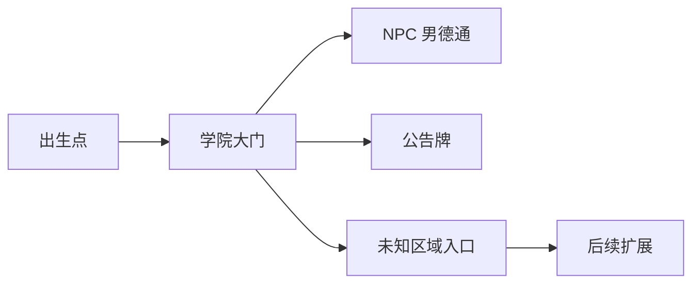

# 德塔（NDO）美术设计规范

> 版本：V1 | 日期：2026-07-13 | 状态：待黑机同步生成

---

## 1. 视觉风格

### 1.1 总体定位

| 维度 | 设定 |
|------|------|
| 风格 | SNES 精细像素风（16-bit style） |
| 参考 | 星之卡比超豪华版、圣剑传说 3、泰拉瑞亚 |
| 色调 | 温暖、明亮、有亲和力（非暗黑、非硬核） |
| 情感 | 轻松、幽默、怀旧、探索感 |

### 1.2 为什么选 SNES 风

| 理由 | 说明 |
|------|------|
| 清晰度 | 32x32 瓦片，细节足够丰富，NPC 立绘可达 512x512 |
| 表现力 | 支持细腻动画和色彩过渡 |
| 怀旧感 | 目标用户（宅男朋友圈）对 16-bit 时代有情感共鸣 |
| 生图友好 | ComfyUI + Pixel-Art-XL LoRA 原生支持此风格 |

---

## 2. 色彩规范

### 2.1 主色调

| 用途 | 色值 | 色块 | 说明 |
|------|------|:----:|------|
| 草地/植被 | #4CAF50 | 🟢 | 温暖的绿色，非荧光绿 |
| 天空/背景 | #87CEEB | 🔵 | 淡蓝，像素天空 |
| 地面/泥土 | #8B6914 | 🟤 | 像素棕 |
| 建筑/墙壁 | #808080 | ⬜ | 灰色石材 |
| 水域 | #4169E1 | 🔷 | 深蓝，像素水面 |
| UI 底色 | #2D2D2D | ⬛ | 暗灰，像素风 UI 面板 |

### 2.2 角色配色原则

- 每个角色外观使用 4-6 种颜色（SNES 限制）
- 主色调 + 辅色 + 阴影色
- 避免过于鲜艳的荧光色，保持温暖复古感

### 2.3 昼夜/天气（预留，V2+）

| 时段 | 色调变化 |
|------|----------|
| 白天 | 默认暖色调 |
| 黄昏 | 叠加橙色滤镜 |
| 夜晚 | 降低亮度，蓝紫调 |

---

## 3. 像素美术规范

### 3.1 基础规格

| 资源类型 | 尺寸 | 颜色数 | 备注 |
|----------|:----:|:------:|------|
| 瓦片（Tile） | 32x32 px | ≤16 色 | 地面、墙壁、装饰 |
| 玩家角色 | 32x64 px | ≤16 色 | 宽 32x 高 64，四方向 |
| NPC 角色 | 32x64 px | ≤16 色 | 同玩家 |
| 物品 | 32x32 px | ≤16 色 | 公告牌、箱子等 |
| NPC 立绘 | 512x512 px | 不限 | 半身像，PNG 透明背景 |
| UI 图标 | 16x16 px | ≤8 色 | 菜单图标 |

### 3.2 精灵表（Sprite Sheet）格式

```
角色行走动画（单方向）：
┌────┬────┬────┬────┐
│ 帧1 │ 帧2 │ 帧3 │ 帧4 │
└────┴────┴────┴────┘
  32x64 每帧，四帧循环

四方向精灵表：
┌────┬────┐
│ 左  │ 右  │
├────┼────┤
│ 上  │ 下  │
└────┴────┘
  每方向 4 帧，总计 16 帧
```

### 3.3 动画帧率

| 动画 | 帧数 | 帧率 | 说明 |
|------|:----:|:----:|------|
| 行走 | 4 帧 | 8 fps | 循环播放 |
| 站立 | 1 帧 | - | 静态 |
| 跳跃 | 2 帧 | 12 fps | 起跳 + 落地 |
| 交互 | 2 帧 | 6 fps | 挥手/点头 |

### 3.4 命名规范

```
{类型}_{名称}_{方向}_{帧号}.png

示例：
tile_grass_00.png           # 草地瓦片
tile_stone_wall_01.png      # 石墙瓦片
sprite_player_male01_r_01.png  # 玩家男1 右向 帧1
sprite_npc_nandetong_idle.png  # NPC男德通 站立
portrait_nandetong.png       # 男德通立绘
item_board_notice.png        # 公告牌物品
```

---

## 4. 地图设计规范

### 4.1 地图结构

```
地图层级（从下到上）：
┌─────────────┐
│  前景装饰层  │  ← 树叶、草、物品（可选）
├─────────────┤
│  碰撞层      │  ← 墙壁、平台（不可行走）
├─────────────┤
│  地面层      │  ← 草地、泥土、石头
├─────────────┤
│  背景层      │  ← 天空、远山、云（视差滚动预留）
└─────────────┘
```

### 4.2 首张地图（学院前庭）

| 属性 | 设定 |
|------|------|
| 尺寸 | 100x30 瓦片（3200x960 px） |
| 主题 | 像素森林 + 学院前庭 |
| 地形 | 平地为主，少量平台（跳跃可达） |
| 建筑 | 学院大门（背景）、NPC 小屋 |
| 出生点 | 地图中央偏左 |

### 4.3 区域规划



| 区域 | 坐标 | 内容 |
|------|------|------|
| 出生点 | x=800, y=800 | 新玩家进入位置 |
| 学院大门 | x=1200, y=800 | 背景装饰，传送门（预留） |
| NPC 男德通 | x=1000, y=800 | 交互 NPC |
| 群公告牌 | x=1400, y=800 | 可交互物品 |
| 东侧小径 | x=2400, y=800 | 通往未知区域（V1 扩展） |

---

## 5. UI 设计规范

### 5.1 游戏内 UI

| 元素 | 样式 | 位置 |
|------|------|------|
| 玩家昵称 | 像素字体，白色 + 阴影 | 角色头顶 |
| 交互提示 | 「按 E 交互」气泡 | 交互对象上方 |
| 在线列表 | 右侧面板，像素风 | 屏幕右上角 |
| 小地图 | 缩略地图（V2） | 屏幕右下角 |

### 5.2 交互弹窗

```
┌──────────────────────────────┐
│ ┌────────┐  ┌──────────────┐ │
│ │        │  │              │ │
│ │  NPC   │  │  对话框/     │ │
│ │  立绘  │  │  功能面板    │ │
│ │        │  │              │ │
│ └────────┘  └──────────────┘ │
│         [关闭]               │
└──────────────────────────────┘
```

### 5.3 字体

| 场景 | 字体 | 说明 |
|------|------|------|
| 游戏内文字 | 像素字体（Press Start 2P 或类似） | 8px-12px |
| 立绘对话框 | 中文字体（思源黑体或类似） | 16px-20px |
| 网站 UI | 现有网站字体 | 不变 |

---

## 6. AI 生图工作流（黑机 ComfyUI）

### 6.1 基础模型

| 组件 | 模型 | 用途 |
|------|------|------|
| 基础模型 | SDXL 1.0 | 通用生成 |
| 像素风格 | Pixel-Art-XL LoRA | 像素风风格化 |
| 角色专用 | SD_PixelArt_SpriteSheet_Generator | 四方向精灵表 |

### 6.2 提示词模板

#### 瓦片生成
```
pixel art, 32x32 tile, grass ground, SNES style, 
16-bit retro game, seamless, no outline, 
warm colors, flat shading
Negative: blur, realistic, 3D, gradient, high resolution
```

#### 角色生成
```
pixel art, 32x64 character sprite, four-directional walk cycle, 
SNES style, 16-bit, simple design, 
side view, male character, casual outfit
Negative: 3D, realistic, blur, complex background
```

#### 立绘生成
```
portrait, half body, pixel art style, SNES era, 
512x512, transparent background, 
anime-inspired, friendly expression, 
warm lighting, simple composition
Negative: realistic, 3D, photo, complex background
```

### 6.3 后处理

| 步骤 | 工具 | 说明 |
|------|------|------|
| 背景移除 | ComfyUI Remove BG Node | 立绘透明背景 |
| 尺寸调整 | ComfyUI Resize | 精确到目标尺寸 |
| 调色板限制 | 手动调整 | 限制颜色数量，确保像素风 |
| 精灵表裁剪 | 手动/脚本 | 四方向帧裁剪为独立文件 |

---

## 7. 资源目录结构

```
game/
├── tilesets/
│   ├── forest.json          # Tiled 瓦片集定义
│   └── forest.png           # 瓦片集图片
├── sprites/
│   ├── players/
│   │   ├── avatar_01/       # 外观 1 四方向精灵
│   │   ├── avatar_02/       # 外观 2
│   │   └── ...
│   ├── npcs/
│   │   ├── nandetong/       # 男德通 NPC
│   │   └── ...
│   └── items/
│       ├── board_notice.png # 公告牌
│       └── ...
├── portraits/
│   ├── nandetong.png        # 男德通立绘
│   └── ...
├── maps/
│   ├── academy_front.json   # 学院前庭（Tiled 导出）
│   └── ...
└── ui/
    ├── font.png             # 像素字体
    └── icons/               # UI 图标
```

---

## 8. 设计原则总结

1. **SNES 优先**：所有美术资源以 16-bit / SNES 风格为基准
2. **像素真实**：不使用缩放放大，保持像素颗粒感
3. **色彩克制**：每个精灵 ≤16 色，保持复古感
4. **立绘例外**：立绘可达 512x512，不限制颜色，允许更丰富的表现
5. **AI 为主，人工为辅**：ComfyUI 生成 80%，人工调色/裁剪 20%