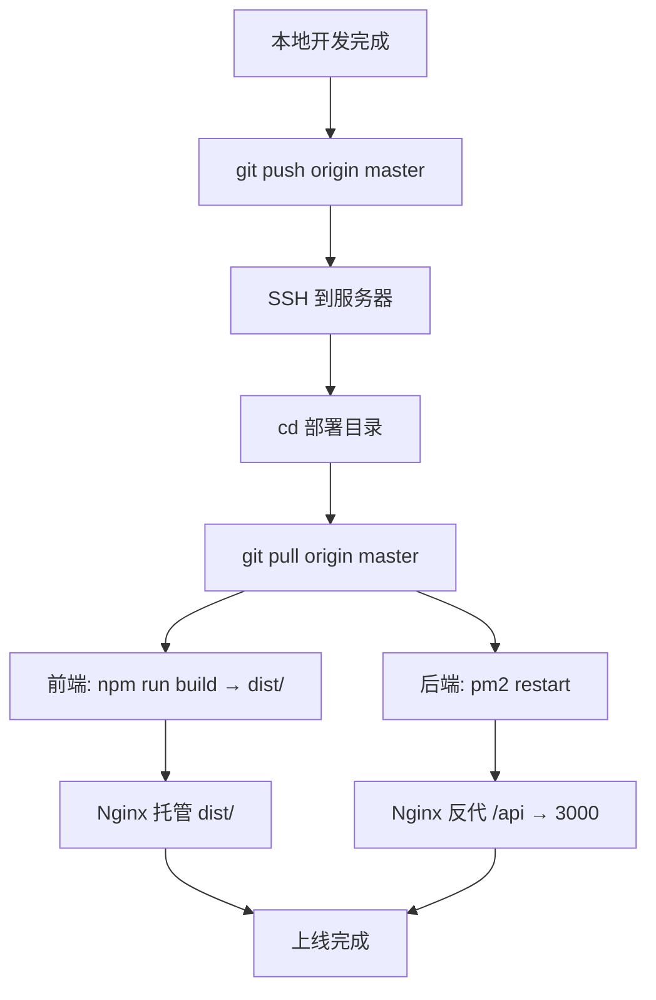

# 部署方案

## 服务器信息

| 项目 | 值 |
|------|-----|
| 云服务商 | 阿里云 |
| 实例规格 | ecs.e-c1m1.large（经济型e，2vCPU，2GiB） |
| 公网 IP | 47.96.158.104 |
| 操作系统 | Ubuntu 22.04.5 LTS |
| 带宽 | 3 Mbps（按固定带宽） |
| 存储 | ESSD Entry 40GB |
| 已装 | git, nginx（宝塔自带）, 宝塔面板 |
| 备案 | 已完成 |

## 仓库结构

```
[服务器 bare 仓库]  ← 中央枢纽（存历史，无工作区）
/root/projects/www.nandexueyuan.top.git
        ↑↓
[本地开发机]  [服务器部署目录]
              /root/projects/www.nandexueyuan.top
```

## 部署流程



## Nginx 配置要点

| 路径 | 转发目标 | 说明 |
|------|---------|------|
| `/` | `dist/` 静态文件 | Vue SPA，try_files 回退 index.html |
| `/api/*` | `http://127.0.0.1:3000` | 反代到 Node 后端 |
| 443 | SSL 证书 | 备案后申请 Let's Encrypt |

## PM2 守护

```
pm2 start src/index.js --name nandexueyuan-api
pm2 save
pm2 startup  # 开机自启
```

## 内存预算

| 组件 | 占用 |
|------|------|
| 系统 + 宝塔 | ~400 MB |
| Nginx | ~50 MB |
| Node.js 后端 | ~80-150 MB |
| SQLite | ~10 MB |
| **总计** | **~600 MB**，剩余 ~1 GB |
