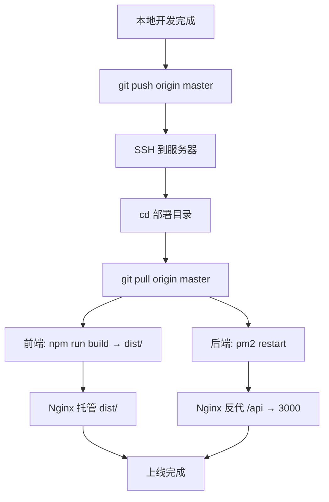

# 部署方案

## 服务器信息

| 项目 | 值 |
|------|-----|
| 云服务商 | 阿里云 |
| 实例规格 | ecs.e-c1m1.large（经济型e，2vCPU，2GiB） |
| 公网 IP | 47.96.158.104 |
| 操作系统 | Ubuntu 22.04.5 LTS |
| 带宽 | 3 Mbps（按固定带宽） |
| 存储 | ESSD Entry 40GB |
| 已装 | git, nginx（宝塔自带）, 宝塔面板 |
| 备案 | 已完成 |

## 仓库结构

```
[服务器 bare 仓库]  ← 中央枢纽（存历史，无工作区）
/root/projects/www.nandexueyuan.top.git
        ↑↓
[本地开发机]  [服务器部署目录]
              /root/projects/www.nandexueyuan.top
```

## 部署流程



## Nginx 配置要点

| 路径 | 转发目标 | 说明 |
|------|---------|------|
| `/` | `dist/` 静态文件 | Vue SPA，try_files 回退 index.html |
| `/api/*` | `http://127.0.0.1:3000` | 反代到 Node 后端 |
| 443 | SSL 证书 | 备案后申请 Let's Encrypt |

## PM2 守护

```
pm2 start src/index.js --name nandexueyuan-api
pm2 save
pm2 startup  # 开机自启
```

## 内存预算

| 组件 | 占用 |
|------|------|
| 系统 + 宝塔 | ~400 MB |
| Nginx | ~50 MB |
| Node.js 后端 | ~80-150 MB |
| SQLite | ~10 MB |
| **总计** | **~600 MB**，剩余 ~1 GB |

## 常见部署问题（踩坑日志）

### 问题 1：`pnpm install --frozen-lockfile` 漏装 Server 依赖

**现象**：`ERR_MODULE_NOT_FOUND: Cannot find package 'multer'` 或 `'dotenv'` 或 `'csv-parse'`

**原因**：根目录的 `pnpm-lock.yaml` 不包含 server/ 子包的全部依赖。

**解决**：部署流程中 server 安装必须单独执行：
```bash
cd server
pnpm install --frozen-lockfile
```

### 问题 2：`@prisma/client` 未生成

**现象**：`SyntaxError: The requested module '@prisma/client' does not provide an export named 'PrismaClient'`

**原因**：`pnpm install` 重装依赖后，Prisma Client 被清空，需要重新生成。

**解决**：server 安装后必须执行：
```bash
cd server
npx prisma generate
```

### 问题 3：`pnpm add` 会清理 node_modules

**现象**：用 `pnpm add` 补装遗漏依赖后，之前已安装的依赖（如 `@prisma/client`）被移入 `.ignored` 目录。

**原因**：`pnpm add` 认为旧依赖是"其他包管理器安装的"，会重置。

**解决**：先 `pnpm install --frozen-lockfile`，再 `pnpm add`，最后 `npx prisma generate`。

### 问题 4：服务器缺少 `dotenv`

**现象**：`Cannot find package 'dotenv'`

**原因**：`dotenv` 是 server 的直接依赖，但 `pnpm install --frozen-lockfile` 在 server 目录下可能漏装。

**解决**：`pnpm add dotenv` 补装。

### 问题 5：数据库迁移未执行

**现象**：API 调用报 `no such table` 错误。

**原因**：`git pull` 后新增了 migration 文件，但未执行 `prisma migrate deploy`。

**解决**：部署流程中必须包含：
```bash
cd server
npx prisma migrate deploy
```

## 完整部署流程（修正版）

服务器端执行顺序：

```bash
cd /root/projects/www.nandexueyuan.top
git pull origin master

# 后端
cd server
pnpm install --frozen-lockfile
npx prisma generate
npx prisma migrate deploy
cd ..

# 前端
pnpm install --frozen-lockfile
NODE_OPTIONS=--max-old-space-size=512 pnpm build

# 重启
pm2 restart nandexueyuan-api
pm2 save
sleep 2
curl -s http://localhost:3000/api/hello
```
