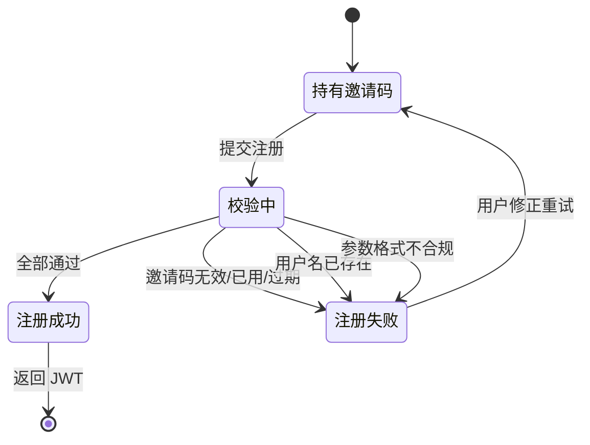
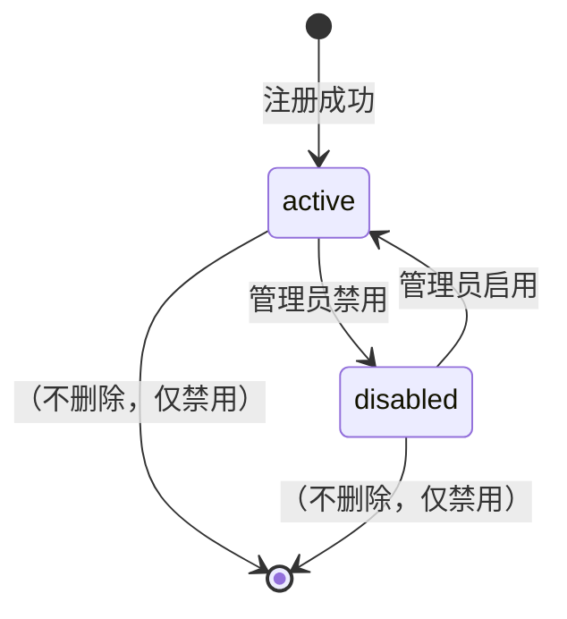
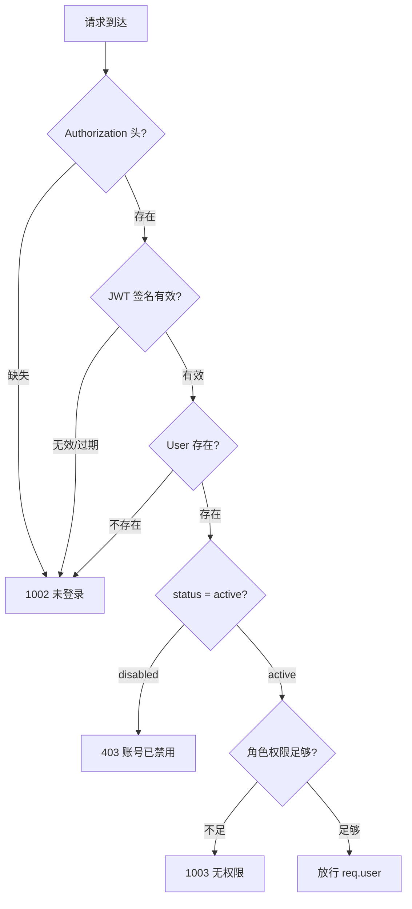
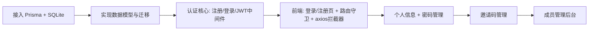

# 用户系统 PRD

## 1. Why-Who-What

- **业务背景**：男德学院为朋友圈限定社区（约 20 人），需识别成员身份、控制准入、区分管理权限
- **目标用户**：21 名已知名册的朋友
- **功能范围**：邀请码注册、用户名登录、JWT 鉴权、个人信息管理、密码管理、邀请码管理、用户管理

## 2. 角色体系

| 角色 | 标识 | 人数 | 权限 |
|------|------|------|------|
| 院长 | `super_admin` | 1（陈梓键） | 全部权限：管理管理员、生成邀请码、管理所有成员、分配角色 |
| 管理员 | `admin` | 若干 | 生成邀请码、管理普通成员（禁用/重置密码） |
| 成员 | `member` | 其余 | 仅编辑本人信息、修改本人密码 |

### 权限矩阵

| 操作 | 院长 | 管理员 | 成员 |
|------|:----:|:------:|:----:|
| 注册账号（凭邀请码） | - | - | - |
| 登录 / 登出 | ✓ | ✓ | ✓ |
| 查看 / 编辑本人信息 | ✓ | ✓ | ✓ |
| 修改本人密码 | ✓ | ✓ | ✓ |
| 生成邀请码 | ✓ | ✓ | ✗ |
| 查看邀请码列表 | ✓ | ✓（仅自己生成的） | ✗ |
| 查看成员列表 | ✓ | ✓ | ✗ |
| 禁用 / 启用成员 | ✓ | ✓（仅 member） | ✗ |
| 重置成员密码 | ✓ | ✓（仅 member） | ✗ |
| 分配 / 变更角色 | ✓ | ✗ | ✗ |
| 管理管理员（禁用/降级） | ✓ | ✗ | ✗ |

## 3. 数据模型

### User

| 字段 | 类型 | 约束 | 说明 |
|------|------|------|------|
| id | Int | PK, 自增 | |
| username | String | 唯一, 2-20 字符 | 登录账号 |
| password_hash | String | 非空 | bcrypt 哈希 |
| nickname | String | 可空 | 显示昵称，空则用 username |
| avatar | String | 可空 | 头像 URL |
| role | Enum | 非空, 默认 `member` | `super_admin` / `admin` / `member` |
| status | Enum | 非空, 默认 `active` | `active` / `disabled` |
| invite_code_id | Int | FK, 可空 | 注册时使用的邀请码 |
| created_at | DateTime | 默认 now | |
| updated_at | DateTime | 自动更新 | |

### InviteCode

| 字段 | 类型 | 约束 | 说明 |
|------|------|------|------|
| id | Int | PK, 自增 | |
| code | String | 唯一, 8 字符 | 随机生成（大小写字母+数字） |
| created_by | Int | FK → User.id | 生成者 |
| used_by | Int | FK → User.id, 可空 | 使用者，未使用为 null |
| status | Enum | 默认 `unused` | `unused` / `used` / `expired` |
| expires_at | DateTime | 非空 | 过期时间（生成后 7 天） |
| created_at | DateTime | 默认 now | |

## 4. 功能清单

| 功能 | 优先级 | 状态 | 角色 |
|------|--------|------|------|
| 邀请码注册 | P0 | 待开发 | 公开（凭码） |
| 用户名登录 | P0 | 待开发 | 公开 |
| 登出 | P0 | 待开发 | 已登录 |
| 获取当前用户信息 | P0 | 待开发 | 已登录 |
| JWT 鉴权中间件 | P0 | 待开发 | 系统级 |
| 修改个人信息 | P1 | 待开发 | 已登录 |
| 修改密码 | P1 | 待开发 | 已登录 |
| 生成邀请码 | P1 | 待开发 | admin+ |
| 查看邀请码列表 | P1 | 待开发 | admin+ |
| 成员列表 | P1 | 待开发 | admin+ |
| 禁用/启用成员 | P1 | 待开发 | admin+ |
| 重置成员密码 | P1 | 待开发 | admin+ |
| 分配/变更角色 | P2 | 待开发 | super_admin |

## 5. 业务契约

### 5.1 邀请码注册

- **前置条件**：持有有效邀请码
- **处理规则**：
  1. 校验邀请码存在且 `status = unused` 且未过期
  2. 校验 username 唯一、长度 2-20
  3. 校验 password 长度 6-32
  4. bcrypt 哈希密码（cost=10）
  5. 创建 User（role=`member`, status=`active`）
  6. 标记邀请码 `status = used`, `used_by = 新用户id`
  7. 签发 JWT（payload: `{ userId, role }`，有效期 7d）
- **输出结果**：返回 JWT + 用户基本信息
- **提示文案**：
  - 邀请码无效/已使用/已过期：**「邀请码无效或已失效」**
  - 用户名已存在：**「用户名已被占用」**
  - 用户名长度不合规：**「用户名需 2-20 个字符」**
  - 密码长度不合规：**「密码需 6-32 个字符」**

### 5.2 用户名登录

- **前置条件**：账号已存在且 `status = active`
- **处理规则**：
  1. 按 username 查询 User
  2. bcrypt 比对密码
  3. 签发 JWT（payload: `{ userId, role }`，有效期 7d）
- **输出结果**：返回 JWT + 用户基本信息
- **提示文案**：
  - 账号不存在或密码错误：**「用户名或密码错误」**（不区分，防枚举）
  - 账号已禁用：**「账号已被禁用，请联系管理员」**

### 5.3 登出

- **前置条件**：已登录
- **处理规则**：前端清除 localStorage 中的 token，跳转登录页
- **说明**：JWT 无状态，服务端不维护黑名单（20 人社区无需 token 撤销复杂度）

### 5.4 获取当前用户信息

- **前置条件**：已登录（JWT 有效）
- **处理规则**：从 JWT 取 userId，查询 User
- **输出结果**：username, nickname, avatar, role（不含 password_hash）

### 5.5 JWT 鉴权中间件

- **前置条件**：请求头 `Authorization: Bearer <token>`
- **处理规则**：
  1. 提取 token，缺失 → 1002
  2. jwt.verify 校验签名和过期，失败 → 1002
  3. 按 userId 查 User，不存在 → 1002
  4. status = disabled → **「账号已被禁用」** 403
  5. 将 user 挂载到 req.user，放行
- **角色守卫**：路由级中间件检查 `req.user.role`，不满足 → 1003

### 5.6 修改个人信息

- **前置条件**：已登录
- **处理规则**：仅可修改 nickname、avatar（username、role 不可自行修改）
- **提示文案**：修改成功：**「个人信息已更新」**

### 5.7 修改密码

- **前置条件**：已登录
- **处理规则**：
  1. bcrypt 验证旧密码
  2. 校验新密码长度 6-32
  3. 新密码不能与旧密码相同
  4. bcrypt 哈希新密码，更新
- **提示文案**：
  - 旧密码错误：**「原密码错误」**
  - 新旧密码相同：**「新密码不能与原密码相同」**
  - 成功：**「密码已修改，请重新登录」**（前端清除 token 跳登录页）

### 5.8 生成邀请码

- **前置条件**：role = admin 或 super_admin
- **处理规则**：
  1. 随机生成 8 字符码（大小写字母+数字，排除易混淆字符 0O1lI）
  2. 唯一性校验（冲突则重新生成）
  3. expires_at = now + 7d
  4. 写入 InviteCode
- **输出结果**：返回 code、expires_at

### 5.9 成员管理（列表/禁用/重置密码）

- **列表**：分页查询 User 列表（id, username, nickname, role, status, created_at）
- **禁用/启用**：更新 status。不可禁用自己；管理员不可禁用 admin/super_admin
- **重置密码**：生成随机 8 位临时密码，bcrypt 哈希后更新。返回明文临时密码（仅此次返回）
- **提示文案**：
  - 不可禁用自己：**「不能禁用自己的账号」**
  - 权限不足：**「无权操作该用户」**

### 5.10 分配/变更角色

- **前置条件**：role = super_admin
- **处理规则**：
  1. 目标用户不能是自己
  2. 不可降级院长（仅 1 个 super_admin，不可变更自身角色）
  3. 更新目标用户 role
- **提示文案**：
  - 操作自己：**「不能修改自己的角色」**
  - 目标是院长：**「院长的角色不可变更」**

## 6. API 契约

> 统一响应格式：`{ code, message, data }`，错误码见 [API规范.md](../04-接口契约/API规范.md)

### 6.1 认证相关

| 方法 | 路径 | 鉴权 | 说明 |
|------|------|:----:|------|
| POST | `/api/auth/register` | 公开 | 邀请码注册 |
| POST | `/api/auth/login` | 公开 | 用户名登录 |
| POST | `/api/auth/logout` | 已登录 | 登出 |
| GET | `/api/auth/me` | 已登录 | 获取当前用户信息 |

**POST /api/auth/register**
```json
// Request
{ "username": "string", "password": "string", "inviteCode": "string" }
// Response data
{ "token": "string", "user": { "id": 1, "username": "", "nickname": "", "avatar": "", "role": "member" } }
```

**POST /api/auth/login**
```json
// Request
{ "username": "string", "password": "string" }
// Response data
{ "token": "string", "user": { "id": 1, "username": "", "nickname": "", "avatar": "", "role": "member" } }
```

### 6.2 用户相关

| 方法 | 路径 | 鉴权 | 说明 |
|------|------|:----:|------|
| PUT | `/api/user/profile` | 已登录 | 修改个人信息 |
| PUT | `/api/user/password` | 已登录 | 修改密码 |

### 6.3 邀请码管理

| 方法 | 路径 | 鉴权 | 说明 |
|------|------|:----:|------|
| POST | `/api/invite-codes` | admin+ | 生成邀请码 |
| GET | `/api/invite-codes` | admin+ | 邀请码列表 |

### 6.4 成员管理

| 方法 | 路径 | 鉴权 | 说明 |
|------|------|:----:|------|
| GET | `/api/admin/users` | admin+ | 成员列表 |
| PATCH | `/api/admin/users/:id/status` | admin+ | 禁用/启用成员 |
| POST | `/api/admin/users/:id/reset-password` | admin+ | 重置成员密码 |
| PATCH | `/api/admin/users/:id/role` | super_admin | 变更角色 |

## 7. 状态机

### 注册流程



### 账号状态



### JWT 鉴权



## 8. 异常分支（MECE）

### 注册
- [x] 邀请码不存在
- [x] 邀请码已被使用
- [x] 邀请码已过期
- [x] 用户名已存在
- [x] 用户名长度不合规（<2 或 >20）
- [x] 密码长度不合规（<6 或 >32）

### 登录
- [x] 账号不存在（不区分提示，防枚举）
- [x] 密码错误（不区分提示，防枚举）
- [x] 账号已禁用
- [x] 并发登录：允许多端登录，不互踢（20 人社区无需单点限制）

### 鉴权
- [x] token 缺失
- [x] token 签名无效（篡改）
- [x] token 过期
- [x] 用户已被禁用（token 签发后禁用）
- [x] 角色权限不足

### 个人信息
- [x] nickname 超长（限制 20 字符）
- [x] avatar URL 格式不合法

### 修改密码
- [x] 旧密码错误
- [x] 新旧密码相同
- [x] 新密码长度不合规

### 邀请码
- [x] 生成时随机码冲突（重试机制）
- [x] 邀请码过期未使用（状态变更为 expired）

### 成员管理
- [x] 禁用自己
- [x] 管理员禁用 admin/super_admin
- [x] 重置密码的用户不存在
- [x] 变更角色操作自己
- [x] 变更院长的角色

### 网络/空状态
- [x] 弱网：前端请求超时提示**「网络异常，请稍后重试」**
- [x] 断网：前端检测 offline 提示**「网络已断开」**
- [x] 首次进入无个人信息：nickname 为空时回退显示 username
- [x] 邀请码列表为空：展示空状态引导生成
- [x] 成员列表为空：不会发生（至少有院长）

## 9. 技术依赖（待接入）

| 依赖 | 用途 | 安装位置 |
|------|------|----------|
| @prisma/client | ORM | server |
| prisma (dev) | 迁移工具 | server |
| bcryptjs | 密码哈希 | server |
| jsonwebtoken | JWT 签发/校验 | server |
| express-validator | 参数校验（可选） | server |

## 10. 实施路径


