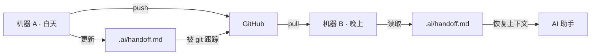
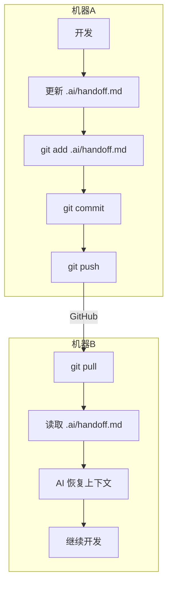

# AI 跨机协作协议

> 适用场景：单人早晚换机，通过 GitHub 中央仓库协同。
> 维护者：陈梓键（chenzijian@nndrobot.com）

---

## 1. 场景定义

| 维度 | 说明 |
|------|------|
| 谁 | 单人开发者，早晚两台设备 |
| 什么 | 通过 GitHub 同步代码，AI 助手需跨机恢复上下文 |
| 为什么 | 避免换机后 AI 从零开始，丢失进度、决策与注意事项 |



---

## 2. 共享资源（纳入 git 跟踪）

以下目录/文件提交到 GitHub，两台设备共享同一份：

| 路径 | 用途 | 说明 |
|------|------|------|
| `.trae/.rules/` | AI 规则集 | 编码规范、git 流程、部署纪律、项目规则等 |
| `.trae/.skills/` | AI 技能库 | 需求收集、PRD 验证、UI 创建等 |
| `prd/` | 产品需求文档 | 需求调研、技术架构、设计规范、功能模块、接口契约、开发规范 |
| `.ai/handoff.md` | AI 交接文件 | 跨机上下文恢复，**每次换机前必更新** |
| `prd/05-开发规范/ai-collab.md` | 本协议 | 两台设备 AI 的协作约定 |
| `prd/05-开发规范/git-manage.md` | Git 管理规则 | 分支策略、提交规范、部署流程 |
| `pnpm-lock.yaml` | 依赖锁文件 | 确保两台机器安装相同版本的依赖 |
| `vite.config.js` | 构建配置 | 端口、代理、打包规则，项目核心配置 |

---

## 3. 因地制宜（不纳入 git）

以下内容各机器独立维护，**不提交**：

| 类别 | 路径/文件 | 原因 |
|------|-----------|------|
| 环境变量 | `.env`、`server/.env` | 含密钥、API Key、端口，各机器不同 |
| 数据库 | `*.db`、`*.db-journal` | SQLite 本地数据，不跨机同步 |
| 依赖 | `node_modules/` | 各机器独立安装 |
| IDE 个人配置 | `.vscode/`、`.idea/` | 编辑器偏好因人而异 |
| IDE 个人状态 | `.trae/*`（除 .rules/.skills 外） | 缓存、会话、IDE 个人偏好 |
| 构建产物 | `dist/`、`build/` | 各机器独立构建 |
| 媒体文件 | `public/media/**/*` | 照片等二进制大文件，仅目录结构保留 |
| 敏感数据 | `prd/01-需求调研/成员分析/` | 含真实聊天记录分析 |
| 临时文件 | `tmp/*` | 各机器本地临时文件 |
| 系统文件 | `.DS_Store`、`Thumbs.db` | 操作系统生成 |

**关键区分**：

- `.trae/.rules/` 和 `.trae/.skills/` -> **项目级共享**，提交
- `.trae/*`（其余） -> **个人级**，忽略（IDE 缓存、会话等）
- `.gitignore` 本身 -> **必须提交**，它是两台机器的共同忽略策略
- `pnpm-lock.yaml` -> **必须提交**，锁定依赖版本，保证两机一致
- `vite.config.js` -> **必须提交**，项目核心配置，否则另一台无法运行

---

## 4. AI 交接协议

### 4.1 交接文件

- **路径**：`.ai/handoff.md`
- **格式**：Markdown，按模板填写
- **跟踪**：纳入 git，随代码提交

### 4.2 触发时机

| 时机 | 动作 |
|------|------|
| 每日开始 | AI 读取 `.ai/handoff.md`，恢复上下文 |
| 每次提交前 | AI 更新 `.ai/handoff.md`，记录当前进度 |
| 换机切换前 | **必须**更新并提交，确保新设备可恢复 |
| 每次会话结束 | 更新"当前任务"和"下一步" |

### 4.3 必填字段

```markdown
# AI 交接单

> 最后更新：YYYY-MM-DD HH:MM
> 提交人：{姓名}
> 所在设备：{设备标识，如 A-台式机 / B-笔记本}

---

## 当前任务
- [ ] 任务一（优先级：高/中/低）
- [ ] 任务二

## 进行中（未完成，切勿遗漏）
- 文件：`src/xxx.js`，正在修改 {功能描述}，当前进度 {X%}
- 问题：{遇到的阻塞或待确认事项}

## 已完成（本次会话）
- [x] 任务一 — 文件：`src/xxx.js`，commit: `abc1234`

## 环境状态
- 分支：`{当前分支}`
- 最后提交：`{commit hash}`
- 数据库：{是否有迁移/seed 变更}
- 依赖：{是否新增/更新了依赖}

## 注意事项
- {新设备需要额外执行的操作，如：npx prisma migrate dev}
- {已知问题或临时 hack}
- {待确认的决策点}

## 下一步
- {下一个会话的开场建议，帮助 AI 快速切入}
```

### 4.4 使用示例

```markdown
# AI 交接单

> 最后更新：2026-07-13 18:30
> 提交人：陈梓键
> 所在设备：A-台式机

---

## 当前任务
- [ ] 新增论坛发帖功能（优先级：高）
- [ ] 修复 AI 助手限流逻辑（优先级：中）

## 进行中（未完成，切勿遗漏）
- 文件：`server/src/controllers/chatController.js`，正在接入火山引擎流式响应，当前进度 60%
- 问题：流式响应 `Transfer-Encoding: chunked` 在前端解析有延迟，需要调研 SSE 方案

## 已完成（本次会话）
- [x] 端口改为 4396 — commit: `a1b2c3d`
- [x] 论坛 schema 设计 — commit: `e4f5g6h`

## 环境状态
- 分支：`master`
- 最后提交：`e4f5g6h`
- 数据库：已执行 `npx prisma migrate dev`
- 依赖：无变更

## 注意事项
- 换机后需重新执行 `npx prisma migrate dev` 同步数据库
- 暂未配置 VOLC_API_KEY，AI 助手功能不可用

## 下一步
- 继续完成流式响应接入，建议先阅读 `server/src/utils/llm.js` 的现有实现
- 论坛模块的前端路由已创建但未接入，可开始开发
```

---

## 5. Git 同步流程



**核心原则**：**handoff.md 必须随代码一起 commit**，不得单独遗漏。AI 在每次 commit 前需确认 handoff 已更新。

---

## 6. 规则与技能同步策略

| 操作 | 策略 |
|------|------|
| 新增规则/技能 | 放入 `.trae/.rules/` 或 `.trae/.skills/`，提交即可 |
| 修改规则/技能 | 与代码修改一起提交 |
| 删除规则/技能 | 提交删除，两设备同步 |
| 个人临时规则 | 放 `.trae/.rules/` 外（不跟踪），或标注 `[本地]` 前缀 |

**冲突处理**：若两设备同时修改了同一规则文件，以 GitHub 最新版本为准，放弃本地修改（规则文件通常由单侧修改，冲突概率低）。

---

## 7. 提交规范（补充）

在 `git-manage.md` 的提交规范基础上，补充：

| type | 说明 | 示例 |
|------|------|------|
| handoff | 纯交接更新（无代码变更） | `handoff: 换机前更新交接单` |
| rules | 规则/技能变更 | `rules: 新增 AI 协作协议` |

**handoff 类提交例外**：允许在无代码变更时单独提交 handoff.md，不强制与代码变更捆绑。