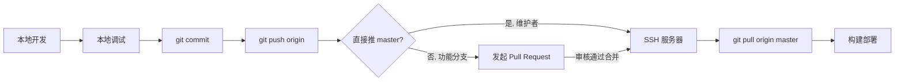

# Git 管理规则

## 开发流程



**核心原则：GitHub 为唯一中央仓库，所有开发推送至 GitHub；master 合并后触发服务器部署拉取。**

## 仓库结构

| 位置 | 路径 | 类型 | 用途 |
|------|------|------|------|
| 本地 | `g:\UGit\nandexueyuan` | 工作仓库 | 开发调试 |
| GitHub | `https://github.com/chen136523510/nandexueyuan` | 托管仓库 | 中央枢纽，存历史，多人协作 |
| 服务器 bare | `/root/projects/www.nandexueyuan.top.git` | bare 仓库 | 历史备份（镜像，可选） |
| 服务器部署 | `/root/projects/www.nandexueyuan.top` | 工作仓库 | 生产运行，从 GitHub 拉取 |

## 分支策略

- `master` — 主干分支，保持可部署状态；**仅维护者（陈梓键）可直接推送/合并**，其他开发者通过 PR 合入
- `feature/<功能名>` — 功能分支，从最新 master 切出，开发完成后发起 Pull Request 合并回 master
- `fix/<问题名>` — 修复分支，同 feature 流程
- **禁止直接部署非 master 分支**；非 master 分支必须经 PR 审核合并后方可部署

### 角色分工

| 成员 | 职责 | 分支权限 |
|------|------|----------|
| 陈梓键 | 维护 master、审核 PR、部署 | master 直接推送 + 合并 PR |
| 丘序明 | feature/fix 分支开发 | 自有分支推送，发起 PR，不可直接推 master |

## 提交规范

### Commit Message 格式
```
<type>: <摘要>
```

| type | 说明 |
|------|------|
| feat | 新功能 |
| fix | 修复 bug |
| refactor | 重构（无功能变化） |
| docs | 文档变更 |
| chore | 构建/配置/依赖 |
| style | 格式调整（无逻辑变化） |

### 提交时机
- 一次提交 = 一个完整的逻辑变更
- 不要提交无法编译的代码
- 不要提交 .env 文件（仅提交 .env.example）

## 不提交的内容

以下内容由 .gitignore 忽略：
- `node_modules/` — 依赖目录，各环境各自安装
- `.env` — 环境变量，各环境各自配置
- `dist/` — 构建产物，部署时生成
- `*.db` — SQLite 数据库文件
- `public/media/**/*` — 媒体文件（仅保留目录结构）
- `package/` — pnpm standalone bundle（临时方案）
- `.trae/*`（除 .rules/.skills 外）— Trae IDE 个人配置（共享 `.trae/.rules/` 和 `.trae/.skills/`，其余忽略）

## 部署流程

1. 本地确认 `git status` 干净（**部署前必须先 commit + push，工作区不允许有未提交变更**）
2. `git push origin master`（推送至 GitHub）
3. SSH 到服务器：`ssh nandexueyuan`
4. 拉取代码：`cd /root/projects/www.nandexueyuan.top && git pull origin master`（从 GitHub 拉取）
5. 前端构建：`npm run build`（或本地构建后上传 dist/）
6. 后端重启：`pm2 restart nandexueyuan-api`
7. Nginx 托管 dist/，反代 /api 到 3000

## 换设备流程

```bash
# 新设备克隆（从 GitHub）
git clone git@github.com:chen136523510/nandexueyuan.git
cd nandexueyuan

# 启用 pnpm（Node >= 16.9 自带 corepack，无需全局安装）
corepack enable pnpm

# 安装依赖
pnpm install                                    # 前端
cd server && pnpm install --ignore-workspace    # 后端

# 复制环境配置
cp .env.example .env  # Windows 用 copy，填入本地实际值
```
